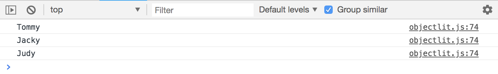

# Object Literals

Object literal reference types.

* Use ```const``` to create a variable called person, set it to a set of curly braces ```{}```
* This defines an object literal.
* Inside, you can put key value pairs.

```
const person = {
  firstName: 'Tommy',          // Logs {firstName: "Tommy"}
  lastName: 'Lanna',
  age: 31,
  email: 'tommy@lanna.com',
  hobbies: ['music', 'hiking', 'photography'],
  address: {
    city: 'Luangprabang',
    country: 'Laos'
  },
  getBirthYear: function(){
    return 2018 - this.age;
  }
}

let val = person;             // Initialize val, mutate later
console.log(val);             // Put below code
```

## Get a specific value, select values from an obj v1

This is the recommended way, commonly seen

```
val = person.firstName;       // Logs Tommy

// Get a specific value, select values from an obj v2
val = person[`firstName`];    // Logs Tommy

// Get specific value for other data types
val = person.age;                 // Logs 32
val = person.hobbies;             // Logs ["music", "hiking", "photography"]
val = person.hobbies[1];          // Logs hiking
val = person.address.city;        // Logs Luangprabang
val = person.address.country;     // Logs Luangprabang
val = person.address['country'];  // Logs Laos
val = person.getBirthYear();      // Logs 1987
```

Within objects, we can access other properties. For example, lets say for the birth year, we want to calculate this with current year and take away the age by using this.age

## Arrays of Objects
Another thing that you'll often see.

```const people = [
  {
    name: 'Tommy', 
    age: 31
  },
  {
    name: 'Jacky',
    age: 38
  },
  {
    name: 'Judy',
    age: 33
  }
];
```

Loop/iterate through, let i = 0, as long as i less than the length of people array, and then increment i by one though every iteration. Then console.log of people with current iteration of [i] and get the name.

```
for (let i = 0; i < people.length; i++) {     // Logs all names from people obj
  console.log(people[i].name);
}
```
In the console on browser:
<kbd></kbd>
