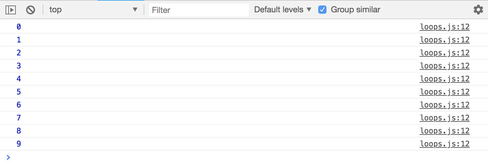
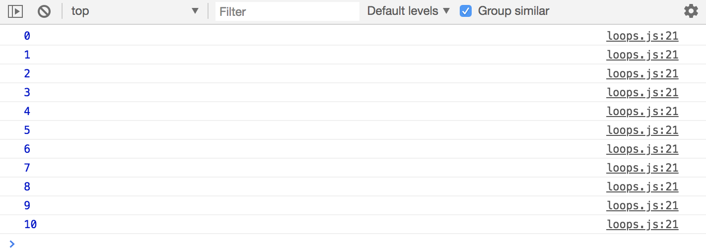
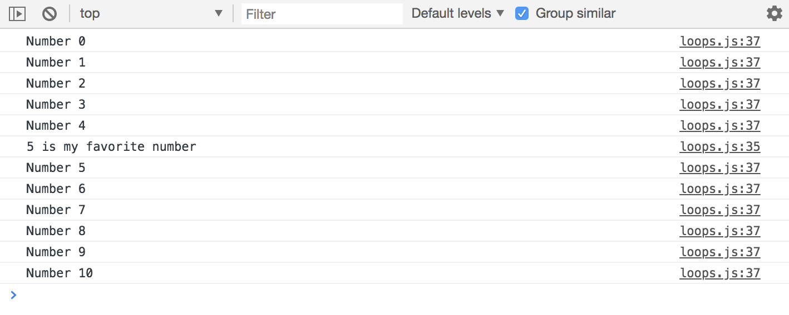
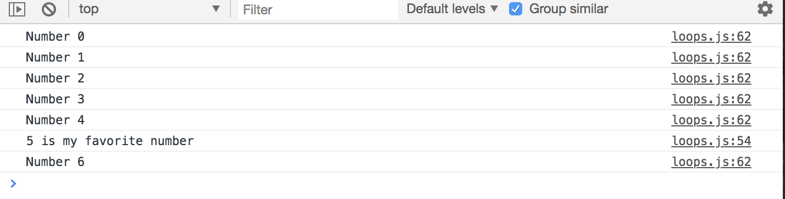
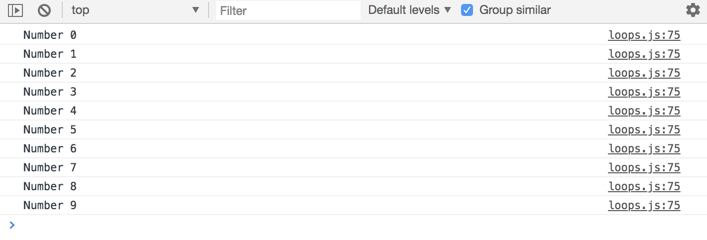
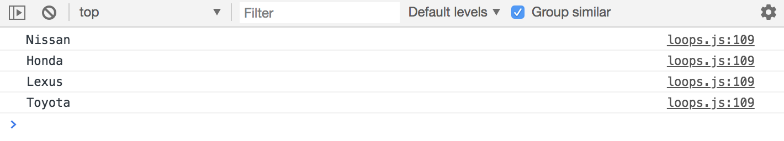
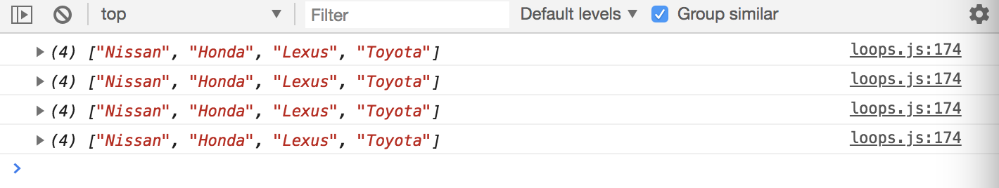
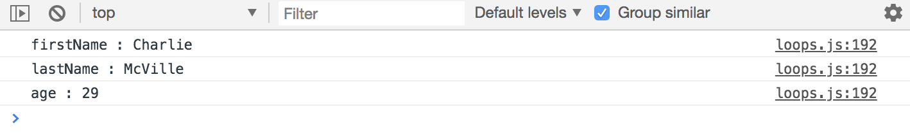

# Loops and Iterations

Loop is an instruction that repeats until a specific condition is reached. For instance, at the end of an array or a certain numbers is reached, loops are used to run the same block of code using different values each time. 

# General Loops
There's multiple ways to run iterations in JavaScript and most languages. The three most general and popular types are:

* for loops
* while loops
* do while

## For Loop
Set up ```for() { }``` like a function, and it takes in three parameters separated by ```;``` semicolons. The first is going to be the declaration of a variable, you always want to use either ```var``` or ```let```, ```let i = 0``` ```i``` is used very commonly, but you can use anything.The second parameter is going to be the condition, ```i < 10```, as long as ```i``` is less than ```10```. The last parameter is going to be an increment of ```i``` as ```i++``` which bascially means ```i = i + 1```, so it's just going to add ```1``` to whatever ```i``` is.

**Less than 10**

```
for(let i = 0; i < 10; i++) {
  console.log(i)
}
```

<kbd></kbd>

**Less than equal to 10**

```
for(let i = 0; i <= 10; i++) {
  console.log(i)
}
```

<kbd></kbd>

**How to skip an iteration or to do something else during a specific iteration.**
Let's say that for number ```5```  we want it to say something differently.

```
for(let i = 0; i <= 10; i++) {
  if (i === 5) {
    console.log('5 is my favorite number')
  }
  console.log('Number ' + i)
}
```

<kbd></kbd>

Notice that is still does ```Number 2``` in the logs. Use ```continue``` statement to exclude ```Number 2``` by stopping at ```5 is my favorite number```. ```continue``` just means keep going with the loop, go to the next iteration.

```
for(let i = 0; i <= 10; i++) {
  if (i === 5) {
    console.log('5 is my favorite number');
    continue;
  }
  console.log('Number ' + i)
}
```

**How to break out of the loop.**

What ```break``` does is as you probably guessed, it just breaks out of the loop.

```
for(let i = 0; i <= 10; i++) {
  if (i === 5) {
    console.log('5 is my favorite number');
    continue;
  }

  if (i === 7) {
    break;
  }

  console.log('Number ' + i)
}
```

<kbd></kbd>

## While Loop

It's preference on what you want to use, but some tend to use for-loops more bc one general rule that you'll hear sometimes is that you should use a for-loop when you know how many times its gonna run, like how many iterations it's gonna have, and use a while-loop when you don't or when it's unclear. But, it's not always the case.

How we set up the while-loop, we set the varible outside of the loop. Then ```while``` with our condition inside ```()```, like ```i``` is less than ```10```. Then, inside the ```{}``` tell it to do whatever you want to do, and then increment with ``i++```. Make sure you do the increment inside the while-loop.

```
let i = 0;

while(i < 10) {
  console.log('Number ' + i);
  i++;
}
```

This works in the same situation like in the for-loop we did earlier.

<kbd></kbd>

## Do While Loop

The do-while-loop is different bc it's always gonna run at least once no matter what. Use ```do {}``` have it do something and increment with ```i++```. Under the ```do{}```, make a ```while(){}``` it's going to have the condition, like ```(i < 10)```

```
let i = 0;                // Change it to 100, it'll still run

do {
  console.log('Number ' + i);
  i++;
}

while(i < 10);
```

You'll get the same output as the while-loop done earlier. But, the difference is that ```console.log('Number ' + i);``` is always going to run no matter what, even if the while condition isn't met.

# Array Specific Iterations with ```forEach()``` and ```map()```

Now, how we can use loops to loop through arrays. Arrays have specific methods that we can use for looping through, that's suggested over using a for-loop, but of course, you still can use a for-loop still too.

<kbd></kbd>

**For loop version**

Let's start off with creating a variable called ```cars``` with values of car names. So we have these car names and now we can for a for-loop, ```let i = 0;``` and the condition is going to be, ```i``` is less than the array name, which is ```cars``` dot ```length```, so we can count the number of values inside the cars array, and then do ```i++```. In this case, ```cars.length``` is going to equal ```4``` bc there are four values inside the array. If we do ```console.log(i)``` its going to just output the index numbers of where there are values. Instead, let's log out the cars names by using ```console.log(cars[i])``` that's how you access the values in the array. Using ```(cars[i])```, the first iteration will be car [0] which is Nissan, next Honda, next etc.

```
const cars = ['Nissan', 'Honda', 'Lexus', 'Toyota'];

for (let i = 0; i < cars.length; i++) {
  console.log(cars[i]);
}
```

**While loop version**

```
const cars = ['Nissan', 'Honda', 'Lexus', 'Toyota'];

let i = 0;
while(i < cars.length) {
  console.log(cars[i]);
  i++;
}
```

**```forEach()``` Array Loops version**

Take the array name ```cars``` and dot ```forEach()```. This ```forEach()``` method takes in a callback function, an anonymous function ```function(){}```. Inside the anonymous function parentheses, it can take in three different parameters, whatever you want to use as the current iteration/iterator, but for this example, we only need one. Let's just use ```car``` as the parameter, it makes since we're dealing with cars - its the single unit of the array name. You'll see that we get the same log output as the for-loop and while-loop, but it's a lot cleaner looking code.

So, if looping through an array, it's best to use a ```forEach()``` method.

```
const cars = ['Nissan', 'Honda', 'Lexus', 'Toyota'];

cars.forEach(function(car) {
  console.log(car);
});
```

**```map()``` Method**

The ```map()``` method can work in a few difference ways actually. But, it's basically to return something different, like to return a different array.

In this example, let's create an array of object of ```users```. Next, set another variable called ```ids```, and let's take this users array of objects and create another array of ids for these users. To do this, set ```users``` dot ```map()```. The ```map()``` takes in a function, just like the ```forEach()``` method. Inside the callback function parenthese, use ```user``` and then ```return user.id;```. So, it's going to loop through and it's going to return each ```id``` in the ```users``` array.

```
const users = [
  {id: 1, name: 'Jim'},
  {id: 2, name: 'Nancy'},
  {id: 3, name: 'Kale'},
  {id: 4, name: 'Peter'},
  {id: 5, name: 'Cole'}
];

const ids = users.map(function(user) {
  return user.id;
});

console.log(ids);             // Logs [1, 2, 3, 4, 5]
```

There's a lot more to ```forEach()``` and map()``` these are just the basics.

**Another example of ```forEach()```**

Again, in ```forEach()``` there's three parameters that it can take in.
* One is the ```current``` iterator - the parameter can be anything, usually its the single unit of the array's plural name.
* Second is the ```index```
* Third is the actual ```array``` - it's going to loop through the entire array each time.

You'll notice that it starts at ```0``` and its increments by 1 at a time.

```
const cars = ['Nissan', 'Honda', 'Lexus', 'Toyota'];

cars.forEach(function(car, index) {
  console.log(`${index} : ${car}`);
});
```

<kbd></kbd>

```
const cars = ['Nissan', 'Honda', 'Lexus', 'Toyota'];

cars.forEach(function(car, index, array) {
  console.log(array)
});
```

<kbd></kbd>

# Iterate though Objects with ```for in```
Loop through an object and get key value pairs.

In this example, lets create a single object called ```user``` and we'll this user object a ```firstName```, ```lastName``` and ```age```. Then we're gonna start off like a regular for-loop with ```for(let x in user)``` this is called a ```for in loop```. First, let's ```console.log(x)```, which will only log out the keys for us. Now, if we want to get the object, lets try using a template string ```(`${x} : ${user[x]}`)```

```
const user = {
  firstName: 'Charlie',
  lastName: 'McVille',
  age: 29
}

for (let x in user) {
  // console.log(x);         // Logs the keys in obj: firstName, lastName, age
  console.log(`${x} : ${user[x]}`); // Logs keys and value
}
```
Logs output of key and values of object:
<kbd></kbd>