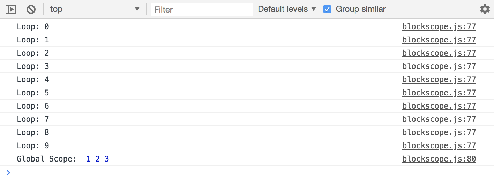
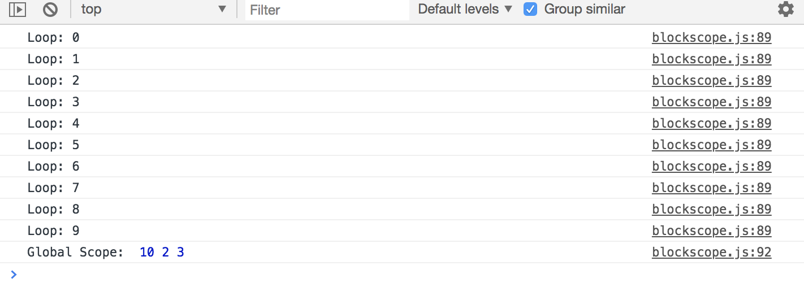

# Block Scope with ```let``` and ```const```

## Global Scope and Function Scope
A global scope is when we're not inside of a function.

In this example, let's use the three methods of defining a variable.

```
var a = 1;
let b = 2;
const c = 3;

console.log('Global Scope: ', a, b, c);   // Logs Global Scope: a, b, c
```

<kbd></kbd>

Now let's do a function. Let's again define three variables, but change the value inside the function.

```
var a = 1;
let b = 2;
const c = 3;

// Function Scope
function test() {
  var a = 4;
  let b = 5;
  const c = 6;
  console.log('Function Scope: ', a, b, c)
}

test();       // Logs Function Scope:  4 5 6

console.log('Global Scope: ', a, b, c);   // Logs Global Scope: 1 2 3
```

<kbd></kbd>

## Block Level Scope
It entails if-statements, loops, anything that is wrapped in curly braces ```{}```. 

Notice that the log output for Block Scope and Global Scope are different. What happened is, we defined ```a``` in the global scope, and then within the block scope of the ```if statement```, that ```var a``` was changed. 

Notice, that ```let``` and ```const``` is still ```2 3``` even though in the block scope, we set them to ```5 6```, they're still ```2 3``` in the global scope bc that's what we initially declared them as. 

So, the way that ```let``` and ```const``` work, is how most programming languages work. ```var``` is kind of weird and is one of the things why some programmers don't like JavaScript - it causes security risks, and it can cause confusion - like when you have a variable in the global scope, and then inside a block some function program has the same variable name, things can get messed up

```
// Global Scope
var a = 1;
let b = 2;
const c = 3;

if (true) {
  // Block Scope
  var a = 4;
  let b = 5;
  const c = 6;
  console.log('If Scope: ', a, b, c)      // Logs If Scope:  4 5 6
}

console.log('Global Scope: ', a, b, c)    // Logs Global Scope:  4 2 3
```

<kbd></kbd>

**Let's now try with a loop**

With ```let``` the value stays as ```1```

```
// Global Scope
var a = 1;
let b = 2;
const c = 3;

for (let a = 0; a < 10; a++) {
  console.log(`Loop: ${a}`)
}

console.log('Global Scope: ', a, b, c);      // Logs Global Scope: 1 2 3
```

<kbd></kbd>

With ```var``` the value changes to ```10```, this is not good. So, that's another reason why ```let``` and ```const``` were created.

```
var a = 1;
let b = 2;
const c = 3;

for (var a = 0; a < 10; a++) {
  console.log(`Loop: ${a}`)
}

console.log('Global Scope: ', a, b, c);     // Logs Global Scope:  10 2 3
```
<kbd></kbd>

* ```let``` and ```const``` have a block level scope.
* ```var``` has a function scope.