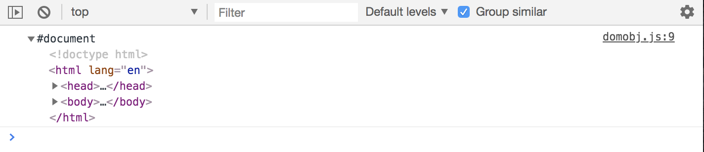
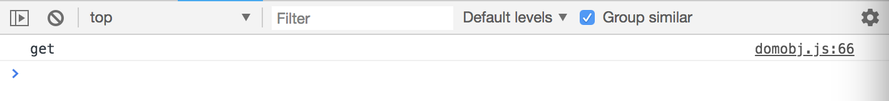

# What is the Document Object Model (DOM)?

It stands for the ```document object model```. It's bascially a structured respresentation of an HTML element. It can be thought of as a tree of nodes or elements created by the browser - node/element meaning any of the HTML tags, like the ```<body>``` tag, etc. 

We can use JavaScript to manipulate these DOM elements/nodes. The DOM is Object Oriented, meaning that each node has its own set of properties and methods that we can change, add, remove, etc.

<kbd></kbd>

The browser gives us a ```window object``` and inside that, we have a ```document object``` which is at the top of the tree, the image above. It represents the loaded document or webpage. 

Then, we have a root element underneath that, which is the ```<html>``` tag/element. From there after, we have ```<head>``` and ```<body>``` tags/elements, which are actually siblings bc they're on the same level in this tree. 

Inside the ```<head>``` tag, we have things like ```<meta>``` tag, ```<title>```.
In the ```<body>``` we have our output like ```<h1>``` tags, links with ```<a>``` and HTML semantic ```<header>``` tags, ```<footer>``` tags, things like that.

If you're not too familiar with JavaScript, but you've built HTML pages with some CSS, then this diagram will look very familiar to you. With that knowledge, we'll use JavaScript to manipulate the DOM.

There are libraries like jQuery which technically makes it easier to manipulate the DOM, but it's worth knowing of to manipulate the DOM using Vanilla JavaScript, especially now with ```querySelector``` and you can do things as easily like jQuery as far as DOM selection and manipulation.

Not using jQuery makes it faster bc we don't have the overhead of the extra library.

# The Document Object - Properties

This has a ton of different methods and properties attached to it. Again, remember the ```document object``` is a part of the ```window object```, which is basically the global object of the browser environment, and that ```document object``` is a property of that ```window object```.

* Look into its properties (the attributes of it)

```
let val;

val = document;

console.log(val);
```
<kbd></kbd>

When working in the DOM, we can get different structures. For example, an ```<html>``` collection, which is kind of like an array, but kind of not, it's formated like an array with bracket ```[]``` and comma separated values, but you can't use, for instance, a ```forEach()``` loop on it, which is an Array Method. Then you have ```node list``` for example, which are also like arrays, but you can use ```forEach()``` loops on them.

If you want to get the entire collection from the HTML document:

```
val = document.all;
```
<kbd></kbd>

* As you can see, it's starting from the top of the document with ```<html>```, then ```<head>```, and keeps going down.


Just like an array, you can access certain indexes. So, if we want the first one of all, we'd put in ```[0]``` bc it's zero-based just like an array.

```
val = document.all[0]       // [1] will give head, [2] will give meta
```

<kbd></kbd>

* You access indexes or items in the collection like you would with an array.

You do propeties as well. It's going to show that there are 27 elements in this DOM.

```
val = document.all.length;    // Logs 27
```

<kbd></kbd>

You can also access specific items alone.

```
val = document.head;          // Logs <head>...</head>
val = document.body;          // Logs <body>...</body>
val = document.doctype;       // Logs <!doctype html>
val = document.domain;        // Logs 127.0.0.1 bc running local
val = document.URL;           // Logs 127.0.0.1... bc running local
val = document.characterSet;  // Logs UTF-8
val = document.contentType;   // Logs text/html
```

You can select stuff without using selectors, you can do it, but not recommended. 
```
val = document.forms;         // Logs HTMLCollection[form..]
```

<kbd></kbd>

You can also access inside that ```<form>``` by adding an index number.
```
val = document.forms[0];      // Logs <form id="task-form">
```
<kbd></kbd>

You can also get stuff from that ```<form>``` like the id.

```
val = document.forms[0].id;
```
<kbd></kbd>


You can also get the method from that ```<form>```.
```
val = document.forms[0].method;
```
<kbd></kbd>

You can also get the action from that ```<form>```.
```
val = document.forms[0].action;
```
<kbd></kbd>

You can also do this with links.         
```
val = document.links;       // Logs collection of <a> links
```
<kbd></kbd>

* More examples:
```
val = document.links;                   // Logs collection of <a> links
val = document.links[0];                // To access certain links
val = document.links[0].className;      // Logs string of all the classes
val = document.links[0].classList;      // Logs collections of DOM token list
val = document.links[0].classList[0];   // To be specific
```

More that you can do:
```
val = document.images;
val = document.scripts;
val = document.scripts[0].getAttribute('src');  // Logs domobj.js
```

Another thing, with HTML collections, if you want to turn them into an array, which will allow you to use ```forEach()```, which you can't use by default with HTML Collection, you can actually do something about it. First convert it to an array.

```
let scripts = document.scripts;

// conversion example
let scriptsArray = Array.from(scripts);

scriptsArray.forEach(function(script) {
  console.log(script);
})
```

Let's try using the ```getAttribute()```
```
let scripts = document.scripts;

// conversion example
let scriptsArray = Array.from(scripts);

scriptsArray.forEach(function(script) {
  console.log(script.getAttribute('src'));  // Logs each source attribute
})
```

These are just examples to give an idea of what's available in the globally to the ```document object```.