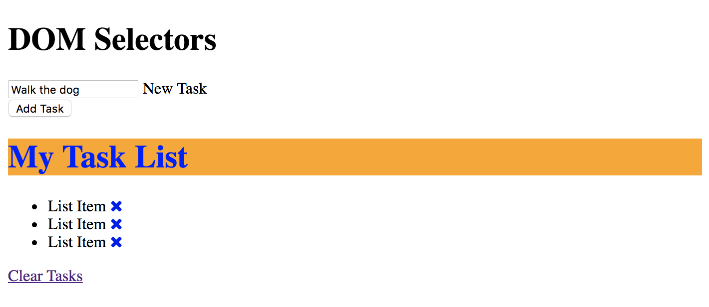
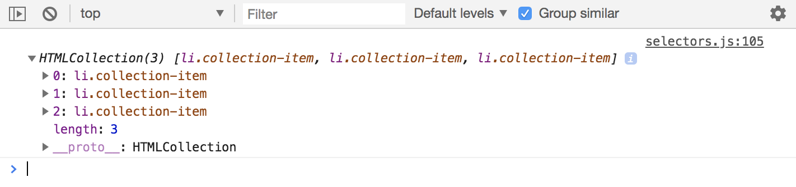
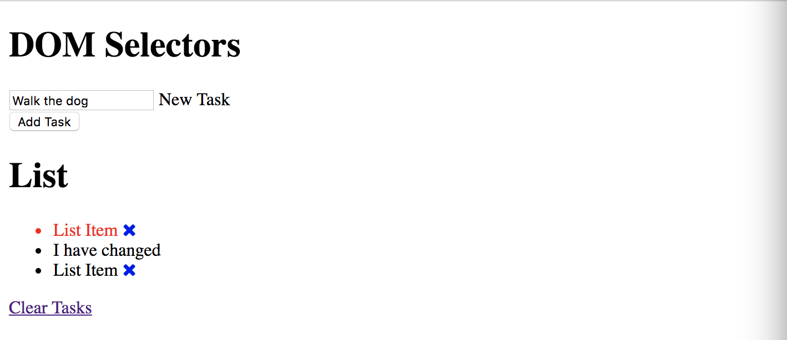
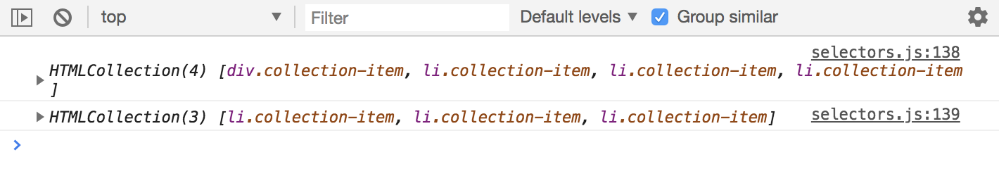
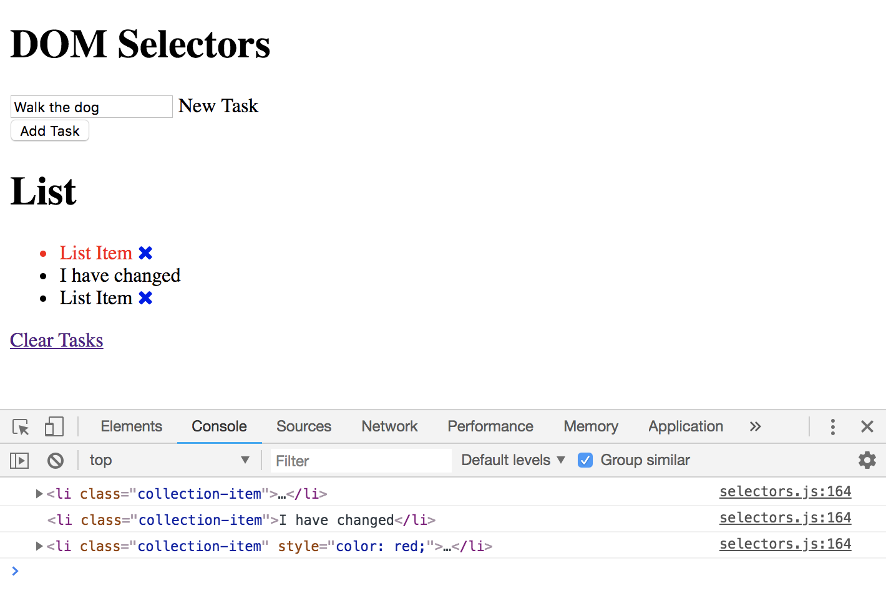
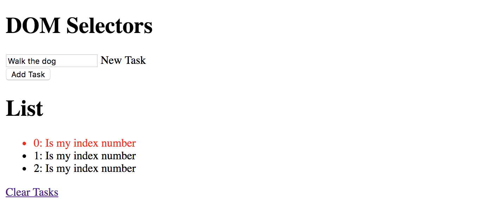
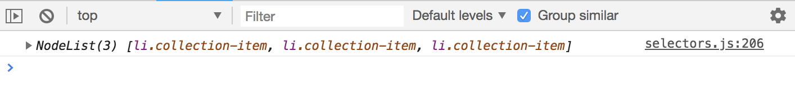
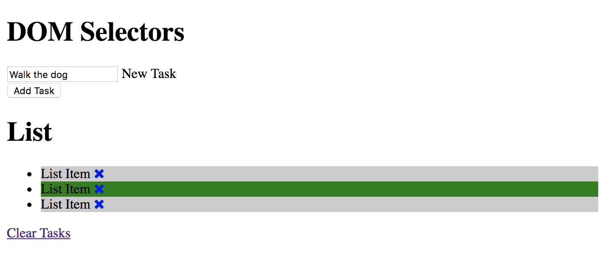

# DOM Selectors

These are ```document object methods``` that allows us to pull things from the DOM and we can do different things with the elements/nodes. 

jQuery was used for a long time to do these stuff for DOM manipulation in DOM selection, but Vanilla JavaScript has gotten much easier to work with now. jQuery is kinda unnecessary now, but one good thing that jQuery is good for is quick simple plugins or scripts that you need to do a specific action, but not so much for DOM manipulation these days.

In Vanilla JavaScript, we have a couple of different ```selectors``` that can be categorized into two different types:

* Single Element Selector - will allow you to grab one element by its ```id``` or its ```class``` and it only stores one thing. So, if you have multiple classes of the same name, it's going to only grab the first one.
* Multiple Elements Selectors - will get all of the elements with that class and then return an HTML Collection or a NodeList, depending on which selector you're using.

# Single Element Selectors
There are two.

* ```document.getElementById()``` - selects things by their id
* ```document.querySelector()``` - selects by id or classname

## ```document.getElementById()```

Let's say we want to get the id from the ```<h1 id="task-title">List</h1>``` that says List.
```
console.log(document.getElementById('task-title'));  // Logs the <h1>
```

**We can also get things from the element, its attributes:**
```
console.log(document.getElementById('task-title').id);  // Logs task-title

console.log(document.getElementById('task-title').className); // Logs test
```

**We can also change the styling:**

Add ```.style``` and then ```.``` to any CSS property you want to change and then equals a string of what you want.
```
document.getElementById('task-title').style.background = 'orange';
document.getElementById('task-title').style.color = 'blue';
document.getElementById('task-title').style.padding = '5px';
```

Note: You don't need to do this just to style your application, rather use CSS to style. But, use this when implementing events, like behavior, if you hover over something, you want something else to show or disappear - it's for dynamic functionality.

**Change content:**
There are a few different methods and properties that you can use to change the content or even insert HTML.

* textContent - it'll change the content on the DOM
* innerText - it'll also change the content on the DOM
* innerHTML - insert HTML, it's very common when working with the DOM and using Vanilla JavaScript, you maybe want to fetch something through the fetch API or through AJAX and then you want to insert a chunk of HTML.

```
document.getElementById('task-title').textContent = 'Task List';
document.getElementById('task-title').innerText = 'My Tasks';
document.getElementById('task-title').innerHTML = '<span style="color:green">My Task List</span>';
```

What we're doing here, calling ```getElemenById()``` in the example above, calling the ```id="task-title"``` isn't efficient, when actual coding, set it into a variable.

```
const taskTitle = document.getElementById('task-title')

taskTitle.style.background = 'orange';
taskTitle.innerHTML = '<span style="color:blue">My Task List</span>';
```

<kbd></kbd>

## ```document.querySelector()```
It's newer and much more powerful. It's much more powerful bc we don't have to select things by ```id``` we can select them by anything. It basically works like jQuery, you can put any CSS selector in here. Like if you want the ```id``` inside the parentheses, wrap the hassh with id name inside quotes ```#task-title``` just like what we would with jQuery.

* Select by ```id```
* Select by ```class```

**Get something by its id:**
```
8console.log(document.querySelector('#task-title'));   // Logs <h1 id="task-title">
```
**Get something by its class:**
```
console.log(document.querySelector('.test'));   // Logs <h1 class="test">
```

**We can also use just the element itself**
```
console.log(document.querySelector('h1'));    // Logs the first h1
```

**How we can target certain elements if there are more than one**
```
document.querySelector('li').style.color = 'red';
document.querySelector('ul li').style.color = 'orange';   // nested elements
```
**Use CSS pseudo-classes to be specific w/ child**
```
document.querySelector('li:last-child').style.color = 'red'; 
```
**Specify selection with nth-child**
```
document.querySelector('li:nth-child(2)').style.color = 'red'; // 2nd is red
```

**Change textContent**
```
document.querySelector('li:nth-child(2)').textContent = 'Hello World!';
```

With CSS3 pseudo-class, you can also do odd or even as which is used to do like every odd or every even ```<li>``` list-item or ```<div>```, etc. But, you'd have to use ```querySelectorAll()```.

# Mulitple Elements Selectors

These selectors are used to select more than one element and they return either an HTML Collection or NodeList, which are both similar to arrays, but there are certain things we can't do that we could do with a regular array. However, they also can be converted into arrays very easily. 

* ```document.getElementsByClassName()```
* ```document.getElementByTagName()```
* ```document.querySelectorAll()```

## ```getElementsByClassName()```

Pay attention, it's plural for elements. In this example, each one of the ```<li>``` list-items has a class of ```collection-item```.

```
const items = document.getElementsByClassName('collection-item');
console.log(items);
```

<kbd></kbd>

You'll notice in the log, at the bottom, you'll get an HTML Collection. Also, each ```<li>``` list item, is going to in an index, like ```0``` for the first one, ```1``` for next, etc., just like an array. Then, when you click the arrow to the left of the index, it'll dropdown and give a list of different properties that are available.

**If you want to select a specific one, then you can treat it like an array**

```
const items = document.getElementsByClassName('collection-item');
console.log(items[0]);            // Logs the first <li> item
```

**We can do certain things to these list items**

```
const items = document.getElementsByClassName('collection-item');
console.log(items[0]);
items[0].style.color = 'red';             // styles the 1st <li>
items[1].textContent = 'I have changed';  // changes 2nd text content
```

<kbd></kbd>

**We don't only have to use ```getElementsByClassName()``` on a global scope**

In this example, let's select from the ```<ul>```.
* Gonna add a new ```<div>``` in the HTML with a class name of ```collection-item``` outside of the ```<ul>```.
* With that said, we can attach ```getElementsByClassName()``` to specific tags.

```
const items = document.getElementsByClassName('collection-item');
const listItems = document.querySelector('ul').getElementsByClassName('collection-item');

console.log(items);       // this'll include the <div> classname bc global scope
console.log(listItems);   // not included these are only from inside <ul>
```

<kbd></kbd>

## ```getElementByTagName()```
Select elements by its tab name.

```
const lis = document.getElementsByTagName('li');
console.log(lis);                       // Logs HTML Collection w/ all <li>
console.log(lis[0]);                    // Logs specific <li> index
lis[0].style.color = 'red';             // styles the 1st <li>
lis[1].textContent = 'I have changed';  // changes 2nd text content
```

**Convert HTML Collection into an Array**

```
let lis = document.getElementsByTagName('li');
// console.log(lis);                       // Logs HTML Collection w/ all <li>
// console.log(lis[0]);                    // Logs specific <li> index
lis[0].style.color = 'red';             // styles the 1st <li>
lis[1].textContent = 'I have changed';  // changes 2nd text content

// convert to an array
lis = Array.from(lis);

lis.reverse();
lis.forEach(function(li) {
  console.log(li);
  // console.log(li.className);
})

// console.log(lis);
```
Convert to an array in order to use Array Methods.

<kbd></kbd>

**Change all**

```
let lis = document.getElementsByTagName('li');
lis[0].style.color = 'red';             // styles the 1st <li>
lis[1].textContent = 'I have changed';  // changes 2nd text content

// convert to an array
lis = Array.from(lis);

lis.forEach(function(li) {
  li.textContent = 'Hello there';
})
```

<kbd></kbd>

**Pass in an index**

```
let lis = document.getElementsByTagName('li');
lis[0].style.color = 'red';             // styles the 1st <li>
lis[1].textContent = 'I have changed';  // changes 2nd text content

// convert to an array
lis = Array.from(lis);

lis.forEach(function(li, index) {
  // set to template string
  li.textContent = `${index}: Is my index number`;
})
```

<kbd></kbd>

## ```querySelectorAll()```
It's pretty much like ```getElementsByClassName()``` and ```getElementByTagName()``` except it returns a ```NodeList```. There are some differences. A ```NodeList``` actually counts not just elements, but things like ```text nodes```. It also allows us to do things like ```forEach()``` and some other array methods without having to convert it.

Inside ```querySelectorAll()``` parentheses, you can put any kind of CSS selector similar to jQuery.

```
const items = document.querySelectorAll('li');

console.log(items);
```

<kbd></kbd>

**Change ```<li>```**
With this method, you don't have to convert to an array.

```
const items = document.querySelectorAll('li');

items.forEach(function(item, index) {
  item.textContent = `${index}: Hello there`;
})

console.log(items);         // Logs a NodeList Collection
```

<kbd></kbd>

**Changing style for odd or evens**

```
const liOdd = document.querySelectorAll('li:nth-child(odd)');
const liEven = document.querySelectorAll('li:nth-child(even)');

// forEach() loop example
liOdd.forEach(function(li, index) {
  li.style.background = '#ccc';       // changes to all odd <li> to gray
})

// for-loop example
for (let i = 0; i < liEven.length; i++) {
  liEven[i].style.background = 'green';   // all even <li> are green
}
```

<kbd></kbd>

Note: The ```for-loop``` will work even with an HTML Collection, even if you don't convert it into an array bc you can still use the property ```length``` in an HTML Collection and you can still access it with the ```[]``` brackets for index.