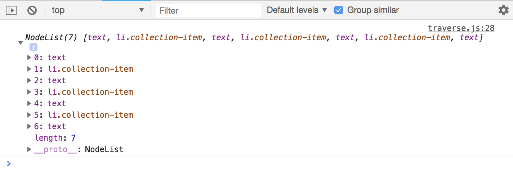
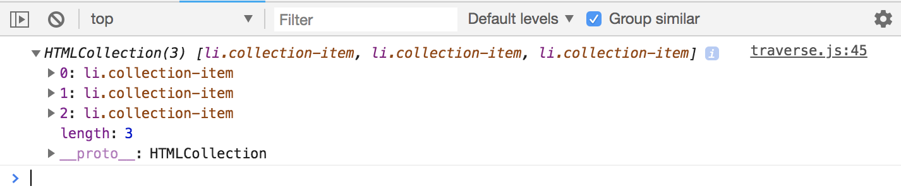

# Traversing the DOM

What ```traverse``` means is the basically move up and down. We're gonna be dealing with ```parent``` and ```children``` of specific nodes or whatever it is that we select.

Set two ```const list```, the first will be for the ```<ul>``` that wrap these list items ```<li>```. The second is for ```li.collection-item```.

We're gonna look at the properties that are attached to these nodes. They have to deal with getting ```children``` and ```parents``` of these nodes.

# Children

**Get ```child nodes```**

* This is going to give us a NodeList Collection of all the childNodes.
* Notice that you'll get the ```<li>``` and also ```text``` nodes. These text nodes are actually just line breaks bc of ```</li>```.

```
let val;

const list = document.querySelector('ul.collection'); // You can also do just 'ul'

val = list;         // Logs the <ul>

val = list.childNodes;

console.log(val);
```

<kbd></kbd>

This can be a little confusing at first, in most cases, you're not going to want to care about the ```text``` nodes, you just want the ```child element```, so for that, we have another property called ```children ```.

**Get children element nodes**

This is actually an ```HTML Collection```, this is not a ```NodeList Collection```. So, ```childNodes``` returns a ```NodeList```, ```children``` returns an ```HTML Collection``` - notice there's no ```text```, it's just the element.

```
let val;

const list = document.querySelector('ul.collection'); // You can also do just 'ul'

val = list;         // Logs the <ul>

val = list.children;

console.log(val);
```
<kbd></kbd>

**Theses numbers pertain to what type of nodes these are:**
* 1 = Element
* 2 = Attribute (depreciated)
* 3 = Text node - these are line breaks and comments
* 8 = Comment
* 9 = Document itself
* 10 = Doctype

```
let val;

const list = document.querySelector('ul.collection'); // You can also do just 'ul'

val = list;         // Logs the <ul>

val = list.childNodes;
val = list.childNodes[0];             // Logs #text item
val = list.childNodes[0].nodeName;    // Logs #text item
val = list.childNodes[1].nodeType;    // Logs 3, this is an element node
```

**More on get ```children``` element nodes**

```
let val;

const list = document.querySelector('ul.collection'); // You can also do just 'ul'

val = list;         // Logs the <ul>

val = list.children;
val = list.children[0];        // Logs the 1st <li>
val = list.children[1];        // Logs the 2nd <li>
list.children[1].textContent = 'Meow meow';   // text in DOM is changed
```

**Get ```children``` of children**

```
let val;

const list = document.querySelector('ul.collection'); // You can also do just 'ul'

val = list;         // Logs the <ul>

list.children[2].children[0].id = 'test-link';  // add id
val = list.children[2].children;       // give a collection of links
val = list.children[2].children[0];    // to access specific link
```

**```firstChild```**
```
let val;

const list = document.querySelector('ul.collection'); // You can also do just 'ul'

val = list;         // Logs the <ul>

val = list.firstChild;       // Logs #text, it's the 1st node
```

**```firstElementChild```, if you don't want to deal with ```text``` nodes**

```
val = list.firstElementChild;   // Logs the 1st <li>, no text nodes
```

**```lastChild```**
```
val = list.lastChild;           // Logs #text node
val = list.lastElementChild;    // Logs last <li>
```

**Get the ```count```**

```
val = list.childElementCount;   // Logs 3 bc we have 3 children of the <ul>
                                // 3 list-items <li>
```

# Parents

* ```parentNode```
* ```parentElement```

```
const listItem = document.querySelector('li.collection-item:first-child');

val = listItem.parentNode;                    // Logs the <ul>
val = listItem.parentElement;                 // Logs the <ul>
val = listItem.parentElement.parentElement;   // Logs the <body>

console.log(val);
```

# Siblings

* ```nextSibling```
* ```nextElementSibling```
* ```previousSibling```
* ```previousElementSibling```

**Get ```next sibling```**
```
const listItem = document.querySelector('li.collection-item:first-child');

val = listItem.nextSibling;           // Logs #text node
val = listItem.nextElementSibling;    // Logs <li>
val = listItem.nextElementSibling.nextElementSibling;  // Logs next <li>
val = listItem.nextElementSibling.nextElementSibling.previousElementSibling;  // Logs next <li>
```

**Get ```previous sibling```**
```
val = listItem.previousSibling;           // Logs #text node
val = listItem.previousElementSibling;    // Logs null bc dealing w/ <li>
                                          // there's no previous sibling
```