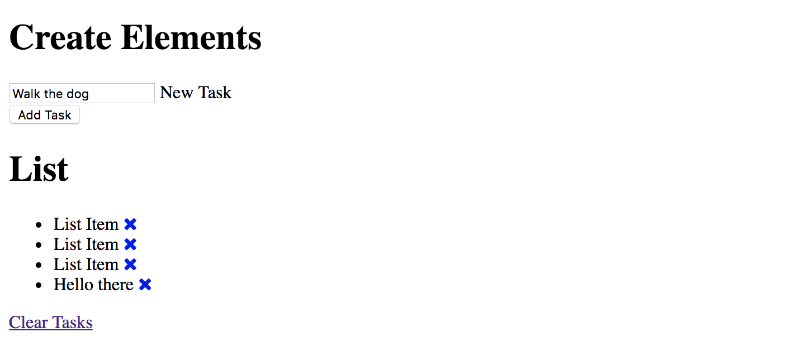

# Create Elements

How to create an element and add things to it liek classes, id, attributes. We can create and element and insert it into the DOM.

* ```document.createElement()```
* ```className```
* ```id```
* ```setAttribute()```
* ```appendChild()```
* ```createTextNode()```

In this example, we'll add and extra ```<li>``` list-item at the bottom of the existing. It'll include the ```#text```, with whatever you want to put on as text and also the link with the ```x``` icon for delete.

## ```document.createElement()```

We want to create an ```<li>``` element. So, we can construct DOM elements from scratch with Vanilla JavaScript.

**Create element**
```
const li = document.createElement('li');  // Logs <li></li>
```

**Add class**
```
li.className = 'collection-item';  // Logs <li class="collection-item"></li>
```

**Add id**
```
li.id = 'new-item'; // Logs Logs <li id="new-item"></li>
```

**Add attribute**
* set to title as 'New Item'
```
li.setAttribute('title', 'New Item'); // Logs <li title="New Item"></li>
```

**Create text node and append**
* ```appendChild()``` means you want to put something in something
* use ```document.createTextNode()``` to make a text node
```
li.appendChild(document.createTextNode('Hello there')); // Logs <li>Hello there</li>
```
* or you can use a variable to store
```
let newText = document.createTextNode('Hello there');
li.appendChild(newText);
```

**Create new link element, will append child to ul below**
```
const link = document.createElement('a');

// add class to the link
link.className = 'delete-item';

// add icon html
link.innerHTML = '<i class="fa fa-remove"></i>';

// append link into <li>
li.appendChild(link);
```

**Create new link element, will append child to ul below**
```
const link = document.createElement('a');

let newText = document.createTextNode('Hello there ');
li.appendChild(newText);

link.setAttribute('href', '#');

// add class to the link
link.className = 'delete-item';

// add icon html
link.innerHTML = '<i class="fa fa-remove"></i>';

// append link into <li>
li.appendChild(link);

// append <li> as child to <ul>
document.querySelector('ul.collection').appendChild(li);
```

<kbd></kbd>