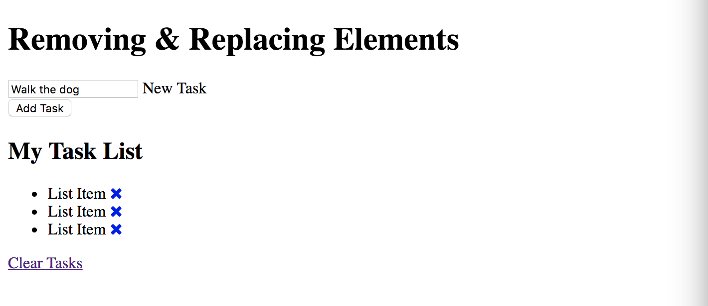
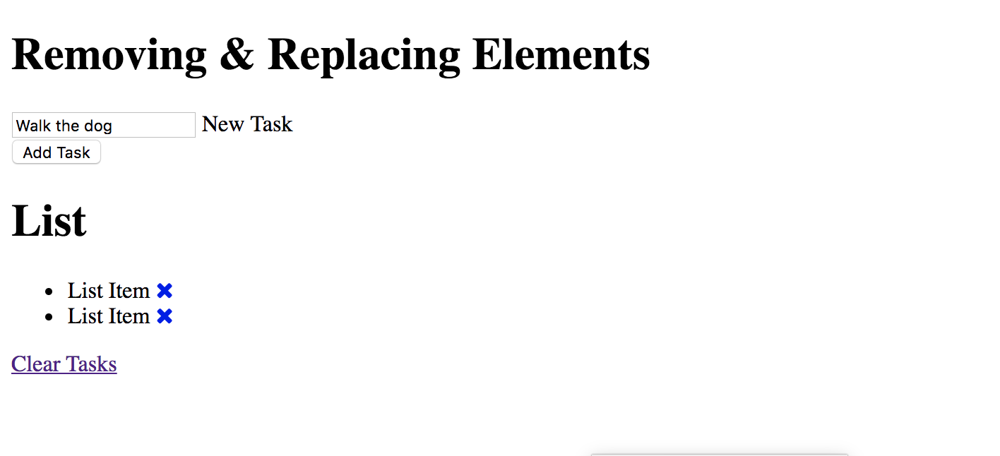

# Removing & Replacing Elements

How to remove, replace, work with classes, manipulate classes and attributes, etc.

## Replacing Elements
Use the ```replace()``` method.
Let's replace the ```<h1>``` with the text List, with an ```<h2>``` and different text.

**Create element**
```
const newHeading = document.createElement('h2');
```

**Add id**
```
newHeading.id = 'task-title';
```

**New text node**
```
newHeading.appendChild(document.createTextNode('My Task List'));
```

**Get old heading**
```
const oldHeading = document.querySelector('h1#task-title');
```

**Get parent**
```
const theParent = document.querySelector('.the-parent');
```

**Replace**
```
theParent.replaceChild(newHeading, oldHeading);
```

<kbd></kbd>

## Removing Element

Use the ```remove()``` method.

```
// get all <li> items
const lis = document.querySelectorAll('li');

// get the list itself <ul>
const list = document.querySelector('ul');

// remove a specific list item
lis[0].remove();        // Removes the 1st <li> item
```

<kbd></kbd>

**Remove child element**
```
list.removeChild(lis[2]);    // Removes the 3rd one down
```

## Classes and Attributes

**Classes**

The element that we're gonna work with is the ```<a>``` for the ```x``` delete icon.

Get the first ```<li>```
```
const firstLi = document.querySelector('li:first-child');
```
Get ```<a>``` tag for the 1st one
```
const link = firstLi.children[0];
```
```
let val;

// look at ```className```
val = link.className;                       // Logs a string of classes inside the tag

// look at ```classList```
val = link.classList;                       // Logs DOMTokenList, setup like an array

// access inside ```classList```
val = link.classList[0];                    // Logs delete-item

// add a class using ```classList```
link.classList.add('test-new-add');
val = link;                                 // Logs <a href="#" class="delete-item test-new-add">...</a>

// remove a class using ```classList```
link.classList.remove('test-new-add');      // Logs <a href="#" class="delete-item">...</a>

console.log(val);
// console.log(firstLi.children[0]);        // Test to get <a> tag for the 1st one
```

**Attributes**

Continue to work with the link variable.

```
const firstLi = document.querySelector('li:first-child');
const link = firstLi.children[0];

let val;

// get specific attribute
val = link.getAttribute('href');        // Logs #

// set/edit specific attribute
val = link.setAttribute('href', 'http://google.com');

// check to see if there is an attribute
val = link.hasAttribute('href');        // Logs true
val = link.hasAttribute('title');       // Logs false

link.setAttribute('title', 'Google');
val = link.hasAttribute('title');       // Logs true

// remove an attribute
link.removeAttribute('title');          // Removes title
val = link;

console.log(val);
```