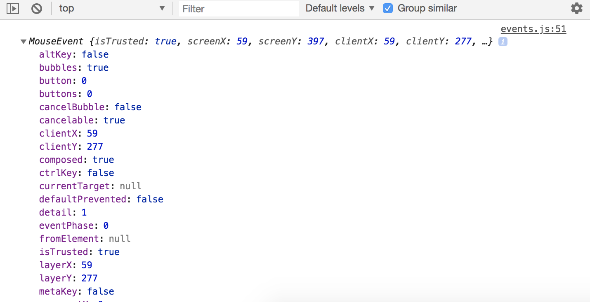

# Event Listeners & Event Object

## Event Listeners

This gives us interaction with the User Interface (UI), the webpage. You can listen to events on any element, anything on the DOM.

Let's add an Event Listener on to the clear task link.

Add event listener to the clear task link.
```addEventListener()``` - takes in two things, the actual event that we want to listen for, like a ```click```, and it'll take in an anonymous function aka a callback function. Inside the ```{}``` is going to be the action when we run the ```click event``` on the ```.clear-tasks``` object.

```
document.querySelector('.clear-tasks').addEventListener('click', function() {
  console.log('You clicked me, Clear Tasks');
});
```

You may get an issue of the message flashing in the console bc by default, the form is gonna try to submit when you click, especially if you href tag is blank. You can resolve this by putting in a # inside. Another way is to ```preventDefault()```:

```
document.querySelector('.clear-tasks').addEventListener('click', function(e) {
  console.log('You clicked me, Clear Tasks');

  e.preventDefault();   // this is the stop the link behavior from running
});
```
You can also put a named function.

Let's make another function that's named ```onClick``` and put it in that the 2nd parameter to the ```addEventListener()```, now, it's going to look for a function called ```onClick```. Have a named function is much neater than sticking an unnamed (anonymous) function as the 2nd parameter.
```
document.querySelector('.clear-tasks').addEventListener('click', onClick);

function onClick(e) {
  console.log('You have clicked using onClick function you created');
}
```

## Event Object

**Set val equal to the event object**
This will log the MouseEvent object with a whole bunch of stuff associated with it. For instance, the ```clientX``` and ```clientY``` gives us the position of where the event happened relative to the window, we can get ```shiftKey``` tells us if the shift key on the keyboard was held when the event happened, we can get the ```timeStamp```, but the most important thing is the ```target```.

```target``` represents the element where the event actually happened on, in this case, it's the ```<a>``` tag bc we click on the Clear Tasks link.

```
document.querySelector('.clear-tasks').addEventListener('click', onClick);

function onClick(e) {
  let val;
  val = e;   
  console.log(val);
}
```
<kbd></kbd>

**Let's look inside the ```target```**

You can do whatever you want when the event fires off. 

```
document.querySelector('.clear-tasks').addEventListener('click', onClick);

function onClick(e) {
  let val;
  val = e;   
  
  // event target element, to give the actual element
  val = e.target;

  // get target id
  val = e.target.id;

  // get target className
  val = e.target.className;

  // get target collection
  val = e.target.classList;

  // change text with innerText
  e.target.innerText = 'My Text Changed'

  console.log(val);
}
```

**Look at event ```type``` in Event Object**

```
document.querySelector('.clear-tasks').addEventListener('click', onClick);

function onClick(e) {
  let val;
  val = e;   
  
  // get type of event (click, mouseover, etc.)
  val = e.type;

  // get timestamp
  val = e.timestamp

  // get coordinates of event relative to the window
  val = e.clientY;    // number for vertical axis
  val = e.clientX;    // number for horizontal axis

  // get coordinates relatives to the element itself
  val = e.offsetY;
  val = e.offsetX;

  console.log(val);
}
```

Note: the ```target``` is really important to know, especially when we get into event delegation later on.