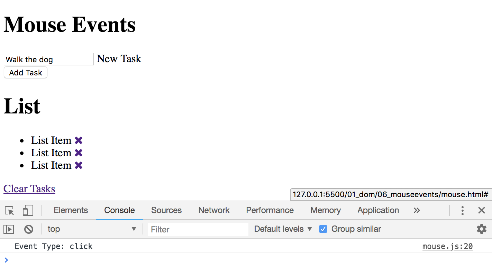
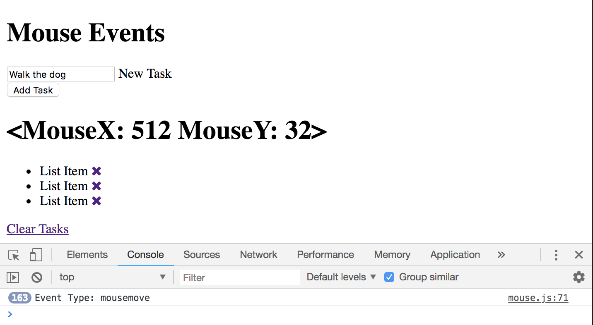
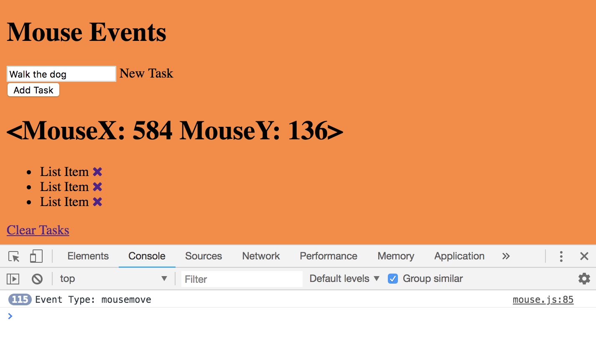

# Mouse Events

**Create variables for items we want to deal with**
```
const clearLink = document.querySelector('.clear-tasks');
const entireList = document.querySelector('.the-parent');
const heading = document.querySelector('h1#task-title');
```
**Create a click event**

When ```click``` happens, run the ```runEvent``` function.
```
clearLink.addEventListener('click', runEvent);
```

**Create an event handler**

The runEvent is going to take in one parameter, the event object.
```
function runEvent(e) {
  console.log(`Event Type: ${e.type}`);
}
```
<kbd></kbd>

## Other Mouse Events

**click**
```
clearLink.addEventListener('click', runEvent);
```

**doubleclick**
```
clearLink.addEventListener('dbclick', runEvent);
```

**mouse down (holding key down fires it)**
```
clearLink.addEventListener('mousedown', runEvent);
```

**mouse up (holding key up fires it)**
```
clearLink.addEventListener('mouseup', runEvent);
```

**mouse enter (fires when drag into parent element)**
```
clearLink.addEventListener('mouseenter', runEvent);
```

**mouse leave (fires when drag out of parent element)**
```
clearLink.addEventListener('mouseleave', runEvent);
```

**mouse over (fires when inside the element)**
```
clearLink.addEventListener('mouseover', runEvent);
```

**mouse out (fires when outside the element)**
```
clearLink.addEventListener('mouseout', runEvent);
```

**mouse move (any movement inside that element)**

Useful when it comes to games like if you want to know where your characters are moving around, anything interactive. Let's try getting the heading and changing the coordinates as we move the mouse. 

```
const entireList = document.querySelector('.the-parent');
const heading = document.querySelector('h1#task-title');

entireList.addEventListener('mousemove', runEvent);

function runEvent(e) {
  console.log(`Event Type: ${e.type}`);

  heading.textContent = `<MouseX: ${e.offsetX} MouseY: ${e.offsetY}>`;
}
```

<kbd></kbd>


```rgb()``` value represent Red, Green, Blue - it takes in three parameters and each can be a value from 0-255. You'll get different variations depending on those numbers.

In this example, take the ```offestX``` and ```offsetY``` from the event object, and use those as parameters.
```
entireList.addEventListener('mousemove', runEvent);

function runEvent(e) {
  console.log(`Event Type: ${e.type}`);

  heading.textContent = `<MouseX: ${e.offsetX} MouseY: ${e.offsetY}>`;

  document.body.style.backgroundColor = `rgb(${e.offsetX}, ${e.offsetY}, 50)`;
}
```

<kbd></kbd>