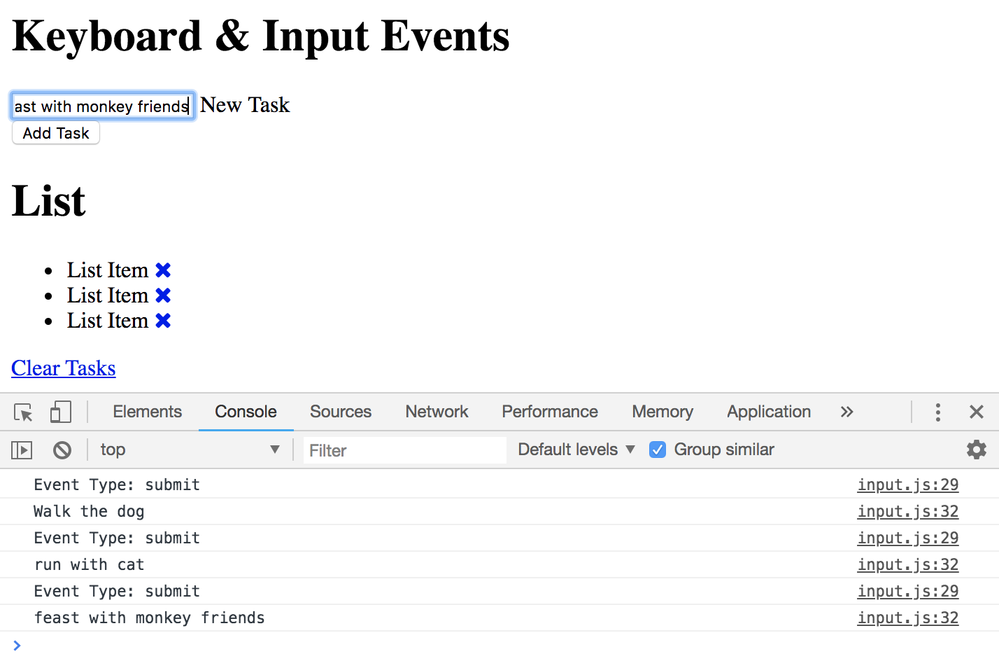
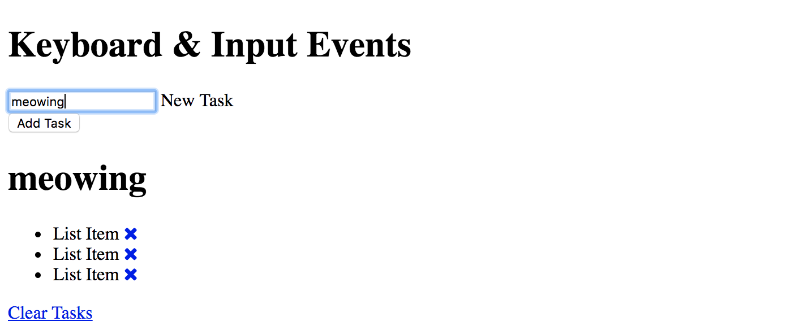
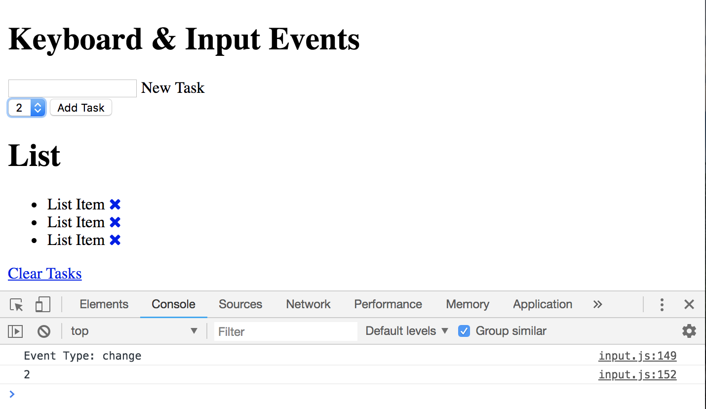

# Keyboard & Input Events

## Submiting Form Event Listener

```
const form = document.querySelector('form');
const taskInput = document.getElementById('task');

form.addEventListener('submit', runEvent);

function runEvent(e) {
  console.log(`Event Type: ${e.type}`);
  e.preventDefault();
}
```

Note: If you have a big application with multiple forms, you you be more specific with the selection, rather than just the form tag. Instead use the id or the class of the tag element.

## Get Input Value for Form

```
const form = document.querySelector('form');
const taskInput = document.getElementById('task');

form.addEventListener('submit', runEvent);

function runEvent(e) {
  console.log(`Event Type: ${e.type}`);

  // get the input fields and its value
  console.log(taskInput.value);

  e.preventDefault();
}
```

<kbd></kbd>


Clearing out form submission with JavaScript

```
const form = document.querySelector('form');
const taskInput = document.getElementById('task');

// clears out input field
taskInput.value = '';

form.addEventListener('submit', runEvent);

function runEvent(e) {
  console.log(`Event Type: ${e.type}`);

  // get the input field and its value
  console.log(taskInput.value);

  e.preventDefault();
}
```

## Keyboard Events

This is when you're doing things with the keyboard to input value in the form input field.

**keydown** - fires when key is pressed down

```
const form = document.querySelector('form');
const taskInput = document.getElementById('task');
const heading = document.querySelector('h1#task-title');

// clears out input field
taskInput.value = '';

// keydown
taskInput.addEventListener('keydown', runEvent);

function runEvent(e) {
  console.log(`Event Type: ${e.type}`);

  // catch keydown input
  console.log(e.target.value);

  // dyanmically display keydown input on heading
  heading.innerText = e.target.value;
}
```

**keyup** - fires off when you lift the key up

```
const form = document.querySelector('form');
const taskInput = document.getElementById('task');
const heading = document.querySelector('h1#task-title');

taskInput.value = '';

taskInput.addEventListener('keyup', runEvent);

function runEvent(e) {
  console.log(`Event Type: ${e.type}`);

  // catch keyup input
  console.log(e.target.value);

  // dyanmically display keydown input on heading
  heading.innerText = e.target.value;
}
```

<kbd></kbd>

**keypress** - is a generalized keyboard event

## Other Input Events

**focus** - when you click inside of input field and you set it to focus

```
const form = document.querySelector('form');
const taskInput = document.getElementById('task');
const heading = document.querySelector('h1#task-title');

taskInput.value = '';

taskInput.addEventListener('focus', runEvent);

function runEvent(e) {
  console.log(`Event Type: ${e.type}`);
}
```

**blur** - click in, then click out of input field, you'll get the blur event type

**cut** - when you highlight the value you put in input field and right click and cut, you'll get the event type. also if you control+x

**paste** - when you highlight the value you put in input field and right click and paste, you'll get the event type. also if you control+v

**input** - will fire off on any input event, all the events we listed above

**change** - work with the ```<select>``` lists
```
const form = document.querySelector('form');
const taskInput = document.getElementById('task');
const heading = document.querySelector('h1#task-title');
const select = document.querySelector('select');

taskInput.value = '';

select.addEventListener('change', runEvent);

function runEvent(e) {
  console.log(`Event Type: ${e.type}`);

  // get the value
  console.log(e.target.value);
}
```
<kbd></kbd>