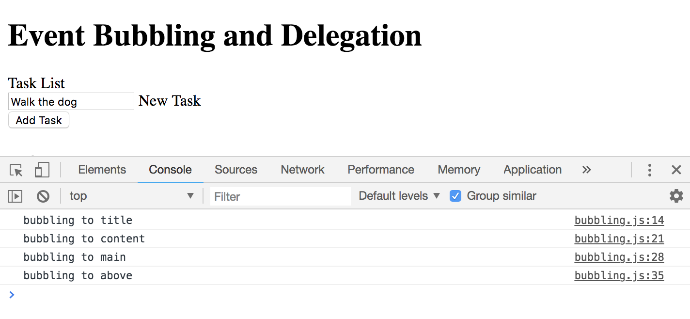

# Event Bubbling and Delegation

## Event Bubbling

Is the bubbling up of events through the DOM. So, when an event happens on a particular element in the DOM, it'll actually bubble up through its parent.

In this example, when you click on the element with the class of title, it's going to bubble up and then all of the other class names are also going to be called. They will all fire off bc of event bubbling, it bubbles up the DOM.

The HTML file
```
<div class="above">
  <div class="main">
    <div class="content">
      <span class="title">Task List</span>
      <form id="task-form" action="index.html">
        <div>
          <input type="text" name="task" id="task" value="Walk the dog">
          <label for="task">New Task</label>
        </div>
        <input type="submit" value="Add Task" class="btn">
      </form>
    </div>
  </div>
</div>
```
The JS file
```
// child element ```<span class="title">Task List</span>```
const title = document.querySelector('.title');

title.addEventListener('click', function() {
  console.log('bubbling to title');
})

// parent element ```<div class="content">```
const content = document.querySelector('.content');

content.addEventListener('click', function() {
  console.log('bubbling to content');
})

// ```<div class="content">``` has the parent of ```<div class="main">```
const main = document.querySelector('.main');

main.addEventListener('click', function() {
  console.log('bubbling to main');
})

// ```<div class="main">``` has the parent of ```<div class="above">```
const above = document.querySelector('.above');

above.addEventListener('click', function() {
  console.log('bubbling to above');
})
```

<kbd></kbd>

## Event Delegation

It can be described as the opposite bc we're putting an event listener on the parent and then going down. Essentially, you're putting a listener on the parent of what you're looking for and then putting a condition to find the target using ```e.target``` and doing a functionality there.

In the example, we'll use the ```<li>``` list-items. We will put the event on the ```<ul>``` which is the ```<li>``` parent element, and then we're going to target the list-item and its delete link. Gonna use Event Delegation.

**A Situation without Event Delegation**

Without all the  ```delete-item``` classes.
So, when you click the ```x``` icon with the delete-item class, only the first ```<li>``` works. So this is a situation that needs Event Delegation.

```
const deleteItem = document.querySelector('.delete-item');

deleteItem.addEventListener('click', removeItem);

function removeItem() {
  console.log('delete item');
}
```

Another situation where you need to use Event Delegation is if you dynamically insert something into the DOM through JavaScript. For example, if you insert a a new ```<li>``` that was not there when the page loaded, then you also need to use Event Delegation. Now all the ```x``` icon in the ```<li>``` works.

```
// if you click anywhere on the body, it'll log 'delete item'
document.body.addEventListener('click', removeItem);

function removeItem(e) {
  // create conditional to specifiy
  if (e.target.className === 'fa fa-remove') {
    // this will show us the target whereever clicked
    console.log('delete item');
  }
}
```

Now, we want to get more specific. We want to get the ```<a>``` tag for the link, not just the ```x``` icon bc its the parent. When you use ```parentElement``` remember to list all the classnames if there is more than one in the ```<a>``` tag. This is one way, but not the best. If all of a sudden you add a new classname inside only one of the ```<a>```, it's not going to work for all again.

```
document.body.addEventListener('click', removeItem);

function removeItem(e) {
  // create conditional to specifiy for parent element
  if (e.target.parentElement.className === 'delete-item') {
    // this will show us the target whereever clicked
    console.log('delete item on parent');
  }
}
```

A better way to do Event Delegation is with ```classList.contains()``` and then the class that you're looking for. It'll work even if there are other classnames in the tag.

```
document.body.addEventListener('click', removeItem);

function removeItem(e) {
  // create conditional to specifiy for parent element
  if (e.target.parentElement.classList.contains('delete-item')) {
    // this will show us the target whereever clicked
    console.log('delete item on with classList.contain()');
  }
}
```

Let's make the functionality of the removeItem() function - we want to delete the whole ```<li>``` list-item not just from the ```<a>``` tag level. So, we need to chain starting with getting the whole```<li>...</li>``` element, then get the ```parentElement``` which is the ```<a>``` tag, then get the ```parentElement``` of that, which is the ```<li>``` specifically.

```
document.body.addEventListener('click', removeItem);

function removeItem(e) {
  // create conditional to specifiy for parent element
  if (e.target.parentElement.classList.contains('delete-item')) {
    console.log('delete item');
    // use the remove() method to delete
    e.target.parentElement.parentElement.remove()
  }
  // console.log(e.target); // is the <li>...</li>
}
```