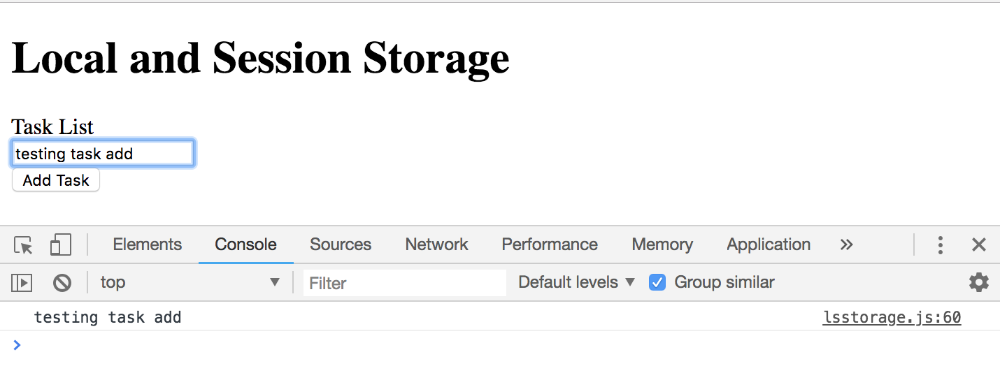

# Local and Session Storage

The difference between local storage and session storage, is that local storage will stay until you manually clear out your settings or your program. With session storage, it'll go away once yur browser is closed out, once the session ends. Other than that, the API is the same.

# Local Storage

The Local Storage API is a part of the web browser. In the console, look into the ```window``` object, scroll down and you'll see the ```localStorage``` API with a bunch of methods. You can set key value pairs into it. 

It's important to know that what you set as a value has to be a ```string```. You can still save arrays and object inside, but you have to turn them into a string first using a method called  ```JSON.stringify```, and then when you want to pull it out to use it, you need to parse it back using a method called ```JSON.parse````.

## How to Set Local Storage Item

First set with ```localStorage``` with ```setItem()``` and store a key of ```name``` and a value of ```May```. Next, go into your DevTools in Chrome, go to Application and on the left column where it says Storage, click on Local Storage and you'll see your localhost, click on the localhost and you'll see on the right, it'll show the key of ```name``` and the value of ```May```.

```
localStorage.setItem('name', 'May');
```
<kbd></kbd>


## How to remove from Local Storage
```
localStorage.removeItem('name');
```


## Get the value from Local Storage
```
const name = localStorage.getItem('name');
console.log(name);
```

## Clearing Local Storage

```
const name = localStorage.getItem('name');
const age = localStorage.getItem('age');

// to clear (when you clear, it's going to turn the value to null)
localStorage.clear();

console.log(name, age);     // Logs both null
```

## Use Form to Add a Task to Local Storage

First, select the ```<form>``` element, then ```addEventListener``` with event type ```submit``` and a callback function for the action, also ```e.preventDefault()``` to prevent default behavior of submission. When you click the button, in the DevTools console in Chrome, you see it log ```123```.

```
document.querySelector('form').addEventListener('submit', function(e) {
  console.log(123); // test it out

  e.preventDefault();
});
```
<kbd></kbd>

It works, so now let's create a variable called ```task``` and set it equal to ```document.getElementById('task').value``` to get the ```task``` input and get the value with ```value```.

```
document.querySelector('form').addEventListener('submit', function(e) {
  const task = document.getElementById('task').value;
  console.log(task);  // test it out

  e.preventDefault();
});
```
<kbd></kbd>

To set that input value to ```localStorage``` with ```setItem``` and set it to the ```task``` as the first parameter, and we'll set it to the ```task``` variable that we created with ```const task = document.getElementById('task').value;```. Then let's do an ```alert()``` with Task saved.

```
document.querySelector('form').addEventListener('submit', function(e) {
  const task = document.getElementById('task').value;
  localStorage.setItem('task', task);

  alert('Task saved');

  e.preventDefault();
});
```

<kbd></kbd>
<kbd></kbd>

The problem with this, if we were to add another task, it's going to replace the previous task we added, so with our example above, we can only store one task at a time. To fix this, what we can do is create an array of tasks and store it as a string. 

First, initialize ```let tasks;``` variable. Then, we want to first check to see if there is anything in Local Storage. If there is, pull that info out and continue to add to it, if not, just start with an empty array and then add to it.

If ```localStorage.getItem()``` and since it's going to be an array of tasks, call it ```'tasks'``` plural is equal to ```null```, that means there's nothing in there for ```tasks```, so set ```tasks``` to an empty ```[]```. Else, if there is something in there, then set that variable ```tasks``` equal to whatever is in there with ```localStorage.getItem('tasks');```.

But, the issue here is that now ```tasks = localStorage.getItem('tasks');``` input value is going to be a string. So, what we need to do is parse it into a JSON, which is an object, so that we can use it. But in this example, the value that we're storing is only one value, an array of strings. Usually, you'll store an array of JSON objects.

```
document.querySelector('form').addEventListener('submit', function(e) {
  const task = document.getElementById('task').value;
  let tasks;    
  
  if (localStorage.getItem('tasks') === null) {
    tasks = [];
  } else {
    tasks = JSON.parse(localStorage.getItem('tasks'));
  }

  e.preventDefault();
});
```

After ```JSON.parse()```, we need to push the task that's coming through the form with ```const task = document.getElementById('task').value;``` onto the variable ```let tasks;```. Use ```tasks.push(task);``` and it'll add to it.

```
document.querySelector('form').addEventListener('submit', function(e) {
  const task = document.getElementById('task').value;
  let tasks;    
  
  if (localStorage.getItem('tasks') === null) {
    tasks = [];
  } else {
    tasks = JSON.parse(localStorage.getItem('tasks'));
  }

  tasks.push(task);

  e.preventDefault();
});
```

But this is not gonna change anything in Local Storage yet, we now need to reset the Local Storage task with the ```tasks.push(task);``` added value. We need to use ```setItem()``` and set ```'tasks'``` as the first parameter to the second parameter of the ```tasks``` variable which incudes the new value that's added, but remember, Local Storage can only store strings, so we have to wrap ```JSON.stringify``` to the second ```tasks``` parameter. Now that should set it inside of an array and formatted as a string.

```
document.querySelector('form').addEventListener('submit', function(e) {
  const task = document.getElementById('task').value;
  let tasks;    
  
  if (localStorage.getItem('tasks') === null) {
    tasks = [];
  } else {
    tasks = JSON.parse(localStorage.getItem('tasks'));
  }

  tasks.push(task);

  localStorage.setItem('tasks', JSON.stringify(tasks));

  alert('Task saved!');

  e.preventDefault();
});
```

Go back to DevTools in Chrome and clear out the old Local Strorage in the Application and Storage section. Go ahead and add a new task, ```Walk the cat```, click the Add button, and now in the Application DevTool section, you'll see that it added an array with a string value.

<kbd></kbd>

If you add another task, you'll see that it adds a second string value in the array, added to ```tasks```.

<kbd></kbd>

## Getting the info out, you need to use ```JSON.parse()```

Remember, Local Storage only stores strings, so we need to use ```JSON.parse()```, then we'll be able to loop through.

```
const tasks = JSON.parse(localStorage.getItem('tasks'));

tasks.forEach(function(task) {
  console.log(task);
});
```

<kbd></kbd>

# Session Storage

## How to Set Session Storage Item

First set with ```sessionStorage``` with ```setItem()``` and store a key of ```name``` and a value of ```James```. Next, go into your DevTools in Chrome, go to Application and on the left column where it says Storage, click on Session Storage and you'll see your localhost, click on the localhost and you'll see on the right, it'll show the key of ```name``` and the value of ```James```.

If you close your browser and go back into Session Storage, you'll see that it cleared out.

```
sessionStorage.setItem('name', 'James');
```
<kbd></kbd>

Note: We're gonna just learn Local Storage for now. Session Storage is very similar anyways. Learn one and you'll get the other fine.