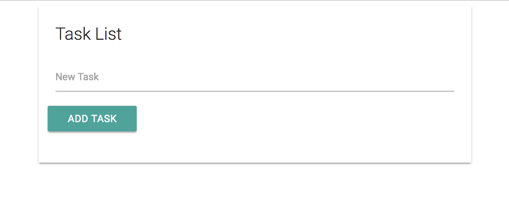
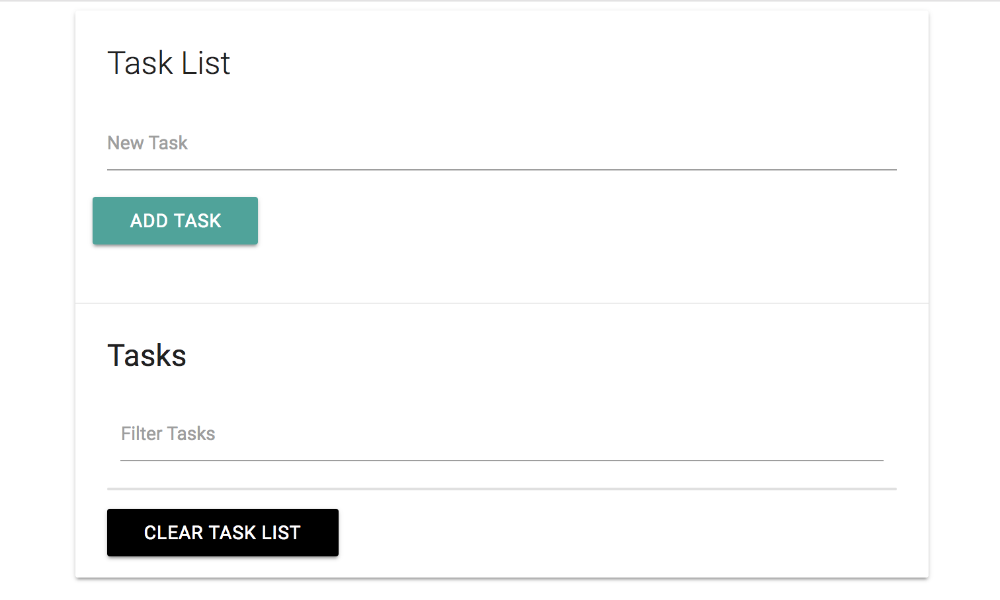
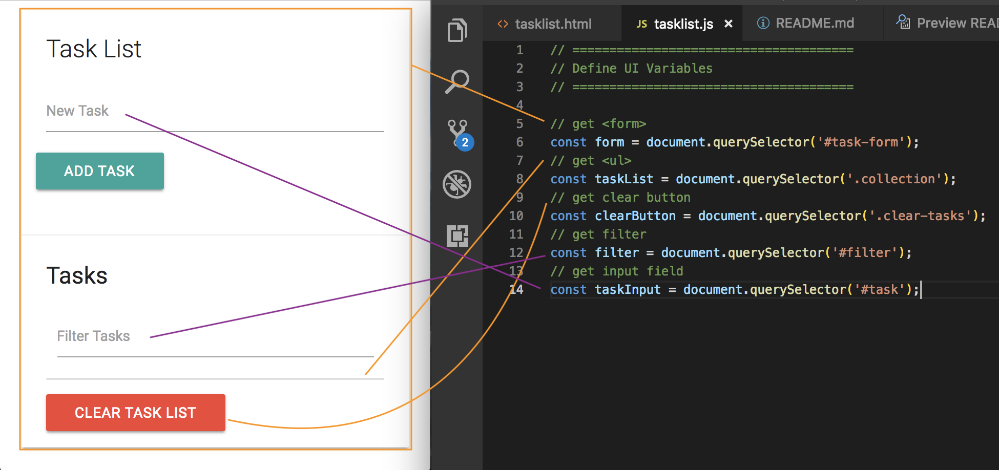
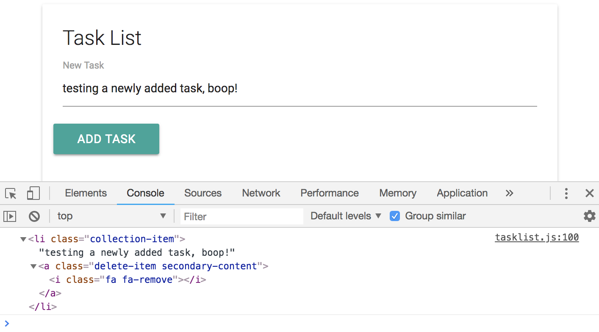
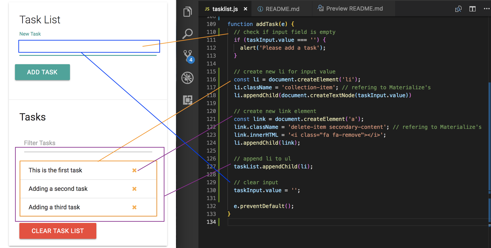

# Task List App

## Setup UI

**Get these CDNs:**

* Materialize CSS
* jQuery
* Font Awesome

**Layout inside ```<body>```:**

```
<div class="container">
  <div class="row">
    <div class="col s12">
      <div id="main" class="card">
        <div class="card-content">
          <span class="card-title">Task List</span>
          <div class="row">
            <form id="task-form">
              <div class="input-field col s12">
                <input type="text" name="task" id="task">
                <label for="task">New Task</label>
              </div>
              <input type="submit" value="Add Task" class="btn">
            </form>
          </div>
        </div>
      </div>
    </div>
  </div>
</div>
```
What it should look like:

<kbd></kbd>

**Create another section**

Go under the ```<div class="card-content">``` create another div with <div class="card-action">. Add an ```<h5>``` and below that, we want to have a filter input, so when we have a list of tasks later, we should be able to filter through them. As in, as we type, it'll filter through the list of tasks.

This'll be just a dynamic input.

```
<div class="card-action">
  <h5 id="task-title">Tasks</h5>
  <div class="input-field col s12">
    <input type="text" name="filter" id="filter">
    <label for="filter">Filter Tasks</label>
  </div>
</div>
```

Underneath the ```<div class="input-field col s12">``` in ```<div class="card-action">``` make a ```<ul>``` and it'll be where our list-items will be put in dynamically. Then under that, a Clear Task List button as a link with ```<a>```

```
<div class="card-action">
  <h5 id="task-title">Tasks</h5>
  <div class="input-field col s12">
    <input type="text" name="filter" id="filter">
    <label for="filter">Filter Tasks</label>
  </div>
  <ul class="collection"></ul>
    <a href="#" class="clear-tasks btn black">Clear Task List</a>
</div>
```

<kbd></kbd>


## Add Task Items

**Define UI Variables**

<kbd></kbd>


Our ```addTask``` function will take in one parameter of ```e``` to handle our event. Also add in ```e.preventDefault()``` to stop the default behavior which is a form submit.

Inside, create a condition to check if there is a value in the input field. If ```taskInput``` is equal to nothing, then, we'll alert the user to input something.

**Function for Add Task**

```
function addTask(e) {
  if (taskInput.value === '') {
    alert('Please add a task');
  }

  e.preventDefault();
}
```

Now, when we add a task, we want to be able to make an ```<li>``` element. First, create a variable ```const li = document.createElement('li');``` and then add a class to it. Next, ```createTextNode``` and ```appendChild``` to the li variable. Inside ```createTextNode()``` add whatever you want to pass into the input to be the text node, we want the value of ```taskInput```.

```
function addTask(e) {
  if (taskInput.value === '') {
    alert('Please add a task');
  }

  // create list-item
  const li = document.createElement('li');

  // add class
  li.className = 'collection-item'; // refering to Materialize's className

  // create text node and append to the li
  li.appendChild(document.createTextNode(taskInput.value))


  e.preventDefault();
}
```

Next, create a new link element for the ```x``` icon link to delete the task. 
* First, create ```const link = document.createElement('a');```
* Then add a class to that with ```link.className = 'delete-item secondary-content';```In Materialize, if you want something to the right, use ```secondary-content``` for class. 
* After, add the icon HTML ```link.innerHTML = '<i class="fa fa-remove"></i>';```
* Next, append the link to the li with ```li.appendChild(link);```

```
function addTask(e) {
  // check if input field is empty
  if (taskInput.value === '') {
    alert('Please add a task');
  }

  // create new li for input value
  const li = document.createElement('li');
  li.className = 'collection-item'; // refering to Materialize's className
  li.appendChild(document.createTextNode(taskInput.value))

  // create new link element
  const link = document.createElement('a');

  // add class
  link.className = 'delete-item secondary-content'; // refering to Materialize's className

  // add icon html
  link.innerHTML = '<i class="fa fa-remove"></i>';

  // append the link variable to li
  li.appendChild(link);

  // test
  console.log(li);

  e.preventDefault();
}
```

<kbd></kbd>

Finally, add li to ul, the <ul> is on the actual HTML we created earlier.

```
function addTask(e) {
  // check if input field is empty
  if (taskInput.value === '') {
    alert('Please add a task');
  }

  // create new li for input value
  const li = document.createElement('li');
  li.className = 'collection-item'; // refering to Materialize's
  li.appendChild(document.createTextNode(taskInput.value))

  // create new link element
  const link = document.createElement('a');
  link.className = 'delete-item secondary-content'; // refering to Materialize's
  link.innerHTML = '<i class="fa fa-remove"></i>';
  li.appendChild(link);

  // append li to ul
  taskList.appendChild(li);

  // clear input
  taskInput.value = '';

  e.preventDefault();
}
```

<kbd></kbd>

## Technology
* Vanilla JavaScript
* HTML, Materialize CSS
* Local Storage