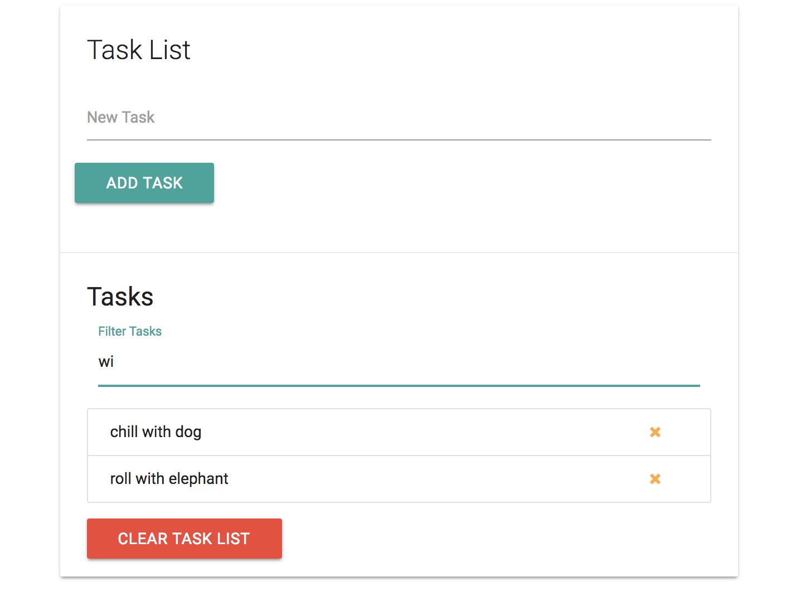

# Task List App

## Setup UI

**Get these CDNs:**

* Materialize CSS
* jQuery
* Font Awesome

**Layout inside ```<body>```:**

```
<div class="container">
  <div class="row">
    <div class="col s12">
      <div id="main" class="card">
        <div class="card-content">
          <span class="card-title">Task List</span>
          <div class="row">
            <form id="task-form">
              <div class="input-field col s12">
                <input type="text" name="task" id="task">
                <label for="task">New Task</label>
              </div>
              <input type="submit" value="Add Task" class="btn">
            </form>
          </div>
        </div>
      </div>
    </div>
  </div>
</div>
```
What it should look like:

<kbd></kbd>

**Create another section**

Go under the ```<div class="card-content">``` create another div with <div class="card-action">. Add an ```<h5>``` and below that, we want to have a filter input, so when we have a list of tasks later, we should be able to filter through them. As in, as we type, it'll filter through the list of tasks.

This'll be just a dynamic input.

```
<div class="card-action">
  <h5 id="task-title">Tasks</h5>
  <div class="input-field col s12">
    <input type="text" name="filter" id="filter">
    <label for="filter">Filter Tasks</label>
  </div>
</div>
```

Underneath the ```<div class="input-field col s12">``` in ```<div class="card-action">``` make a ```<ul>``` and it'll be where our list-items will be put in dynamically. Then under that, a Clear Task List button as a link with ```<a>```

```
<div class="card-action">
  <h5 id="task-title">Tasks</h5>
  <div class="input-field col s12">
    <input type="text" name="filter" id="filter">
    <label for="filter">Filter Tasks</label>
  </div>
  <ul class="collection"></ul>
    <a href="#" class="clear-tasks btn black">Clear Task List</a>
</div>
```

<kbd></kbd>


## Add Task Items

**Define UI Variables**

<kbd></kbd>


Our ```addTask``` function will take in one parameter of ```e``` to handle our event. Also add in ```e.preventDefault()``` to stop the default behavior which is a form submit.

Inside, create a condition to check if there is a value in the input field. If ```taskInput``` is equal to nothing, then, we'll alert the user to input something.

**Function for Add Task**

```
function addTask(e) {
  if (taskInput.value === '') {
    alert('Please add a task');
  }

  e.preventDefault();
}
```

Now, when we add a task, we want to be able to make an ```<li>``` element. First, create a variable ```const li = document.createElement('li');``` and then add a class to it. Next, ```createTextNode``` and ```appendChild``` to the li variable. Inside ```createTextNode()``` add whatever you want to pass into the input to be the text node, we want the value of ```taskInput```.

```
function addTask(e) {
  if (taskInput.value === '') {
    alert('Please add a task');
  }

  // create list-item
  const li = document.createElement('li');

  // add class
  li.className = 'collection-item'; // refering to Materialize's className

  // create text node and append to the li
  li.appendChild(document.createTextNode(taskInput.value))


  e.preventDefault();
}
```

Next, create a new link element for the ```x``` icon link to delete the task. 
* First, create ```const link = document.createElement('a');```
* Then add a class to that with ```link.className = 'delete-item secondary-content';```In Materialize, if you want something to the right, use ```secondary-content``` for class. 
* After, add the icon HTML ```link.innerHTML = '<i class="fa fa-remove"></i>';```
* Next, append the link to the li with ```li.appendChild(link);```

```
function addTask(e) {
  // check if input field is empty
  if (taskInput.value === '') {
    alert('Please add a task');
  }

  // create new li for input value
  const li = document.createElement('li');
  li.className = 'collection-item'; // refering to Materialize's className
  li.appendChild(document.createTextNode(taskInput.value))

  // create new link element
  const link = document.createElement('a');

  // add class
  link.className = 'delete-item secondary-content'; // refering to Materialize's className

  // add icon html
  link.innerHTML = '<i class="fa fa-remove"></i>';

  // append the link variable to li
  li.appendChild(link);

  // test
  console.log(li);

  e.preventDefault();
}
```

<kbd></kbd>

Finally, add li to ul, the <ul> is on the actual HTML we created earlier.

```
function addTask(e) {
  // check if input field is empty
  if (taskInput.value === '') {
    alert('Please add a task');
  }

  // create new li for input value
  const li = document.createElement('li');
  li.className = 'collection-item'; // refering to Materialize's
  li.appendChild(document.createTextNode(taskInput.value))

  // create new link element
  const link = document.createElement('a');
  link.className = 'delete-item secondary-content'; // refering to Materialize's
  link.innerHTML = '<i class="fa fa-remove"></i>';
  li.appendChild(link);

  // append li to ul
  taskList.appendChild(li);

  // clear input
  taskInput.value = '';

  e.preventDefault();
}
```

<kbd></kbd>

## Delete Task

We need another event listener, each of the ```x``` icon has a class of ```delete-item``` and since there are mulitple of them and also dynamic, we need to use Event Delegation here. So that means, put the even listener on to the Task List itself, the ```<ul>```.

Go into the ```init()``` function for the load event listeners and create that'll listen for a ```click``` and call ```removeTask``` we'll create that function later.

```
const form = document.querySelector('#task-form');
const taskList = document.querySelector('.collection');
const clearButton = document.querySelector('.clear-tasks');
const filter = document.querySelector('#filter');
const taskInput = document.querySelector('#task');

// INITIALIZE
init();

// FUNCTION TO LOAD EVENT LISTENERS
function init() {
  // Add task event
  form.addEventListener('submit', addTask);
  // Remove task event
  taskList.addEventListener('click', removeTask);
}

// FUNCTION TO ADD TASK
function addTask(e) {
  // check if input field is empty
  if (taskInput.value === '') {
    alert('Please add a task');
  }

  // create new li for input value
  const li = document.createElement('li');
  li.className = 'collection-item'; // refering to Materialize's
  li.appendChild(document.createTextNode(taskInput.value))

  // create new link element
  const link = document.createElement('a');
  link.className = 'delete-item secondary-content'; // refering to Materialize's
  link.innerHTML = '<i class="fa fa-remove"></i>';
  li.appendChild(link);

  // append li to ul
  taskList.appendChild(li);

  // clear input
  taskInput.value = '';

  e.preventDefault();
}
```

**Remove Task Function**

This function ```removeTask``` is going to take an event parameter ```e``` and then remember, we need to target the ```x``` icon. So, we need to check and create a condition for that particular target. Use ```e.target.parentElement.classList.contains``` to get the ```<a>``` link.

Remember, we want the whole ```<li>``` to remove when the target element is clicked on. Right now the setup is, when you click on the target element, it logs ```<i>...</i>``` icon level, but we want to remove up to two levels of parent element, the ```<a>``` and then ```<li>```.

```
function removeTask(e) {
  if (e.target.parentElement.classList.contains('delete-item')) {
    // console.log(e.target);   // Test, logs <i>..</i>
    e.target.parentElement.parentElement.remove();
  }
}
```

We can also add confirmation to check if the user really wants to remove the task.

```
function removeTask(e) {
  if (e.target.parentElement.classList.contains('delete-item')) {
    // console.log(e.target);   // Test, logs <i>..</i>
    if (confirm('Are you sure you want to remove task?')) {
      e.target.parentElement.parentElement.remove();
    }
  }
}
```

## Clear Task Button

The while-loop, while there is a first child in the task list, ```taskList.firstChild``` meaning that there's still something in the list, then we want to ```taskList.removeChild(taskList.firstChild)```

```
function clearTasks() {
  // taskList.innerHTML = '';

  // while loop is faster
  while (taskList.firstChild) {
    taskList.removeChild(taskList.firstChild);
  }
}
```

## Filter Through Tasks

Add another event listener for filter, ```filter.addEventListener('keyup', filterTasks);``` inside the ```init()``` function, it's going to use the 'keyup' event type and call the filterTasks function.

```
// FUNCTION TO LOAD EVENT LISTENERS
function init() {

  // Add task event
  form.addEventListener('submit', addTask);

  // Remove task event
  taskList.addEventListener('click', removeTask);

  // Clear task event
  clearButton.addEventListener('click', clearTasks);

  // Filter tasks event
  filter.addEventListener('keyup', filterTasks);
}
```

First, get the value of whatever that's being typed in the input field. Turn it to lowercase so we can match correctly even if the user accidently has the caps-lock on.

Next, take all of the list items with ```document.querySelectorAll('.collection-item').forEach();``` and we can use ```forEach()``` bc ```querySelectorAll``` returns a ```NodeList```, but if we used ```getElementByClassName``` that would return an ```HTML Collection``` which we would have to convert to an array in order to use ```forEach()```. In the ```forEach()``` pass a function with ```task``` as a parameter for our iterator. Then, set a variable for ```item``` and set it to ```task.firstChild``` and then we want the ```textContent``` of that ```firstChild```. 

Afterwards, create a condition to check inside of ```document.querySelectorAll('.collection-item').forEach(function(task) {...}``` if ```item.toLowerCase()``` to make in not case-sensitive, and ```indexOf(text)``` and pass in the ```text``` that's the text that's being typed, we want to search in our list and pass it to ```indexOf()```, if there's no match, it's going to equal to ```-1``` so we want to say, if it's not equal to negative one ```!=``` then we want the task to show, set it to show with ```task.style.display = 'block';``` else hide it with 
```task.style.display = 'none';```

```
function filterTasks(e) {
  // get the input field value
  const text = e.target.value.toLowerCase();

  document.querySelectorAll('.collection-item').forEach(function(task) {
    const item = task.firstChild.textContent;

    if (item.toLowerCase().indexOf(text) != -1) {
      task.style.display = 'block';
    } else {
      task.style.display = 'none';
    }
    // console.log(item);  // test
  });

  // console.log(text); // test, it'll log input on keyup
}
```

<kbd></kbd>


## Technology
* Vanilla JavaScript
* HTML, Materialize CSS
* Local Storage