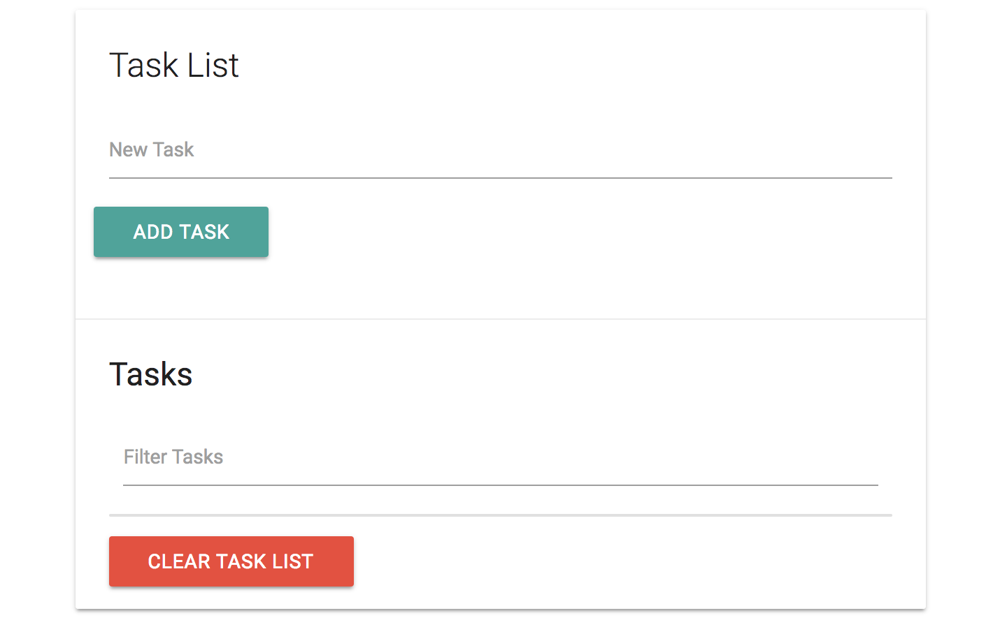

# Task List App

## Setup UI

**Get these CDNs:**

* Materialize CSS
* jQuery
* Font Awesome

**Layout inside ```<body>```:**

```
<div class="container">
  <div class="row">
    <div class="col s12">
      <div id="main" class="card">
        <div class="card-content">
          <span class="card-title">Task List</span>
          <div class="row">
            <form id="task-form">
              <div class="input-field col s12">
                <input type="text" name="task" id="task">
                <label for="task">New Task</label>
              </div>
              <input type="submit" value="Add Task" class="btn">
            </form>
          </div>
        </div>
      </div>
    </div>
  </div>
</div>
```
What it should look like:

<kbd></kbd>

**Create another section**

Go under the ```<div class="card-content">``` create another div with <div class="card-action">. Add an ```<h5>``` and below that, we want to have a filter input, so when we have a list of tasks later, we should be able to filter through them. As in, as we type, it'll filter through the list of tasks.

This'll be just a dynamic input.

```
<div class="card-action">
  <h5 id="task-title">Tasks</h5>
  <div class="input-field col s12">
    <input type="text" name="filter" id="filter">
    <label for="filter">Filter Tasks</label>
  </div>
</div>
```

Underneath the ```<div class="input-field col s12">``` in ```<div class="card-action">``` make a ```<ul>``` and it'll be where our list-items will be put in dynamically. Then under that, a Clear Task List button as a link with ```<a>```

```
<div class="card-action">
  <h5 id="task-title">Tasks</h5>
  <div class="input-field col s12">
    <input type="text" name="filter" id="filter">
    <label for="filter">Filter Tasks</label>
  </div>
  <ul class="collection"></ul>
    <a href="#" class="clear-tasks btn black">Clear Task List</a>
</div>
```

<kbd></kbd>


## Add Task Items


## Technology
* Vanilla JavaScript
* HTML, Materialize CSS
* Local Storage