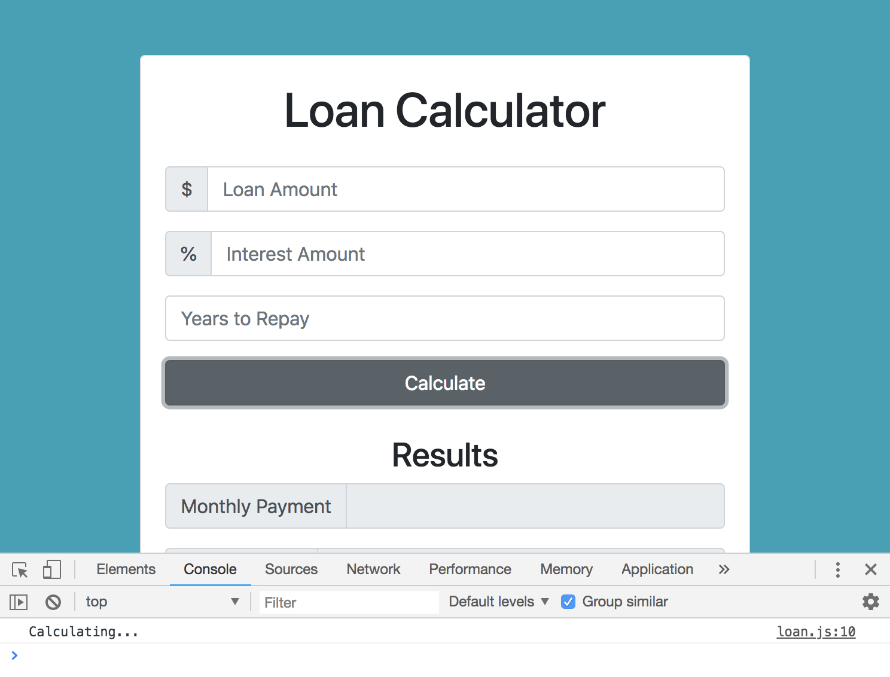
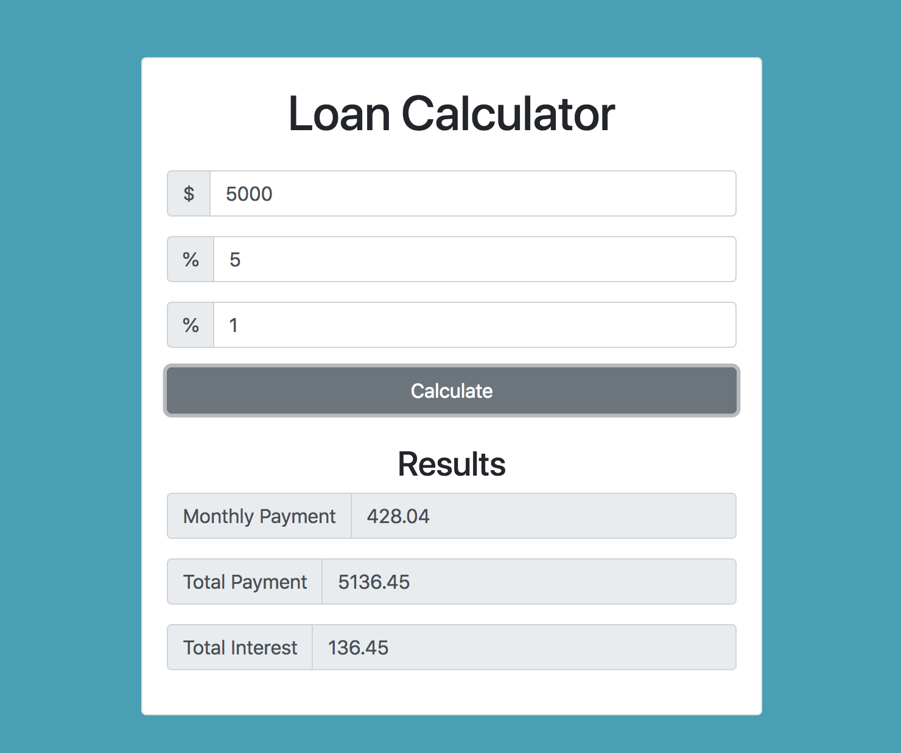
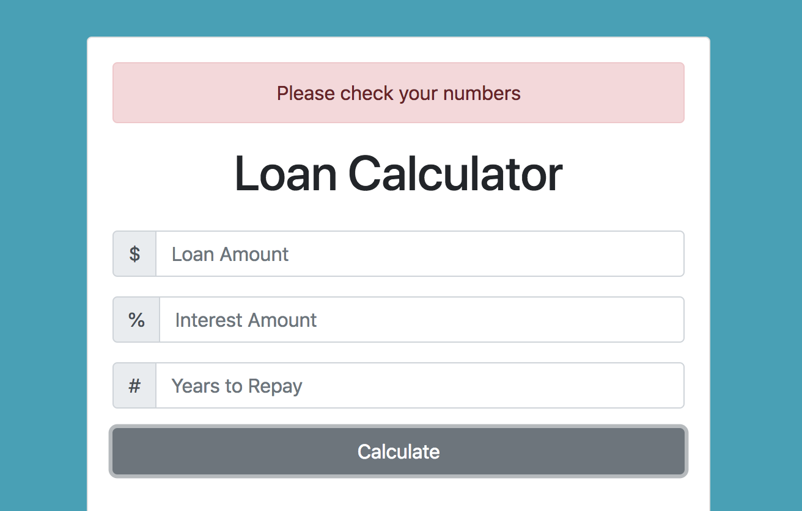

# Loan Calculator

## Technology
* Vanilla JavaScript
* HTML, Bootstrap v4.0

## Setup UI
* Bootstrap v4.0 - starter template

Add Bootstrap ```.container``` class, this puts everything in the middle, it'll add some margin-auto for margins on the sides.

Use the ```grid systeme``` inside the ```.container``` by inserting a ```.row```

Inside the ```.row```, we want a ```6``` column ```<div>```, so use the class ```col-md-6``` and add a class of ```mx-auto```, which is gonna push it into the middle giving it margin auto on the right and left sides.

Inside that, add a ```.card``` class with a another class of ```.card-body``` and for everything to be centered, add the class of ```text-center``` and also a class of ```mt-5``` which is for margin-top.

Now, you'll see an empty card in the middle bc we have that mx-auto class:

<kbd></kbd>

Next, add ```<h1>``` with class of ```heading``` (will grab for use later) Bootstrap class ```display-5``` and padding bottom with ```pb-3```.

Create the form with ```id="loan-form"``` and inside of it, we want to use Bootstrap's ```.form-group``` class. In Bootstrap, you want your inputs and labels wrapped in a ```.form-gorup``` div. 

We're gonna use ```.input-group``` from Bootstrap bc we want to put the ```$``` to the left of the acutal input. Next, make a ```<span>``` for the ```$``` in Boostrap's  ```.input-group-prepend``` and the below that, ```<input>``` with class of ````.form-control``` bc it'll style the input with padding, makes it a block-level element and also ```id="amount"``` so we can grab it later when we write in JS.

```
<form id="loan-form">
  <div class="form-group">
    <div class="input-group mb-3">
      <div class="input-group-prepend">
        <span class="input-group-text">$</span>
      </div>
      <input type="number" class="form-control" id="amount" aria-label="Loan Amount (to the nearest dollar)" placeholder="Loan Amount">
    </div>
  </div>
</form>
```

Now create a form input group for the interest amount, and just change the input id to ```interest``` so we can grab and use it later. Also change the placeholder holder and aria-lable to interest.

```
<div class="form-group">
  <div class="input-group mb-3">
    <div class="input-group-prepend">
      <span class="input-group-text">%</span>
    </div>
    <input type="number" class="form-control" id="interest" aria-label="Interest Amount (to the nearest dollar)" placeholder="Interest Amount">
  </div>
</div>
```

Next thing we want is repayment years.

```
<div class="form-group">
  <input type="number" class="form-control" id="years" aria-label="Years to Repay" placeholder="Years to Repay">
</div>
```

Finally, for our Submit button with a type of submit.

```
<div class="form-group">
  <input type="text" value="Calculate" class="btn btn-dark btn-block">
</div>
```

<kbd></kbd>

Then, add the results section.

<kbd></kbd>

## Functionality to Our Calculator

```
// Listen for Submit on Form
const loanForm = document.querySelector('#loan-form');

// Add Event Listeners
loanForm.addEventListener('submit', calculateResults);


// Function to calculateResults()
function calculateResults(e) {
  console.log('Calculating...'); // test if function works

  e.preventDefault();
}
```

<kbd></kbd>

Next, grab all the info from the UI and put each in const variables and place them inside the ```calculateResults``` function.

```
const amount = document.querySelector('#amount');
const interest = document.querySelector('#interest');
const years = document.querySelector('#years');
const monthlyPayment = document.querySelector('#monthly-payment');
const totalPayment = document.querySelector('#total-payment');
const totalInterest = document.querySelector('#total-interest');
```

To calculate, we'll do it inside the ```calculateResults``` function as well below the UI variables. We'll setup formula variables.

* Principal - is the amount, we want the input as a number value as float, so we have to use ```parseFloat()``` that'll turn it into a decimal, pass the ```amount.value``` as the parameter. ```amount``` is talking about the input value from the client-side, the UI variable that we create above.

* Calculated Interest - this is the ```interest``` input value, the variable we created above grabbing from the input on UI, as a float. Then we're gonna divide by ```100``` and also ```12``` to give us our calculated interest.

* Calculate Payments - is gonna be the ```years``` value.

```
const principal = parseFloat(amount.value);
const calcInterest = parseFloat(interest.value) / 100 / 12;
const calcPayments = parseFloat(years.value);
```

Compute monthly payments and check to see if monthly result is a finite number. Use the JavaScript method, ```isFinite()```. If it is finite, display in the results field of Monthly Payment, the variable we created as ```monthlyPayment``` add/connect with ```value``` in that field, and set it to ```monthly```. We want this to have decimal points so use the method ```toFixed()``` and set the number of decimals you want and here, we want ```2```. Next thing we want is the Total Payment value, which we created ```totalPayment``` variable. So, ```totalPayment.value``` and set that to ```monthly``` times the ```calcPayments``` with ```.toFixed(2)``` for our two decimal places. The last thing we want is ```totalInterest.value``` and set to ```((monthly * calcPayments) - principal).toFixed(2)```

```
if (isFinite(monthly)) {
  monthlyPayment.value = monthly.toFixed(2);
  totalPayment.value = (monthly * calcPayments).toFixed(2);
  totalInterest.value = ((monthly * calcPayments) - principal).toFixed(2);
} else {
  console.log('Error, please check your numbers.');
} 
```

<kbd></kbd>

## Error Alert for UI

Error handling to show on the UI for client-side. We're gonna do the ```createElement``` method from the Document Object and build the alert on JavaScript, rather than just showing the error in the console.

```
const errorDiv = document.createElement('div');
```

Call a function called ```showError``` inside the check on the ```else``` section, we'll create later.

```
if (isFinite(monthly)) {
  monthlyPayment.value = monthly.toFixed(2);
  totalPayment.value = (monthly * calcPayments).toFixed(2);
  totalInterest.value = ((monthly * calcPayments) - principal).toFixed(2);
} else {
  // console.log('Error, please check your numbers.');
  showError('Please check your numbers');
} 
```

Create ```showError``` function that'll take in ```error``` as a parameter. Create a variable ```errorDiv``` and set to ```document.createElement``` and the element we want to create is ```div```. 

In Bootstrap, when you want to show an alert, use the class of ```alert``` and ```alert-danger``` to make it red. On our soon to be created ```divError``` element, add ```className``` and set it to ```alert alert-danger```.

```
errorDiv.className = 'alert alert-danger';
```

Next create text node and append to div. So, on ```errorDiv``` we want to ```appendChild``` bc we want to insert something into it, we're gonna create a text node with ```document.createTextNode(error)``` and the text is gonna be whatever that's passed in the ```error``` parameter.

```
errorDiv.appendChild(document.createTextNode(error));
```

Grab two elements. We want the ```.card``` as the parent div and put it before the Loan Calculater heading.

```
const card = document.querySelector('.card');
const heading = document.querySelecotr('.heading');
```

Insert error before heading with ```card.insertBefore();``` you call it on a parent, and then you pass in the element you want to put in, like the ```errorDiv``` and put in whatever you want to insert before, which for us, the ```heading```.

```
// Show Error - create new element
function showError(error) {
  // create a div
  const errorDiv = document.createElement('div');

  // grab two elements
  const card = document.querySelector('.card');
  const heading = document.querySelector('.heading');

  // add class
  errorDiv.className = 'alert alert-danger';

  // create text node and append to div
  errorDiv.appendChild(document.createTextNode(error));

  // insert error above heading
  card.insertBefore(errorDiv, heading);
}
```

**Let's make the error dissappear too**

Use the method ```setTimeout()``` to have something happen after a certain amount of seconds. It takes in two parameters, one is a function, we'll create a name function later and use it as our first parameter, ```clearError```, and the second parameter is the number of seconds, it's in milliseconds.

<kbd></kbd>