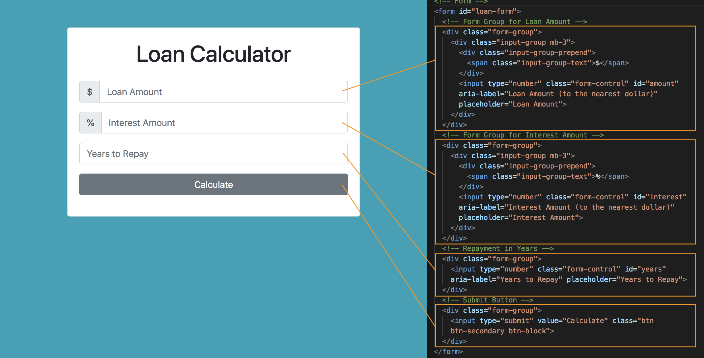
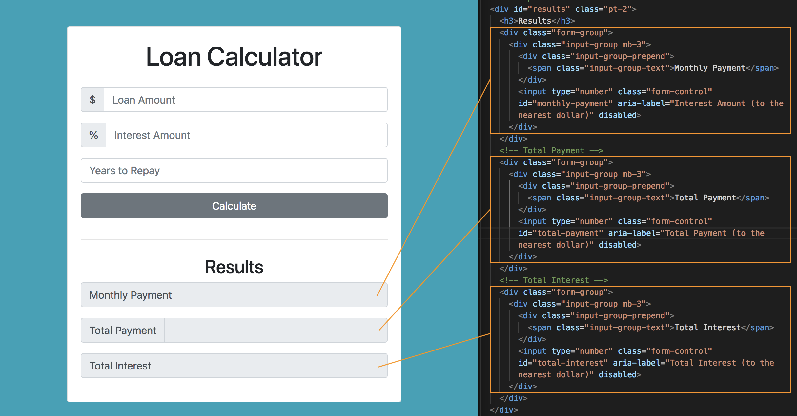

# Loan Calculator

## Technology
* Vanilla JavaScript
* HTML, Bootstrap v4.0

## Setup UI
* Bootstrap v4.0 - starter template

Add Bootstrap ```.container``` class, this puts everything in the middle, it'll add some margin-auto for margins on the sides.

Use the ```grid systeme``` inside the ```.container``` by inserting a ```.row```

Inside the ```.row```, we want a ```6``` column ```<div>```, so use the class ```col-md-6``` and add a class of ```mx-auto```, which is gonna push it into the middle giving it margin auto on the right and left sides.

Inside that, add a ```.card``` class with a another class of ```.card-body``` and for everything to be centered, add the class of ```text-center``` and also a class of ```mt-5``` which is for margin-top.

Now, you'll see an empty card in the middle bc we have that mx-auto class:

<kbd></kbd>

Next, add ```<h1>``` with class of ```heading``` (will grab for use later) Bootstrap class ```display-5``` and padding bottom with ```pb-3```.

Create the form with ```id="loan-form"``` and inside of it, we want to use Bootstrap's ```.form-group``` class. In Bootstrap, you want your inputs and labels wrapped in a ```.form-gorup``` div. 

We're gonna use ```.input-group``` from Bootstrap bc we want to put the ```$``` to the left of the acutal input. Next, make a ```<span>``` for the ```$``` in Boostrap's  ```.input-group-prepend``` and the below that, ```<input>``` with class of ````.form-control``` bc it'll style the input with padding, makes it a block-level element and also ```id="amount"``` so we can grab it later when we write in JS.

```
<form id="loan-form">
  <div class="form-group">
    <div class="input-group mb-3">
      <div class="input-group-prepend">
        <span class="input-group-text">$</span>
      </div>
      <input type="number" class="form-control" id="amount" aria-label="Loan Amount (to the nearest dollar)" placeholder="Loan Amount">
    </div>
  </div>
</form>
```

Now create a form input group for the interest amount, and just change the input id to ```interest``` so we can grab and use it later. Also change the placeholder holder and aria-lable to interest.

```
<div class="form-group">
  <div class="input-group mb-3">
    <div class="input-group-prepend">
      <span class="input-group-text">%</span>
    </div>
    <input type="number" class="form-control" id="interest" aria-label="Interest Amount (to the nearest dollar)" placeholder="Interest Amount">
  </div>
</div>
```

Next thing we want is repayment years.

```
<div class="form-group">
  <input type="number" class="form-control" id="years" aria-label="Years to Repay" placeholder="Years to Repay">
</div>
```

Finally, for our Submit button with a type of submit.

```
<div class="form-group">
  <input type="text" value="Calculate" class="btn btn-dark btn-block">
</div>
```

<kbd></kbd>

Then, add the results section.

<kbd></kbd>