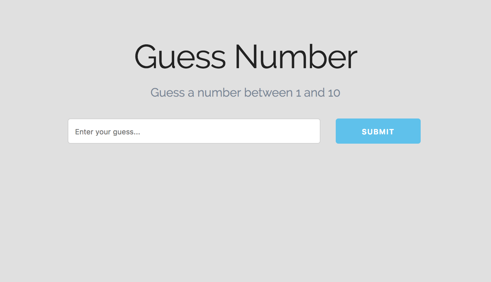

# Guess Number Game

Good way to learn more about changing and keeping track of values, working with the DOM and structuring things in application.

The game, guess a number between a certain range and find the range within the application we'll create, like 1-10. The player will enter a guess number. Then when player submits, it'll tell the player whether their is correct or incorrect, and also tells the player how guess is left. If guesses run out, it'll say something like 'sorry' and the correct answer. Also, once the guesses are all used up, the player can't enter another number anymore. This inability to add number seems little, but it adds to the user experience and making it clear on what the user is supposed to do.

## Technology

* Vanilla JavaScript
* HTML, Skeleton CSS
* Google Fonts - Raleway

## Setup UI

We're gonna use Skeleton CSS, a simple boilerplate, just use the CDN. Also create a custom css to change up the styling yourself.

<kbd></kbd>

## Validation and Winning Case Functionality

* Player must guess a number between a min and max
* Player has a limit amount of guesses
* Let player know the amount of guess remaining
* Let player know the correct answer when uses up all guesses
* Player can choose to play again

**Variables for Game Values**
```
let min = 1;
let max = 20;
let winningNumber = 19;
let guessesLeft = 3;
```

**Variables for UI Elements**
```
const game = document.querySelector('#game');
const minNumber = document.querySelector('.min-number');
const maxNumber = document.querySelector('.max-number'); 
const guessButton = document.querySelector('#guess-button');
const guessInput = document.querySelector('#guess-input');
const message = document.querySelector('.message');
```

**Assign UI min and max to show dynamically, so remove hard code html**
```
minNumber.textContent = min;
maxNumber.textContent = max;
```

**Create event listener for button to listen for click**
```
guessButton.addEventListener('click', submitGuess);
```

**Function action when button is clicked**
```
function submitGuess() {
  let guess = parseInt(guessInput.value);
  // console.log(guess);
  // console.log(typeof guess);

  // Validate input check to make it's not blank, not less than min or above max and is a number
  if (isNaN(guess) || guess < min || guess > max) {
    // change border color when incorrect
    guessInput.style.borderColor = 'red';
    // if any of the above is true, alert a message
    setMessage(`Please enter a number between ${min} and ${max}.`, 'red')
  }
}
```

**Function for setMessage**
```
function setMessage(msg, color) {
  message.style.color = color;
  message.textContent = msg;
}
```

Currently, the code is very repetitive in the validation part. We will optimize the code by creating a separate helper function for ending the game.

For border color, we'll do a conditional with a ternerary operator.