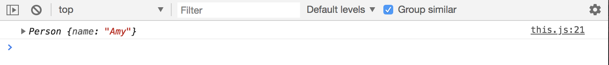
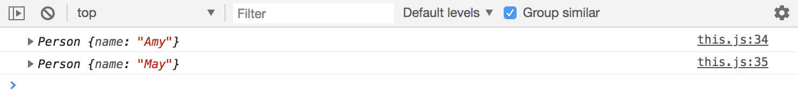
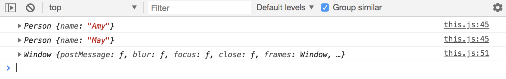
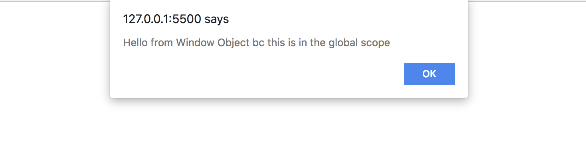
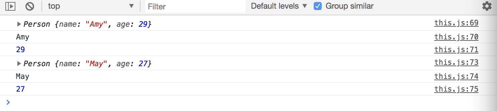
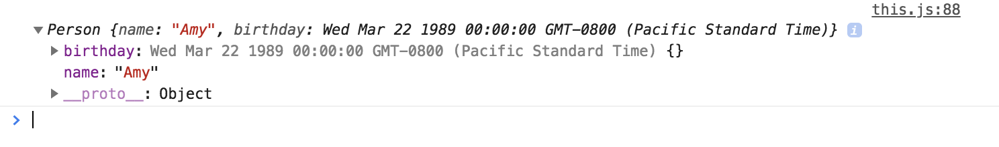
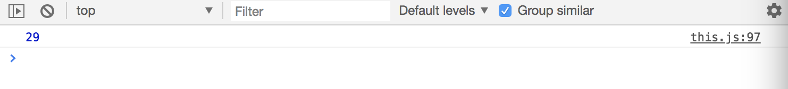

# Object Oriented Programming - JavaScript Constructors & the ```'this'``` Keyword

Learn JavaScript Constructors & the ```'this'``` Keyword works under the hood with ES5.

ES6 is more like syntactic sugar, meaning, designed to make things easier to read or express. ES6 makes it easier to write Object Oriented code, similar to Java, C#, PHP, and language that has classes.

## Object Literals Review

We've already looked at Object Literals, basically, just key-value pairs with different types, like:

```
const amy = {
  name: 'Amy',
  age: 29
}

console.log(amy);
console.log(amy.age);
console.log(amy.name);
```

This is useful for one object or one instance.

## JavaScript Constructor Method

If you want to make multiple instances of a certain type of object, then you're gonna want to create a Constructor. If you to get into Protoype and Inheritence, then you're gonna want to learn and use Constructors.

First, define a function and contructor name should start with a capital letter. This is a Constructor and it has one property called ```name```.

```
function Person () {
  this.name = 'Amy';
}
```

Just with these lines of codes, we can ```instantiate``` a person object from the ```Person``` constructor. To instantiate an object, we use the ```new``` keyword. So, first create a variable with a name like maybe ```amy``` and instead of literal way, use ```new``` and ```Person()```

```
function Person() {
  this.name = 'Amy';
}

const amy = new Person();

console.log(amy);
```

<kbd></kbd>

In the console, you'll see an object with a key name and value as Amy. Also, notice that before it, we have the actual object name ```Person```.

We can make as many people/person as we want, but ```Person()``` needs to take in an argument/parameter of something like ```name```, or whatever you want to name it. That way, when you create a new Person, you can construct it with a name. 


```
function Person(name) {
  this.name = name;
}

const amy = new Person('Amy');
const may = new Person('May');

console.log(amy);
console.log(may);
```

<kbd></kbd>

## ```this``` Keyword

The 'this' keyword is very important, it's referring to the first instance of the object. In this example, 'this' pertains to the ```Person``` function scope.

But, we can also use 'this' outside of the function scope, so it'll be in the global scope. In the global scope, you'll get the ```Window``` object.

<kbd></kbd>

You also do:

```
this.alert('Hello from Window Object bc this is in the global scope');
```

<kbd></kbd>

Just remember, when ```'this'``` is in the global scope, it pertains to the ```Window``` object.

## Add Other Properties

```
function Person(name, age) {
  this.name = name;
  this.age = age;
}

const amy = new Person('Amy', 29);
const may = new Person('May', 27);

console.log(amy);
console.log(amy.name);
console.log(amy.age);

console.log(may);
console.log(may.name);
console.log(may.age);
```
<kbd></kbd>

Birthday property instead of age. When we instantiate an object, we'll pass in a date of birth (dob), it'll be passed in as a string, a date with ```Date()``` and pass in the dob string. Notice that the Date() object, which is a core object of JavaScript also has a constructor, we're calling ```new``` Date().

```
function Person(name, dob) {
  this.name = name;
  this.birthday = new Date(dob);
}

const amy = new Person('Amy', 'March 22, 1989');

console.log(amy);
```

## Method within Constructor

<kbd></kbd>

Birthday property instead of age. When we instantiate an object, we'll pass in a date of birth (dob), it'll be passed in as a string, a date with ```Date()``` and pass in the dob string. Notice that the Date() object, which is a core object of JavaScript also has a constructor, we're calling ```new``` Date().

What we're gonna do is create a ```method``` on this constructor. Again, a ```method``` is a function that's inside of an object. Our method is going to calculate the age from the birthday by subtract ```Date.now()``` from ```dob``` with ```this.birthday.getTime()```.

Then, create another variable ```ageDate``` to create a date from that ```difference``` value. Next, return ```ageDate``` with ```getUTCFullYear``` which gives us the year and the specified date according to the universal time. From there, subtract 1970. Wrap the return statement in ```Math.abs``` for absolute value.

```
function Person(name, dob) {
  this.name = name;
  this.birthday = new Date(dob);
  this.calculateAge = function() {
    const difference = Date.now() - this.birthday.getTime();
    const ageDate = new Date(difference);
    return Math.abs(ageDate.getUTCFullYear() - 1970);
  }
}

const amy = new Person('Amy', 'March 22, 1989');

console.log(amy.calculateAge());
```

<kbd></kbd>