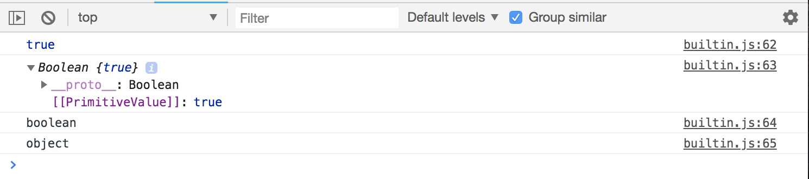
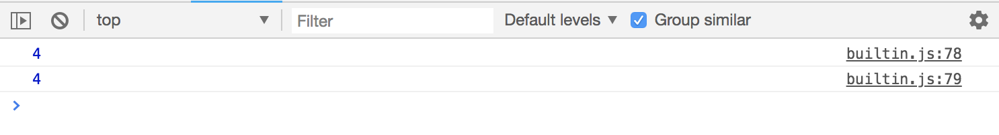
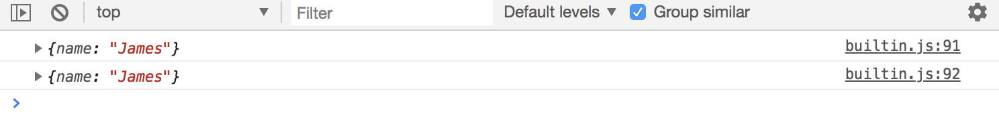
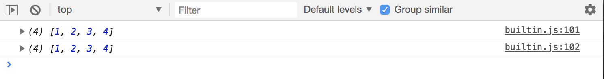
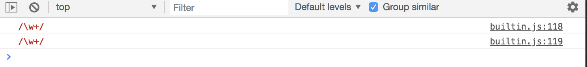

# Object Oriented Programming - JavaScript Built in Constructors

Here, we'll go over core objects constructors in JavaScript. There's lots but only a selected few is ok to use.

For instance, Primitive Types like string, numbers, booleans, can actually be created as Objects instead of Primitives by using certain constructors like ```String```, ```Number```, etc. Reason to why not to use it is bc it slows down execution speed, more code, kinda confusing and issues when you use the ```===``` triple equls operator when trying to compare values the value and type.

We'll go over these core object contstructures just to understand it, but don't have to use.

## String

```
// sets primitive value to a variable
const name1 = 'Joe';

// can create string as an object
const name2 = new String('James');

console.log(name1);
console.log(name2);
```

<kbd></kbd>

Notice that ```name2``` logs as an object. It gives ```PrimitiveValue``` as the key and ```James``` as the value and also gives index for each character of the string.

One thing we can do with the String object, is that we can add property to it. 

```
// sets primitive value to a variable
const name1 = 'Joe';

// can create string as an object
const name2 = new String('James');
// add property
name2.surname = 'Kennedy';

console.log(name2);
```

<kbd></kbd>

When you run into trouble with this is when you're matching types. ```name1``` will log as ```string```, while ```name2``` will log as ```object``` even though ```name2``` is a string, it's an Object, not a primitive value.

```
// sets primitive value to a variable
const name1 = 'Joe';

// can create string as an object
const name2 = new String('James');
// add property
name2.surname = 'Kennedy';

console.log(typeof name1);
console.log(typeof name2);
```

<kbd></kbd>

This is only the case for ```===```, but with ```==``` it may pass as a match in an if-statement.

## Number

Primitive number vs. Number object:

```
const num1 = 5;
const num2 = new Number(5);

console.log(num1);
console.log(num2);

console.log(typeof num1);
console.log(typeof num2);
```

<kbd></kbd>

## Boolean

Primitive boolean vs. Boolean object:

```
const bool1 = true;
const bool2 = new Boolean(true);

console.log(bool1);
console.log(bool2);

console.log(typeof bool1);
console.log(typeof bool2);
```

<kbd></kbd>

## Function

With Function object, looks weird, but it works.

```
const getSum1 = function(num1, num2) {
  return num1 + num2;
}

const getSum2 = new Function('num1', 'num2', 'return num1 + num2');

console.log(getSum1(2, 2));
console.log(getSum2(2, 2));
```

<kbd></kbd>

## Object

```
const james1 = {
  name: 'James'
}

const james2 = new Object({name: 'James'});

console.log(james1);
console.log(james2);
```

<kbd></kbd>

## Array

```
const arr1 = [1, 2, 3, 4];
const arr2 = new Array(1, 2, 3, 4);

console.log(arr1);
console.log(arr2);
```

<kbd></kbd>

## Regular Expression

If we want to create a regular expression, what you'd do is wrap it in two ```/ /```  forward slashes and then put the expression inside. In this case, put a backslash ```\w``` which represents a word character and then a ```+``` 

* ```\w+``` this expression means we're looking for a word character that occurs oen or more time.
* With ```RegEx()``` you need to use escape characters like ```\\w+\``` to get teh same as ```/\w+/```

```
const regex1 = /\w+/;
const regex2 = new RegExp('\\w+');

console.log(regex1);  // logs /\w+/
console.log(regex2);  // logs /w+/
```

<kbd></kbd>