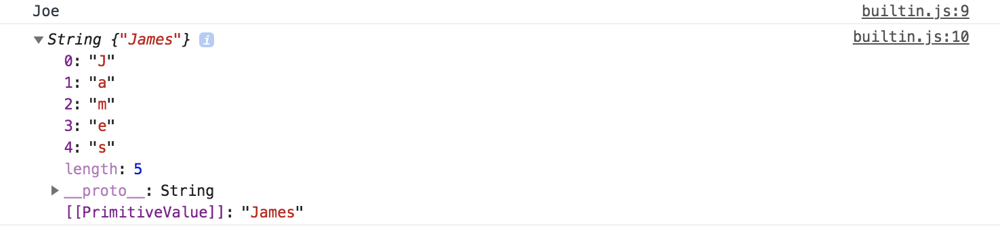
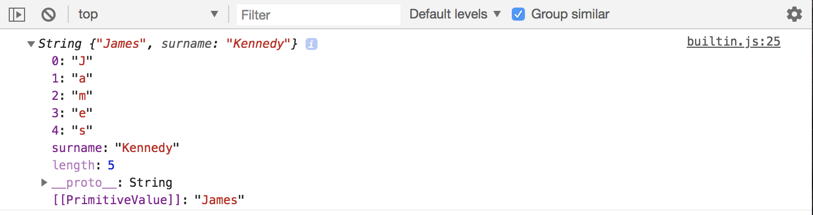
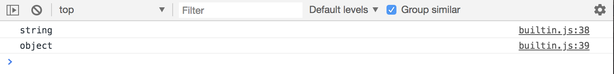
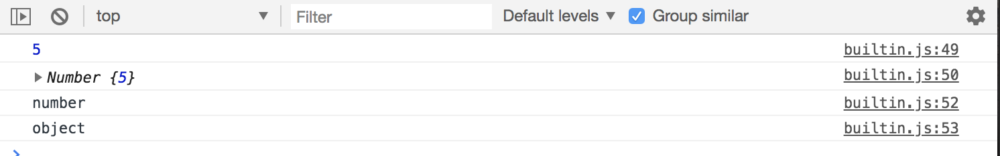

# Object Oriented Programming - JavaScript Built in Constructors

Here, we'll go over core objects constructors in JavaScript. There's lots but only a selected few is ok to use.

For instance, Primitive Types like string, numbers, booleans, can actually be created as Objects instead of Primitives by using certain constructors like ```String```, ```Number```, etc. Reason to why not to use it is bc it slows down execution speed, more code, kinda confusing and issues when you use the ```===``` triple equls operator when trying to compare values the value and type.

We'll go over these core object contstructures just to understand it, but don't have to use.

## String

```
// sets primitive value to a variable
const name1 = 'Joe';

// can create string as an object
const name2 = new String('James');

console.log(name1);
console.log(name2);
```

<kbd></kbd>

Notice that ```name2``` logs as an object. It gives ```PrimitiveValue``` as the key and ```James``` as the value and also gives index for each character of the string.

One thing we can do with the String object, is that we can add property to it. 

```
// sets primitive value to a variable
const name1 = 'Joe';

// can create string as an object
const name2 = new String('James');
// add property
name2.surname = 'Kennedy';

console.log(name2);
```

<kbd></kbd>

When you run into trouble with this is when you're matching types. ```name1``` will log as ```string```, while ```name2``` will log as ```object``` even though ```name2``` is a string, it's an Object, not a primitive value.

```
// sets primitive value to a variable
const name1 = 'Joe';

// can create string as an object
const name2 = new String('James');
// add property
name2.surname = 'Kennedy';

console.log(typeof name1);
console.log(typeof name2);
```

<kbd></kbd>

This is only the case for ```===```, but with ```==``` it may pass as a match in an if-statement.

## Number

Primitive number vs. Number object:

```
const num1 = 5;
const num2 = new Number(5);

console.log(num1);
console.log(num2);

console.log(typeof num1);
console.log(typeof num2);
```

<kbd></kbd>

## Boolean

