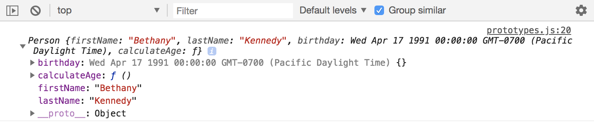
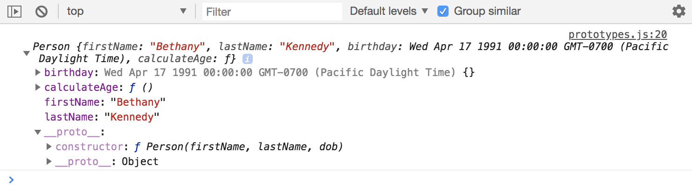
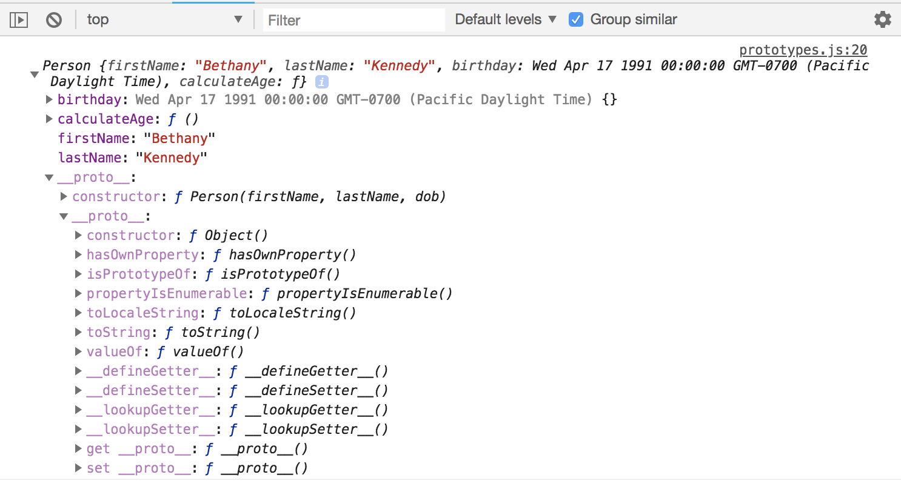
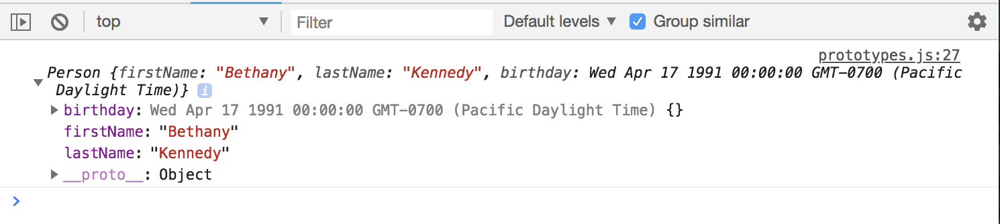
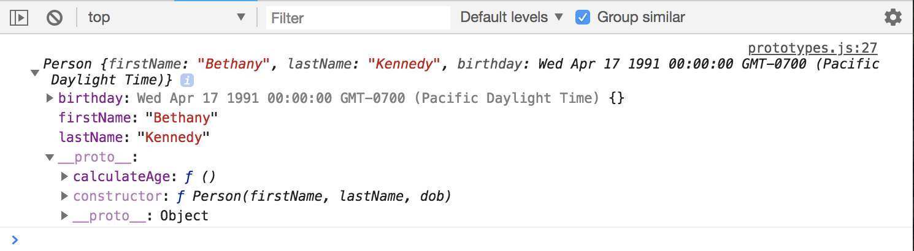
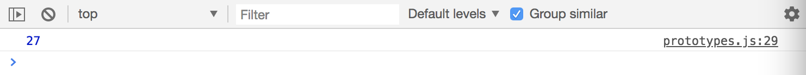

# Object Oriented Programming - JavaScript Prototypes

Prototype is one of the most confusing for beginners. 

* Each Object in JavaScript has a Prototype and a Prototype is an object itself.
* All Objects inherit their properties and methods from their Prototype.

## Object Literals: ```Object.prototype```

When dealing with Object Literals, then you're inheriting from a Prototype called ```Object.prototype```

## Object Constructors: like previous example, ```Person.prototype```

When dealing with Objects create through a Constructor like the ```Person()``` constructor created previously, it's gonna come from ```Person.prototype```

## Prototype Chain

This is where you have your create Object Contructor Prototype and then you can go up to the main ```Object.prototype```

```
// Person Contructor
function Person(firstName, lastName, dob) {
  this.firstName = firstName;
  this.lastName = lastName;
  this.birthday = new Date(dob);
  this.calculateAge = function() {
    const difference = Date.now() - this.birthday.getTime();
    const ageDate = new Date(difference);
    return Math.abs(ageDate.getUTCFullYear() - 1970);
  }
}

// Instantiate a new Person
const james = new Person('James', 'Kennedy', 'March 17, 1991')
const bethany = new Person('Bethany', 'Kennedy', 'April 17, 1991')

console.log(bethany);
```

<kbd></kbd>

Notice we have a ```Person``` object with a birthday in a form of date. We have ```firstName``` and ```lastName``` and a ```calculateAge``` function. Also, attached to this is a ```Prototype```.

A Prototype is not something we can access like in a ```for in``` loop if we were to loop through a property. But, the browser gives us a ```pseudo-property``` aka ```pointer``` called ```__proto__```

<kbd></kbd>

In ```__proto__``` what it represents is the ```Person.prototype``` so anything we put inside of ```Person.prototype``` will show up in there.

<kbd></kbd>

Now, notice that we have another ```__proto```, another pseudo-property, this represents ```Object.prototype``` which is the top of the **Prototype Chain** and this has its own properties and methods.

* ```hasOwnProperty``` - will return a boolean indicating if a specified property is inside of that Object.

## Person Constructor with Prototype Method

It's clear that each Person has to have their own firstName, lastName and birthday. So, those should be actual properties of this Person object. ```calculateAge``` however is going to be the same for every Person. There's no difference in that calculation function. So ```calculateAge``` is something we should put in the Prototype not directly in the object.

```
// Person Contructor
function Person(firstName, lastName, dob) {
  this.firstName = firstName;
  this.lastName = lastName;
  this.birthday = new Date(dob);
  // this.calculateAge = function() {
  //   const difference = Date.now() - this.birthday.getTime();
  //   const ageDate = new Date(difference);
  //   return Math.abs(ageDate.getUTCFullYear() - 1970);
  // }
}

// Instantiate a new Person
const james = new Person('James', 'Kennedy', 'March 17, 1991')
const bethany = new Person('Bethany', 'Kennedy', 'April 17, 1991')

// Calculate Age
Person.prototype.calculateAge = function() {
  const difference = Date.now() - this.birthday.getTime();
  const ageDate = new Date(difference);
  return Math.abs(ageDate.getUTCFullYear() - 1970);
}

console.log(bethany);
console.log(james.calculateAge());
```

<kbd></kbd>

Notice that we have irstName, lastName and birthday, but calculateAge is no longer there. But look into ```Person.prototype``` by clicking on ```__proto__``` you'll see that ```calculateAge``` is there. We've now moved it into the Prototype.

<kbd></kbd>

We can use this just as we did before, it works just as it were inside the Person constructor, as in part of the Object.

```
console.log(james.calculateAge());
```

<kbd></kbd>

## Another Prototype Method

