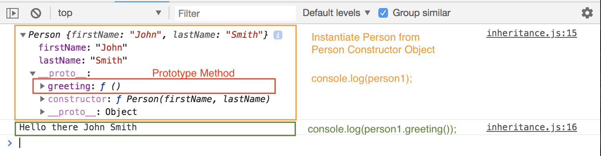
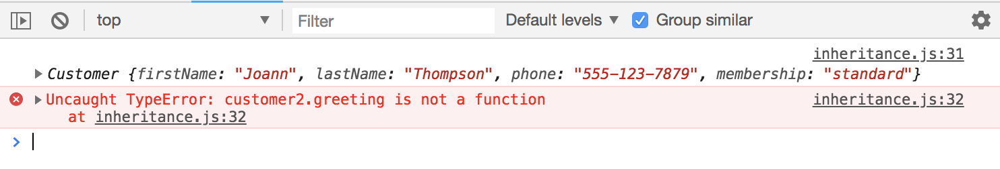
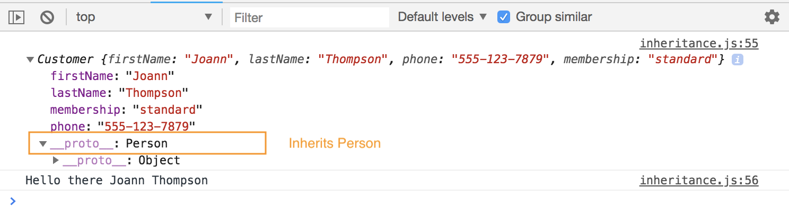
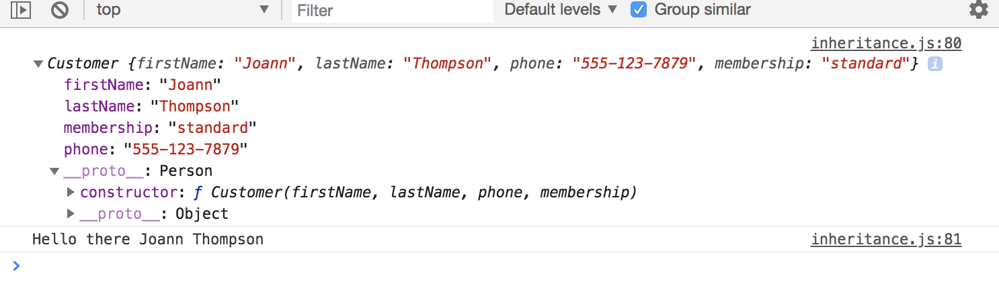
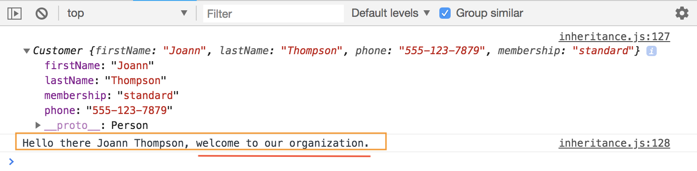
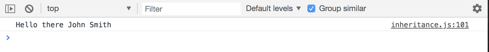

# Object Oriented Programming - JavaScript Protypal Inheritance

What if we want one Object type inherit from another? For example, we have another ```Person``` object again and have another ```Customer``` object that will inherit its prototype. 

## Person Constuctore

First, let's start with a simple setup:

```
// Person Constructor Object
function Person(firstName, lastName) {
  this.firstName = firstName;
  this.lastName = lastName;
}

// Prototype Method for Greeting
Person.prototype.greeting = function() {
  return `Hello there ${this.firstName} ${this.lastName}`;
}

// Instantiate a Person
const person1 = new Person('John', 'Smith');

console.log(person1);
console.log(person1.greeting());
```

<kbd></kbd>

## Customer Constructor

We'll create ```Customer``` function that takes in firstName, lastName, phone and memebership. Inside the function ```{}``` we want to call ```Person```, our Person Constructor, and add ```.call()``` bc it is a function that allows us to call another function from somewhere else in current context.

The first parameter in the ```.call()``` will be ```this```, and after that, we want whatever properties in the Constructor we're inferiting, in this case, firstName and lastName. Then, after that, whatever extra properties we have for Customer we need to just assign like we would normally in a Constructor.

```
function Customer(firstName, lastName, phone, membership) {
  Person.call(this, firstName, lastName);

  this.phone = phone;
  this.membership = membership;
}
```

Let's instantiate a Customer and call ```greeting()``` Protoype Method:

```
// Customer Constructor Object
function Customer(firstName, lastName, phone, membership) {
  Person.call(this, firstName, lastName);

  this.phone = phone;
  this.membership = membership;
}

// Instantiate or create a Customer
const customer2 = new Customer('Joann', 'Thompson', '555-123-7879', 'standard')

// console.log(customer2);
console.log(customer2);
console.log(customer2.greeting());
```

<kbd></kbd>

Notice that there's an error when calling ```greeting()``` bc it's not yet ingeriting the Prototype. So, we need to add a few lines of code for that to happen, using ```Customer.prototype = Object.create(Person.prototype);```

```
// Customer Constructor Object
function Customer(firstName, lastName, phone, membership) {
  Person.call(this, firstName, lastName);

  this.phone = phone;
  this.membership = membership;
}

// Inherit the Person protoype methods
Customer.prototype = Object.create(Person.prototype);

// Instantiate or create a Customer
const customer2 = new Customer('Joann', 'Thompson', '555-123-7879', 'standard')

// console.log(customer1);
console.log(customer2);
console.log(customer2.greeting());
```

Now, 'Hello there Joann Thompson' works, the ```greeting()``` prototype method works. Joann Thompson is a Customer, we set her up as a Customer not Person, and even though ```greeting()``` is part of the ```Person``` constructor as its prototype, we were able to use it by adding ```Object.create(Person.prototype)```

If you click on the proto pseudo selector, ```__proto__```, you'll see we have ```Person```.

<kbd></kbd>

 Next, we want this to actually return ```Customer```, so one more line of code is needed.

 ```
 // Customer Constructor Object
function Customer(firstName, lastName, phone, membership) {
  Person.call(this, firstName, lastName);

  this.phone = phone;
  this.membership = membership;
}

// Inherit the Person protoype methods
Customer.prototype = Object.create(Person.prototype);

// Make customer.prototype return Customer()
Customer.prototype.constructor = Customer;

// Instantiate or create a Customer
const customer2 = new Customer('Joann', 'Thompson', '555-123-7879', 'standard')

// console.log(customer1);
console.log(customer2);
console.log(customer2.greeting());
```

<kbd></kbd>

Now you can see in ```__proto__``` we're using the ```Customer``` constructor.

## Overwrite Person prototype with new prototype

Like if we want to create a separate ```greeting()``` for a customer, we should be able to do that.

Do that by ```Customer.prototype.greeting()``` and set that to a function and return a message.

```
Customer.prototype.greeting = function() {
  return `Hello there ${this.firstName} ${this.lastName}, welcome to our organization.`;
}
```

<kbd></kbd>

Now, if we were to call the Person greeting(),

```
console.log(person1.greeting());
```

that one will just be, ```Hello there John Smith```

<kbd></kbd>

As you see, Person greeting will stay the same. With that said, we can't technically overwrite it, but any prototype we add through Person, will be accessbile through Customer. That's how we do Inheritance.