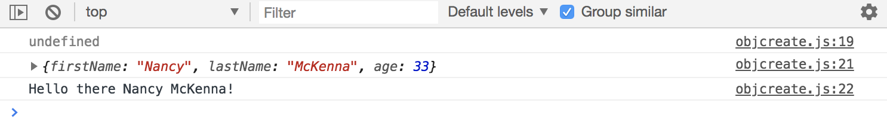

# Object Oriented Programming - Using ```Object.create```

Another way to create Object using ```Object.create``` we can create Prototypes inside of, kind of like a parent Object, and then have different properities with different prototype methods/functions.

```Object.create``` will take in prototypes.

## Simple Way to Create Objects

```
// create a variable as an object with different proto methods
const personPrototypes = {
  greeting: function() {
    return `Hello there ${this.firstName} ${this.lastName}!`;
  }
}

// create an object
const nancy = Object.create(personPrototypes);
```

We can also add properties to this ```nancy``` object.

```
// add properties
nancy.firstName = 'Nancy';
nancy.lastName = 'Powers';
nancy.age = 33;

console.log(nancy);
```

<kbd></kbd>

If we look in the ```__proto__``` you'll see we have ```greeting()``` in there.

```
console.log(nancy);
console.log(nancy.greeting());
```

<kbd></kbd>

Let's do another method inside personPrototypes object with ```getsMarried``` and it's going to take in a new lastname.

```
// create a variable as an object with different proto methods
const personPrototypes = {
  greeting: function() {
    return `Hello there ${this.firstName} ${this.lastName}!`;
  },
  getsMarried: function(newLastName) {
    this.lastName = newLastName;
  }
}

// create an object
const nancy = Object.create(personPrototypes);

// add properties
nancy.firstName = 'Nancy';
nancy.lastName = 'Powers';
nancy.age = 33;

console.log(nancy.getsMarried('McKenna'));
console.log(nancy);
console.log(nancy.greeting());
```

<kbd></kbd>

## Create Object with Constructors

Here, we'll use different syntax of creating Object, but we'll add the second parameter as an object and each property is gonna be an object for each as well. Each of those property as objects will have ```value:``` as their key and then the actual value as the value like ```Rowan```.

```
const rowan = Object.create(personPrototypes, {
  firstName: {value: 'Rowan'},
  lastName: {value: 'Hallet'},
  age: {value: 35}
});

console.log(rowan);
```

<kbd></kbd>

In the ```__proto__``` you can see that it also has ```greeting()```, let's call it:

<kbd></kbd>

So, this is just an alternative way to create Objects using ```Object.create()``` method.