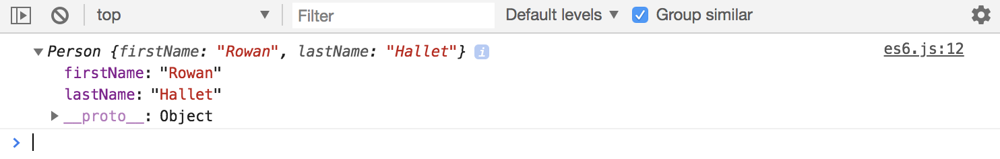
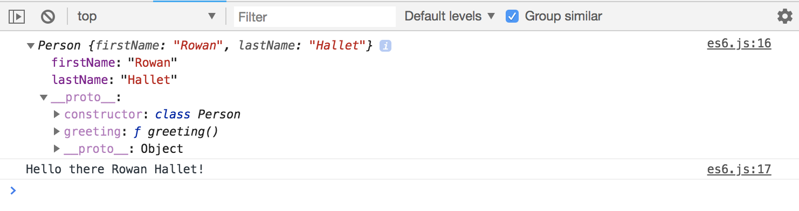
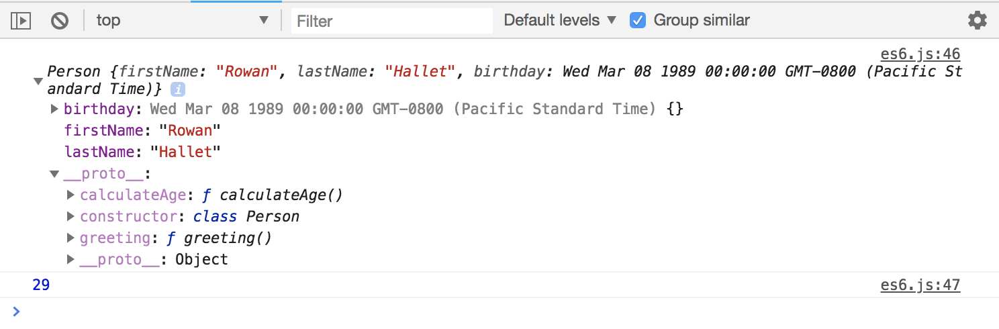
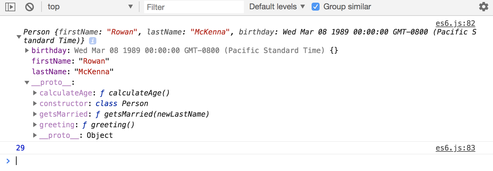

# Object Oriented Programming - ES6 Classes

Gives us a much easier, cleaner syntax for creating Objects. It basically runs on top of the previous way of creating Objects, but it's much easier to write, especially if you come from another programming language like PHP, Java, Python, Ruby on Rails - these all use classes to build Objects. So yeah, ES5 is kinda weird compared to other languages. So ES6 was created to I guess be more similar to how other languages build Objects! 

So far, we've already started using some ES6 features in the previous examples like:

* ```let``` and ```const```
* template strings

We'll learn more later on more ES6+ newer features.

Now, almost all ES6 is compatible with all modern browsers. If you want it to work for older browsers versions, you need to compile it down to ES5 - we'll learn later as well. ES6 are currently fully compliant in Chrome, FireFox, Edge, Safari, so all the modern browsers essentially, so we don't need to compile for these.

## Process for Creating Class

* create class
* create a constructor as a function
* have methods and properties inside of our class

Let's create a ```class Person``` add ```{}``` and inside use ```constructor()``` function and include properties we want to set inside the constructor's ```()``` like ```firstName``` and ```lastName```. And then set ```this.firstName = firstName```, etc. We can use ```this``` anywhere in the class.

```
// create a class
class Person {
  constructor(firstName, lastName) {
    this.firstName = firstName;
    this.lastName = lastName;
  }
}
```

Just with this, we can create an Object and it's the same as the previous ones we've done when creating/instantiating.

```
// create object
const rowan = new Person('Rowan', 'Hallet');

console.log(rowan);
```

<kbd></kbd>

Notice that even though we're using ES6 classes, we still have the ```__proto__: Object``` and when you look in there, we have a ```constuctor``` method with ```class Person```. So, under the hood, in the JavaScript engine, it works almost the exact same way, that's why ```classes``` are called ```syntactic sugar``` as in a convient syntax because it's basically changing the way that we write them, not the way that it works underlying engine or language.

<kbd></kbd>

## Add Another Method to Class

Let's see what happens if we add another method inside our ```Person``` class.

Add a method inside th ```Person``` class below ```constructor()``` function, name the method ```greeting```. We don't have to do ```.prototype``` just define a method. Then inside the ```greeting()``` method, return a message in template literals.

```
// create a class
class Person {
  constructor(firstName, lastName) {
    this.firstName = firstName;
    this.lastName = lastName;
  }

  greeting() {
    return `Hello there ${this.firstName} ${this.lastName}!`;
  }
}

// create object
const rowan = new Person('Rowan', 'Hallet');

console.log(rowan.greeting());
```

When you log out ```rowan``` and look into the ```__proto__``` notice that you have the ```greeting()``` method in there.

<kbd></kbd>

So, anything method you add to the ```class``` is going to be added to the ```prototype``` and we still have the ```Object.prototype``` as well.

## Add Calculate Age Method

Let's go ahead and add ```calculateAge```.

* Pass ```dob``` as the third argument for the  ```constructor``` function.
* Create ```this.birthday``` property and set to ```new Date(dob);```
* Create another method to ```calculateAge```

```
class Person {
  constructor(firstName, lastName, dob) {
    this.firstName = firstName;
    this.lastName = lastName;
    this.birthday = new Date(dob);
  }

  greeting() {
    return `Hello there ${this.firstName} ${this.lastName}!`;
  }

  calculateAge() {
    const currentDate = Date.now();
    const personBday = this.birthday.getTime();
    const difference = currentDate - personBday;
    const ageDate = new Date(difference);
    return Math.abs(ageDate.getUTCFullYear() - 1970);
  }
}

// create object
const rowan = new Person('Rowan', 'Hallet', 'March 8, 1989');

console.log(rowan);
console.log(rowan.calculateAge()); 
```

If you look at the ```rowan``` object in ```__proto__``` you'll see the ```calculateAge``` method.

<kbd></kbd>

## Add Gets Married Method

This method example will show that these methods can also take in parameters/arguments.

```
class Person {
  constructor(firstName, lastName, dob) {
    this.firstName = firstName;
    this.lastName = lastName;
    this.birthday = new Date(dob);
  }

  greeting() {
    return `Hello there ${this.firstName} ${this.lastName}!`;
  }

  calculateAge() {
    const currentDate = Date.now();
    const personBday = this.birthday.getTime();
    const difference = currentDate - personBday;
    const ageDate = new Date(difference);
    return Math.abs(ageDate.getUTCFullYear() - 1970);
  }

  getsMarried(newLastName) {
    this.lastName = newLastName;
  }
}

// create object
const rowan = new Person('Rowan', 'Hallet', 'March 8, 1989');

rowan.getsMarried('McKenna');

console.log(rowan);
console.log(rowan.calculateAge());  
```

<kbd></kbd>


That's the core basic of how ```classes``` work in ES6. Very similar to other languages, maybe a bit easier. 
