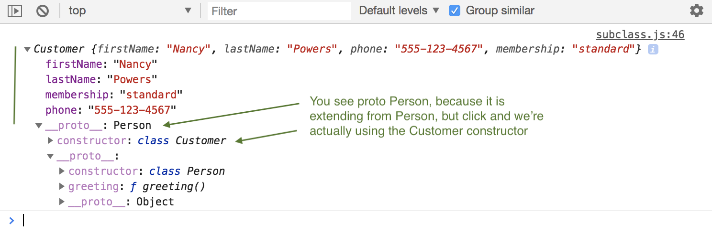
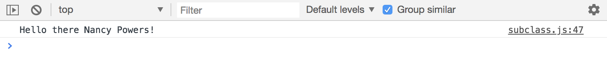

# Object Oriented Programming - Sub Classes

This is Inheritance in ES6 classes, better known as Sub Classes.

For instance, we can create a Person class and then create a Sub Class like maybe Customer, or whatever, and then, we can extend the Person class.

## Create Person Class with Constructor

```
class Person {
  constructor(firstName, lastName) {
    this.firstName = firstName;
    this.lastName = lastName;
  }
}
```

Give it the ```greeting()``` method.

```
class Person {
  constructor(firstName, lastName) {
    this.firstName = firstName;
    this.lastName = lastName;
  }

  greeting() {
    return `Hello there ${this.firstName} ${this.lastName}!`;
  }
}
```

## Now, Extend Person Class to Customer Class

So say, ```class Customer``` and then say ```extends``` ```Person{}```.

* ```class Customer``` is the class we're creating.
* ```Person``` is the class we're extending, so this will be a sublcass of Person.
* Also needs ```constructor``` function. It will take in the parameters like firstName and lastName, but it will also take in phone and membership.

```
class Customer extends Person {
  constructor(firstName, lastName, phone, membership) {

  }
}
```

When we instantiate a Customer, since it's extending a person, we want to call the ```Person``` constructor, and we need to that with the method/function called ```super()```

Hooray! This ```super()``` is in ReactJS, which is a JavaScript framework, this just calls the parents Class constructor. 

In ```super()``` we have to pass in firstName and lastName bc it extends from ```Person```. Then, anything extra that's gonna be just in the Customer class, and not in the Person class, we define like normal with ```this``` below the ```super()```.

```
class Person {
  constructor(firstName, lastName) {
    this.firstName = firstName;
    this.lastName = lastName;
  }

  greeting() {
    return `Hello there ${this.firstName} ${this.lastName}!`;
  }
}

class Customer extends Person {
  constructor(firstName, lastName, phone, membership) {
    super(firstName, lastName);

    this.phone = phone;
    this.membership = membership;
  }
}
```

## Instantiate a new Customer

```
const nancy = new Customer('Nancy', 'Powers', '555-123-4567', 'standard');

console.log(nancy);
```

<kbd></kbd>

## Call ```greeting()``` method on new Customer Instantiated

```
console.log(nancy.greeting());
```

<kbd></kbd>

There's no greeting in Customer, but we're abel to use anything in Person bc we extended it.

## Create Customer Specific Methods

Let's create static method first

```
class Person {
  constructor(firstName, lastName) {
    this.firstName = firstName;
    this.lastName = lastName;
  }

  greeting() {
    return `Hello there ${this.firstName} ${this.lastName}!`;
  }
}

class Customer extends Person {
  constructor(firstName, lastName, phone, membership) {
    super(firstName, lastName);

    this.phone = phone;
    this.membership = membership;
  }

  static getMembershipFee() {
    return 100;
  } 
}

const nancy = new Customer('Nancy', 'Powers', '555-123-4567', 'standard');

console.log(Customer.getMembershipFee());       // Logs 100
```