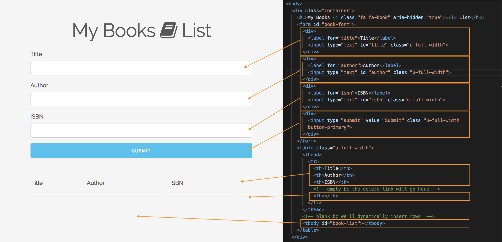
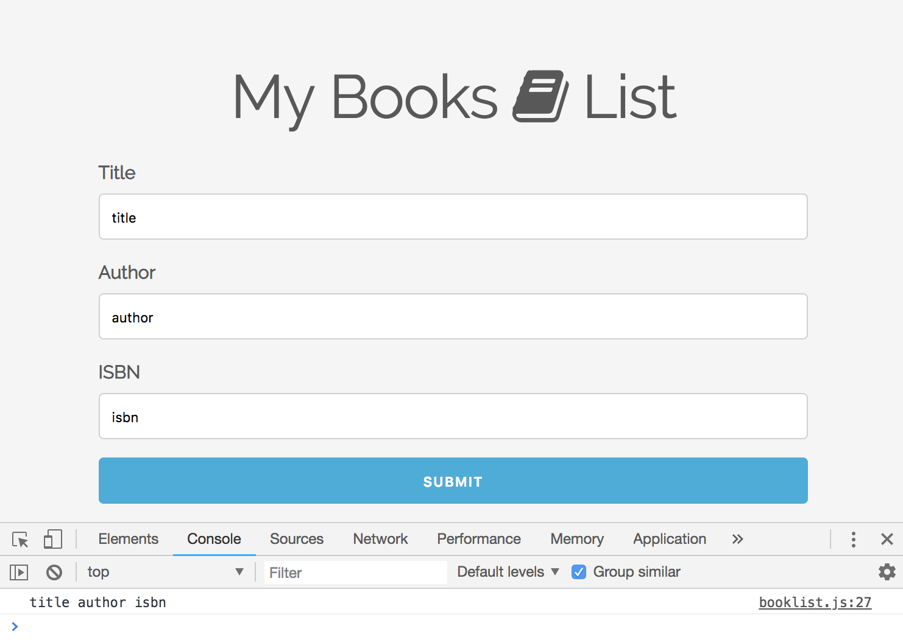
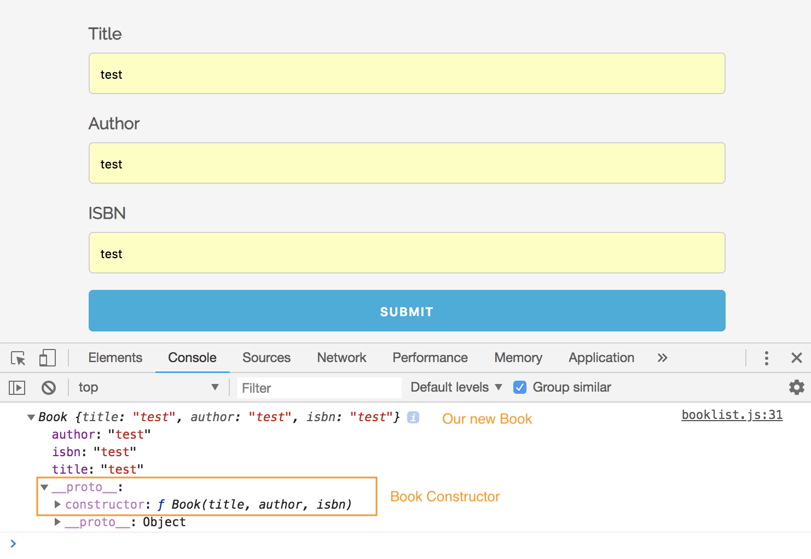

# Book List - Built in ES5

Gonna use Object Oriented Programming in ES5 Syntax, everything will happen in the UI, no database for this project. 

* Can add book to list
* Recieve an alert for submission
* A book will be added to your list below
* Alert error if field is empty
* Can also delete book from list

Simple application, but will show you how to build something with Object Oriented Programming with Vanilla JavaScript.

## Setup UI

* HTML and Skeleton CDN
* Font Awesome
* Google Fonts

Creating the form section in HTML file:

```
<body>
  <div class="container">
    <h1>Add Book</h1>
    <form id="book-form">
      <div>
        <label for="title">Title</label>
        <input type="text" id="title" class="u-full-width">
      </div>
      <div>
        <label for="author">Author</label>
        <input type="text" id="author" class="u-full-width">
      </div>
      <div>
        <label for="isbn">ISBN</label>
        <input type="text" id="isbn" class="u-full-width">
      </div>
      <div>
        <input type="submit" value="Submit" class="u-full-width button-primary">
      </div>
    </form>
...
```

* ```class="u-full-width"``` is a Skeleton class that'll make it a block-level input, takes up whole width.

Create the table section for the list of books in HTML file:

```
...
    <table class="u-full-width">
      <thead>
        <tr>
          <th>Title</th>
          <th>Author</th>
          <th>ISBN</th>
          <!-- empty bc the delete link will go here -->
          <th></th>
        </tr>
      </thead>
      <!-- blank bc we'll dynamically insert rows  -->
      <tbody id="book-list"></tbody>
    </table>
  </div>

  <script src="booklist.js"></script>
</body>
```

<kbd></kbd>

Add classes for alerts in CSS file:

```
.success, error {
  color: #ffffff;
  padding: 5px;
  margin: 5px 0 15px 0;
}

.success {
  background: green;
}

.error {
  background: red;
}
```

## JS File Time! Use ES5 Object Oriented Programming~

* Constructors
* Prototype Methods

**Book Constructor**
Handles creating the actual book object.

```
function Book(title, author, isbn) {
  this.title = title;
  this.author = author;
  this.isbn = isbn;
}
```

**UI Constructor**
Will be a set of prototype methods to do things like add book to the list, delete book, show alert - things that have to do with the UI.

It's gonna be very simple bc we won't be passing anything in. It'll just be an empty function. Everything else is going to go inside the prototype.

```
function UI() {}
```

**Event Listeners**

* get the ```form``` id
* get Form input values

```
// Set Variables
const form = document.querySelector('#book-form');
let title = document.querySelector('#title'),
    author = document.querySelector('#author'),
    isbn = document.querySelector('#isbn'),
    bookList = document.querySelector('#book-list')

// Assign Event Listeners
form.addEventListener('submit', submitBook)

// Helper Function for Submit
function submitBook(e) {
  // Get Form values
  title = title.value;
  author = author.value;
  isbn = isbn.value;
  // console.log(title, author, isbn); // test log

  e.preventDefault();
}
```

<kbd></kbd>

**When ```submit``` Instatiate Book Constructor**

Once we submit these values, we want to Instantiate the Book Constructor, the Book object.

```
function submitBook(e) {
  // Get Form values
  title = title.value;
  author = author.value;
  isbn = isbn.value;
  // console.log(title, author, isbn); // test log

  // Instatiate Book Constructor/object when submit value
  const book = new Book(title, author, isbn);
  console.log(book); // test log

  e.preventDefault();
}
```

<kbd></kbd>

**Dynamically Add Book to Table Below**


