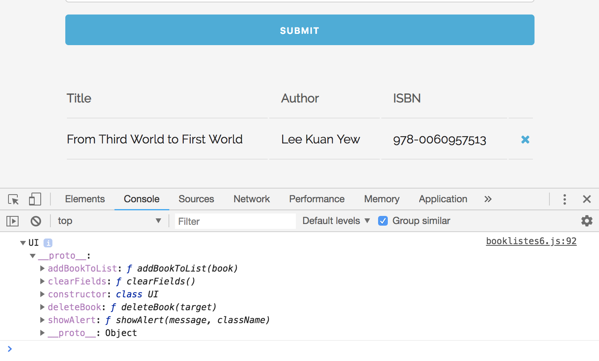
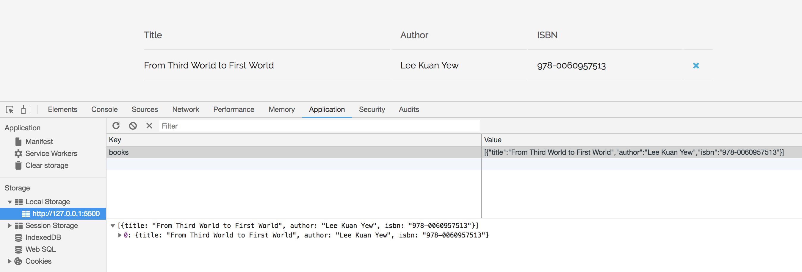
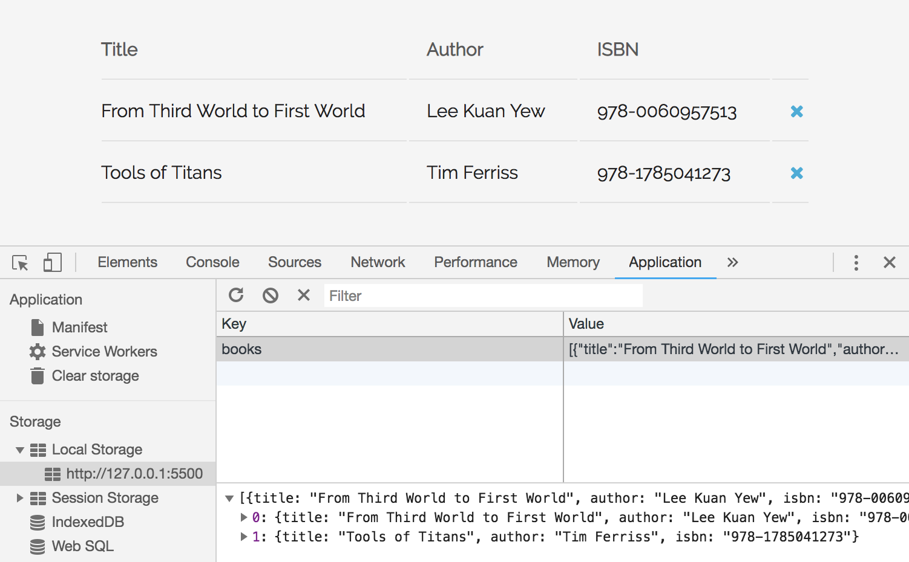

# Book List - Built in ES6 Classes

When we look at our ES5 version, we have two Constructors:

* Book Constructor
* UI Constructor

With ES6, we're gonna take those and turn them into Classes. The UI Class is where we're gonna put in all our methods to deal with user interface. It's going to be the exact same methods like what we used in the ES5 version

**Book Class**
```
class Book {
  constructor(title, author, isbn) {
    this.title = title,
    this.author = author,
    this.isbn = isbn
  }
}
```

**UI Class**
```
class UI {
  addBookToList(book) {
    const list = document.querySelector('#book-list');
    // create <tr> element
    const row = document.createElement('tr');
    // insert columns
    row.innerHTML = `
      <td>${book.title}</td>
      <td>${book.author}</td>
      <td>${book.isbn}</td>
      <td><a href="#" class="delete"><i class="fa fa-remove"></i></a></td>
    `;
    // dyanmically add row to list
    list.appendChild(row);
  }

  showAlert(message) {
    // create <div>
    const div = document.createElement('div');
    // add class to that div
    div.className = `alert ${className}`;
    // add text inside that alert <div>
    div.appendChild(document.createTextNode(message));
    // grab parent
    const container = document.querySelector('.container');
    // grab form
    const form = document.querySelector('#book-form');
    // insert alert location
    container.insertBefore(div, form);
    // set timeout
    setTimeout(function() {
      document.querySelector('.alert').remove();
    }, 3000);
  }

  deleteBook(target) {
    if (target.parentElement.classList.contains('delete')) {
      target.parentElement.parentElement.parentElement.remove();
    }
  }

  clearFields() {
    title.value = '';
    author.value = '';
    isbn.value = '';
  }
}
```

It resembles like a React application.

**Examine ```__proto```**

```
const ui = new UI();
console.log(ui); // test log
```

<kbd></kbd>

You'll see that it has all the Class Methods inside of that Prototype Object. So, under the hood, all this is happening exactly the same way between ES5 adn ES6. The only difference is the syntax.

## Add Local Storage

We'll create an extra ```Store Class``` to use to push to Local Storage, to fetch and remove stuff from Local Storage. We'll make all the Classes static, meaning instantiating the Store Class, we can use it directly.

Add methods to Store Class, make all of them ```static``` so use the keyword:

* getBooks() - fetch from Local Storage, this is applied to all other methods so we don't have to repeat ourselves
* displayBooks() - show books after fetching from Local Storage
* addBooks() -  add to Local Storage
* removeBook() - deletes the book from interface and Local Storage

**Add Book to Local Storage**

In the form validation part:

```
// UI Prototype Method to addBookToList
ui.addBookToList(book);

// Add to Local Storage
Store.addBook(book);
```

**Get books**, whenever we need to fetch from Local Storage, just call getBooks():
```
static getBooks() {
  // initialize a local variable
  let books;
  // check local storage
  if (localStorage.getItem('books') === null) {
    books = [];
  } else {
    // use JSON.parse bc need it to be a JS object
    books = JSON.parse(localStorage.getItem('books'));
  }

  return books;
}
```

How to call and use, we use the ```Store``` Class name bc it's a static method, you don't have to instantiate it:

```
const books = Store.getBooks();
```

**Add Book class method**

```
static addBook(book) {
  const books = Store.getBooks();

  // push on to 'books'
  books.push(book);

  // set Local Storage again with that new book, as 'books'
  // also set the books array, but run it through JSON.stringify
  // in order to store it in Local Storage
  localStorage.setItem('books', JSON.stringify(books));

}
```

<kbd></kbd>

**Display Book class method**

```
static displayBooks() {
  const books = Store.getBooks();

  // loop/iterate through books
  books.forEach(function(book) {
    // instantiate UI class
    const ui = new UI();

    // add book to UI with addBookToList and pass in book
    ui.addBookToList(book);
  });
}
```

also create, to load DOM events:

```
document.addEventListener('DOMContentLoaded', Store.displayBooks);
```

<kbd></kbd>