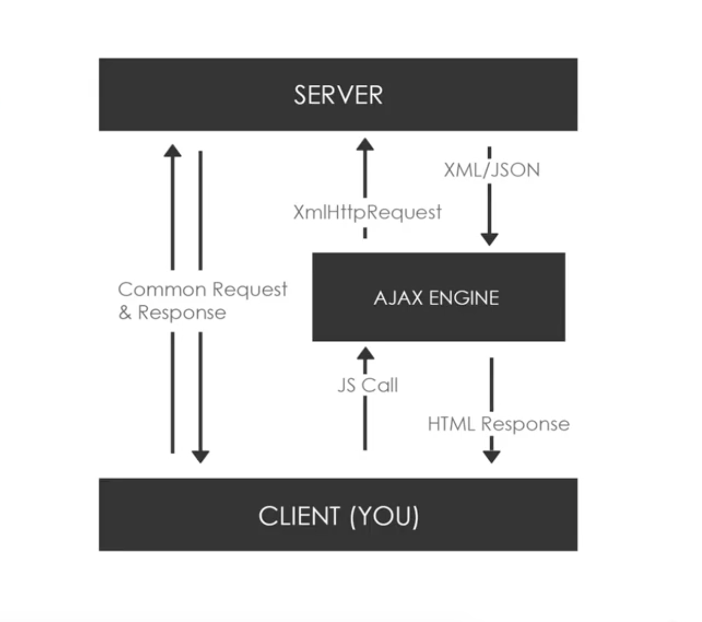

# What is AJAX?

## Asynchronous JavaScript & XML
AJAX stand for Asynchronous JavaScript & XML. 

## Set of web technologies
It's not a framework or library.

## Send & Recieve data asynchronously
Rather, it's a set of web technologies to send and recieve data from the client and server.

## Does not interfere with the current page
It does it asynchronously, so it's doen behind the sceneds without having to explicitly reload the webpage.

## JSON has replaced XML for the most part
One thing that's ironic is that even though XML is actually included in the AJAX acronym, XML is actually rarely used in AJAX anymore. JSON has pretty much taken its place. It's easier, faster and it's more popular.

Most of the API that you're going to work with returns JSON data, not XML. Or in some cases, they'll return both. AJAX can also work with just plain text. 

## AJAX Diagram

The 'client' is the browser, what the user see's. The 'server' is the application. Usually, we would type in a url or click a link on the browser and that would send a common HTTP request to the server and you'd get a common response back and including the entire webpage with the Headers and data. 

With AJAX, it allows us to make requests asynchronously. We do this behind the scenes in the background withou having to reload or refresh the entire webpage. 

So, if we wanted to just update one little section of text we can do that iwth AJAX and it's much faster than having to reload the entire webpage and makes things more interactive.

* Make async requests in the background
* No page reload / refresh
* Fetch data
* Very interactive

<kbd></kbd>

The way this happens by making an AJAX call or an asynchronous JavaScript call and it goes through comething called an AJAX engine and uses the XML HTTP Request Object (XHR Object), which is actually a part of the browser.

The server will then return the data, usually in JSON format, but can also be an XML or plain text. Then, we parse and use that data in our application.

Again, all of this is done behind the scenes without any need to a page refresh, it happens very fast.

## API and ```cors``` (cross-domain communication)
When we send and recieve requests, it can be from something on our local machine, on our local server or can be something from a public API something like Google Maps, Map API, the GitHub API, etc. These APIs have certain persmission granted for us to be able to use them. They usually have something called ```cors``` enabled, which allows for cross-domain communication, meaning that, we can make requests to their API even though we're not on the same domain name as them. Some API do require some kind of authentication - ```OAuth``` is very popular.

## XMLHttpRequest (XHR) Object

This is the core technology in AJAX, it's provided by the browser's JavaScript environment, so all browsers have this API. Its methods transfer data between client and server or browser and server.

It can also be used with other protocols other than HTTP, but HTTP is the most common.

It can work with data other than XML, even though it stands for XMLHttpRequest, you'll mostly deal with JSON data, but we can also deal with plain text as well.

* API in the form of an object
* Provided by the browser's JS environemnt
* Methods transfer data between client / server
* Can be used with other protocols then HTTP
* Can work with data other than XML (JSON, plain text)

## Libraries and Other Methods

There are other libraries and methods to use to make requests. 

* Fetch API - part of the browser that's part of core JavaScript
* Axios - external library, include as external script
* Superagent - external library, include as external script
* jQuery - external library, a DOM manipulation library, no recommend bc it's bloated, heavy
* Node HTTP - if dealing with NodeJS, works well
* Prototype - another external library

It's up to you how you want to make your requests. Fetch is suggested bc it's a part of Vanilla JavaScript.