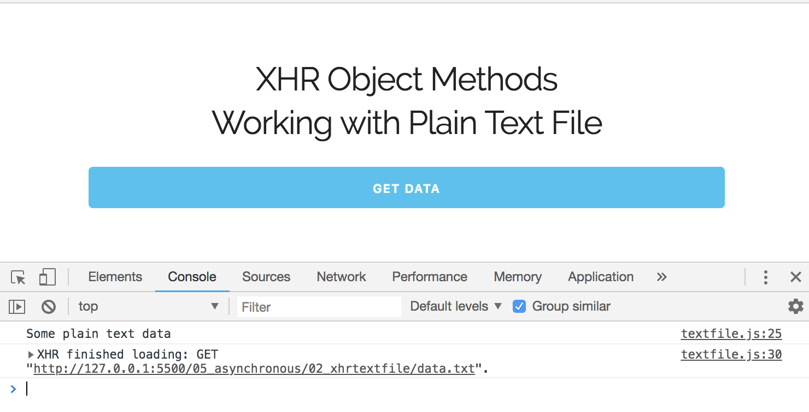

# AJAX: XHR Object Methods & Workign with Plain Text File

How to get data from a text file and bring it into your webpage or your application asynchronously using the XHR Object.

* HTML file:

```
<div class="container">
  <h4>XHR Object Methods<br/>Working with Plain Text File</h4>
  <button id="button" class="u-full-width button-primary">Get Data</button>
  <br><br>
  <div id="output"></div>
</div>
```

* Create a ```.txt``` file for plain data
* Create a ```.js``` file for DOM manipulation

## Request Response Statuses:

* 200: "OK"
* 403: "Forbidden"
* 404: "Not Found"

```
// Grab #button from UI
const button = document.querySelector('#button');

// Add Event Listeners
button.addEventListener('click', loadData);

// Function for loadData()
function loadData() {
  // console.log(1); // test to see if being called

  const xhr = new XMLHttpRequest();

  xhr.open('GET', 'data.txt', true);

  xhr.onload = function() {
    if (this.status === 200) {
       console.log(this.responseText);
    }
  }

  xhr.send();
}
```

We have an event listener, we click it, it calles the ````loadData()``` function. Next, create a new instance for the XHR Object. Call the ```.open``` and pass the type of request a ```'GET'``` request, a GET request means you want to read the file or url, then ```data.txt``` is the file that we're reading, ```true``` is fro async. When everything is ready, it'll call the ```.onload``` and we want to make sure that it's a ```status 200```, which means ```OK```. Then, we'll console.log to test the ```.responseText``` which is the data that's included in the ```data.txt``` file. Finally, we have to add the lin ```xhr.send()``` for everything to work.

<kbd></kbd>

## ```readyState``` Values

When you go through this process, there's a couple of different, ```readyState Values```.

* 0: request not initialized
* 1: server connection established
* 2: request recieved
* 3: processing request
* 4: request finished and response is ready

At this point in our example, when ```xhr.onload``` loads, we're already at step four of readyState values, which is what we want. ```.onload``` is fairly new, before that, it had to be written out as ```xhr.onreadystatechange``` and had to check to make sure if at state 4.