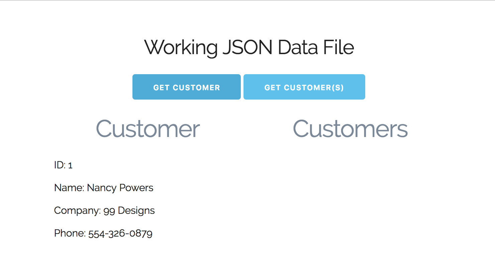
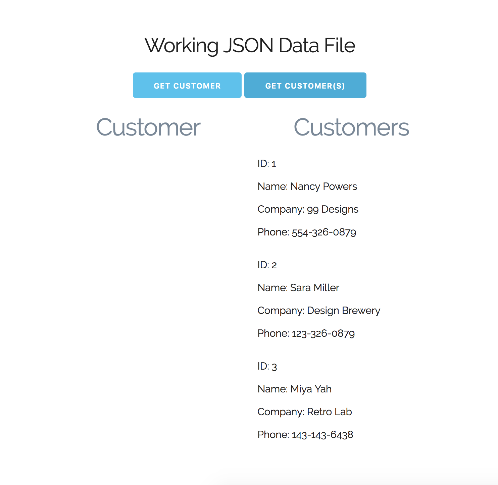

# AJAX: JSON File

In this example, we're gonna have two JSON files. One is for a single customer, and the other will be an arra of customer objects.

JSON stands for JavaScript Object Notation. It's very similar to standard JavaScript Object.

## customer.js file

Setting up JSON, start off with ```{ }``` like what you'd do with a JavaScript Object. But, with JSON, the difference from JS Object Literals, is that with JSON, you need to wrap your ```keys``` and your ```values``` in double quotes ```" "```. Unless it's a number value, you don't have to.

Object Literal
```
{
  id: 1,
  name: 'Nancy Powers'
}
```

JSON
```
{
  "id": 1,
  "name": "Nancy Powers"
}
```

If you ever want to validate your JSON, use tools like: https://jsonlint.com/

## json.js file with customer.json

Here, we'll create vent listners for our buttons to get data from our json file from customrer.json

**Displaying customer.json data on UI**

```
const button1 = document.querySelector('#button1');

button1.addEventListener('click', loadCustomer);

function loadCustomer(e) {
  const xhr = new XMLHttpRequest();

  xhr.open('GET', 'customer.json', true);

  xhr.onload = function() {
    if (this.status === 200) {
      // console.log('STATUS: ', this.responseText); // test log

      const data1 = JSON.parse(this.responseText);
      // console.log(data1); // test log result of parsed data

      output = `
        <ul class="alignment">
          <li>ID: ${data1.id}</li> 
          <li>Name: ${data1.name}</li> 
          <li>Company: ${data1.company}</li>
          <li>Phone: ${data1.phone}</li>
        </ul>
      `;

    const customer = document.querySelector('#customer');

    customer.innerHTML = output;
    }
  }

  xhr.send();
}
```

We're getting the data acrynchronously thorugh the XHR Object and then we're outputting it in the browser.

<kbd></kbd>

It works the same way if you were fetching this from an external url, a public API.

## customers.json 

This example, we're gonna fetch an array of customers and display in UI.

```
function loadCustomers(e) {
  const xhr = new XMLHttpRequest();

  xhr.open('GET', 'customers.json', true);

  xhr.onload = function() {
    if (this.status === 200) {
      // console.log('STATUS: ', this.responseText); // test log

      const data1 = JSON.parse(this.responseText);
      // console.log(data1); // test log result of parsed data

      let output = '';

      data1.forEach(function(data) {
        // create an output template to the UI, use += to append
        output += `
          <ul class="alignment">
            <li>ID: ${data.id}</li> 
            <li>Name: ${data.name}</li> 
            <li>Company: ${data.company}</li>
            <li>Phone: ${data.phone}</li>
          </ul>
        `;
      });

    const customers = document.querySelector('#customers');

    customers.innerHTML = output;
    }
  }

  xhr.send();
}
```

<kbd></kbd>