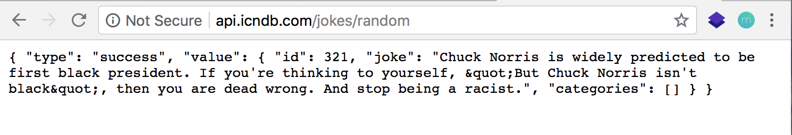
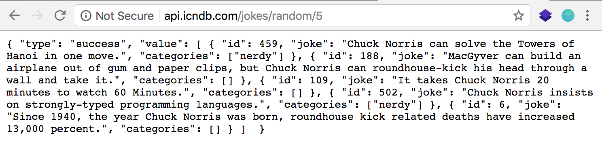
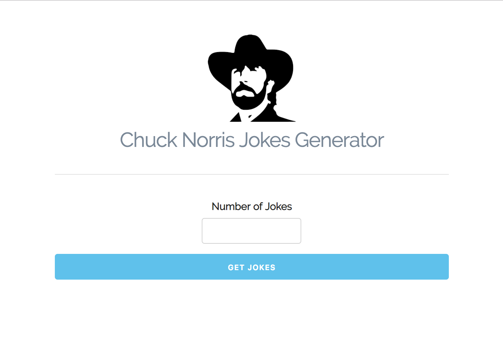
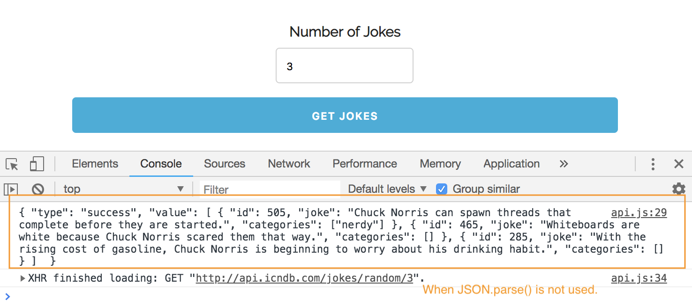
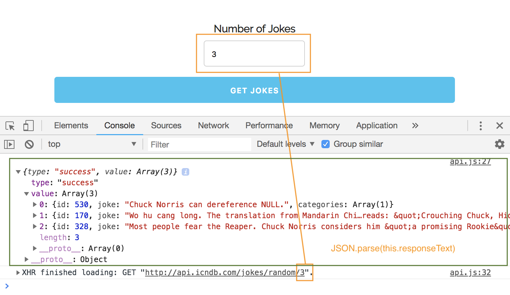

# AJAX: External API

How to fetch data from external API using AJAX, it's becoming more common these days.

In this example, we'll use a very simple external API that takes a GET request formatted as a certain url and then returns random Chuck Norris jokes. You can get a single joke or multiple jokes, you can limit the category.

## External API

http://www.icndb.com/api/

Every API is different, as in how it takes requests and how it responds, so read the documentation for these external APIs.

For our application, we'll have a form, so the user can set the number of jokes they want. It'll make the request and return that number of Chuck Norris jokes.

http://api.icndb.com/jokes/random
* Everytime you reload, it'll be a different joke.

<kbd></kbd>

* If you want more than one joke.

<kbd></kbd>

## Our Fetch External API Project

We'll use AJA to build this application that will get these jokes, return them, and then display them in the browser using DOM techniques.

<kbd></kbd>

**Initial test with json string coming in as response**

```
const button = document.querySelector('.get-jokes');

button.addEventListener('click', getJokes);

function getJokes(e) {
  const number = document.querySelector('#number').value;
  const xhr = new XMLHttpRequest();

  xhr.open('GET', `http://api.icndb.com/jokes/random/${number}`, true);

  xhr.onload = function() {
    if (this.status === 200) {
      // coming in as json string
      const response = this.responseText;
      console.log(response); // test log
    }
  }

  xhr.send();

  e.preventDefault();
}
```

<kbd></kbd>

**Parsed json data version so we can actually use it**

It's now in a different format, an actual Object. Everytime you submit the form, you get a different set of random jokes.

```
...
  xhr.onload = function() {
    if (this.status === 200) {
      // coming in as json string
      const response = JSON.parse(this.responseText);
      console.log(response); // test log
    }
  }
  ...

```

<kbd></kbd>