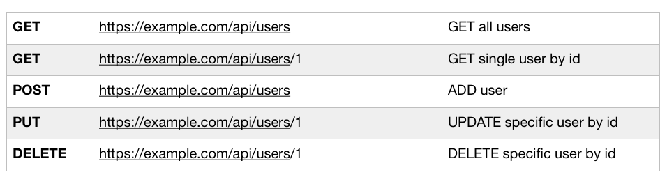

# REST APIs and HTTP Requests

Go over REST API and also other types of requests we can make with AJAX and Fetch API (will go over later on) bc up to this point, we've only worked with ```'GET'``` requests.

## What's an API?

Before we get into REST, let's talk about what API is in general.

* API stands for Application Programming Interface - this is a very broad term bc there's all kinds of APIs, but we're specifically talking about web APIs, but there's also APIs in your computers, operating system, on your smartphone, even some refrigerators, etc.
* It's essentially a contract provided by one piece of software to another.
* Usually consists of a structured request and response - so one peice of software says give me some info formatted in a certain way, and I'll give you this data or this function, or whatever the response may be.
* For example, we worked with a web API that takes a request, which was the url along with the number of jokes we wanted and it processes that and response formatted as json with the Chuck Norris jokes for our generator.

## What is REST APIs?

* The "R" stands for Representational State Transfer.
* It's an architectural style for desinging networked applications.
* It works by relying on a statelss, client-server protocal, almost all cases in HTTP.
* REST was made to treat objects on the server-side as resources that can be created, read, updated or destroyed.
* An example of a server-object would be like a Blog post or a User, and it's usually stored in a database. We can create a post or create resources with the POST request and then we can delete with a DELETE request, etc.
* What makes REST so awesome is that since it operates using just HTTP requests and usually some standard like JSON, it can be used virtually by any programming language. So, any language like JavaScript, PHP, Ruby, Ruby on Rails framework, Java, Python, all of these languages are perfectly capable of working with REST API.
* Remember, API is the messenger, then REST lets us use the HTTP request to format that message.
* REST API takes in multiple types of HTTP requests like GET, POST, DELETE, etc.
* All APIs have their own rules and structure.

## Different Types of HTTP Requests

Main Four:
* **GET**: Retrieve data from a specified resource
* **POST**: Submit data to be processed to a specified resource
* **PUT**: Update a specified resource that's already on the server
* **DELETE**: Delete a specified resource

Extra:
* **HEAD**: Same as GET, but does not return a body, only header
* **OPTIONS**: Returns the supoorted HTTP methods of that specific server/API
* **PATCH**: Update partial resources

## API Endpoints

<kbd></kbd>

Whether you have some kind of external API or if it's your own API, you're going to have something called **endpoints**. Endpoints are the URL that you access to do certain things.

With POST, PUT and DELETE, you're gonna send data along with your request because it needs to know which POST to update and the data that you want it to update with.

Notice that all the URLs are the same, but they're different requests. 

Note, sometimes, you'll have an API that's formatted differently, like "...user/delete/1" or "...user/update/1".