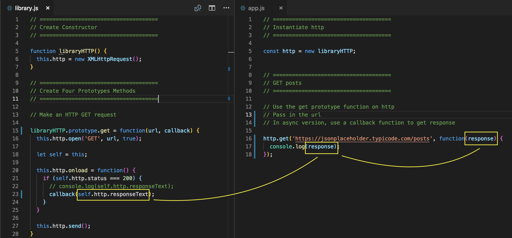
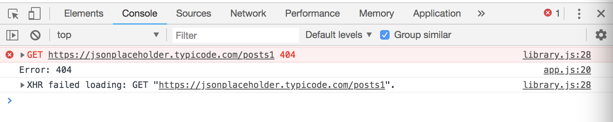

# Custom AJAX Library with Callback Functions

Here, we're gonna build our custom AJAX library. In order to build this, we're gonna need something to test with - a RESTful API that takes GET, POST, PUT and DELETE requests in order to modify some kind of resource. We'll use JSON Placeholder, which is a fake online REST API for testing.

* JSON Placholder - Fake Online REST API for Testing and Prototyping (https://jsonplaceholder.typicode.com/)

You'll see that you have different resources that you can work with. We're gonna work with ```/posts```.

<kbd></kbd>

You can also see the **endpoints** aka the **routes** that we can make.

<kbd></kbd>

Click on posts, https://jsonplaceholder.typicode.com/posts, and it'll give you an array of 100 different posts.

<kbd></kbd>

This fake API doesn't let us actually modify data on their server, what it does though is that it reutrns a successful response and sends it as a repsosne with your new post. So we can see it only in our application. Same with PUT and DELETE methods.

## Our Library Project

* library.html
* library.js
* app.js - where we'll test our library

**HTML file**

The order of the ```<script>``` file is important.

```
<!DOCTYPE html>
<html lang="en">
<head>
  <meta charset="UTF-8">
  <meta name="viewport" content="width=device-width, initial-scale=1.0">
  <meta http-equiv="X-UA-Compatible" content="ie=edge">
  <title>Custom AJAX Library with Callback Functions</title>
</head>
<body>
  <h1>Custom AJAX Library with Callback Functions</h1>  

  <script src="library.js"></script>
  <script src="app.js"></script>
</body>
</html>
```

**library.js**

Here, we'll build out our library. We're gonna build ES5 Object Oriented library, so we're gonna use Prototypes instead of Classes.

Later on, we'll use the new Fetch API instead of AJAX-XHR and also use Classes, so we'll make an updated version of this library project.

Here, we're gonna start off with just using AJAX-XHR and practice more with Prototypes, which is good to know bc it actually runs under the ES6 Class.

* Start off with creating a Constructor.
* The only property we're gonna have here is called  ```this.http``` and we'll set it to the ```new XMLHttpRequest()``` object. In the previous examples we wrote ```xhr = new XMLHttpRequest();``` and then ```xhr.open```, ```xhr.onload```, etc. Instead, in this example, we'll use ```this.http.open```, ```this.http.onload```, etc.

```
function libraryHTTP() {
  this.http = new XMLHttpRequest();
}
```

**Next, make four different Prototype methods**

## GET Request
* For GET request, ```libraryHTTP.prototype.get``` set to a function and pass in ```url``` as parameter. We're gonna pass https://jsonplaceholder.typicode.com/posts in. 
* Inside, ```this.http.open()``` and pass in three parameters, the ```type``` of request, the ```url``` and then ```true``` bc it's asynchrnous.
* Below that, ```this.http.onload``` set to a function, and inside it, check to see if status is 200. Use the **arrow function** bc it'll refer to the **lexical scope** of ```this```. It'll work and get the data for us.

**app.js**

```
const http = new libraryHTTP;
http.get('https://jsonplaceholder.typicode.com/posts');
```

**library.js** - This does not work, the reason bc ```this``` is in the function. When you're inside this function, the ```this``` keyword pertains to that function it's inside of.
```

libraryHTTP.prototype.get = function() {
  this.http.open('GET', url, true);

  this.http.onload = function() {

  }

  this.http.send();
}
```

<kbd></kbd>

**library.js** - Need to use arrow function, it fixes it by adding what's called the ```lexical this```, now it works.

```
libraryHTTP.prototype.get = function(url) {
  this.http.open('GET', url, true);

  this.http.onload = () => {
    if (this.http.status === 200) {
      console.log(this.http.responseText);
    }
  }

  this.http.send();
}
```

<kbd></kbd>

**library.js** - Another way to fix it in ES5 without using the arrow function is to set another varible, like maybe call it ```self``` or ```that```. Now, we can capture that ```this``` in this scope. And then use ```self``` or ```that``` instead of ```this```.

```
libraryHTTP.prototype.get = function(url) {
  this.http.open('GET', url, true);

  let self = this;

  this.http.onload = function() {
    if (self.http.status === 200) {
      console.log(self.http.responseText);
    }
  }

  this.http.send();
}
```

* Then, down at the bottom, ```this.http.send();```.

## Synchronous Version - doesn't work

You may think that what we can do is ```return self.http.responseText```, and then go back to ```app.js``` and set ```const posts = http.get('https://jsonplaceholder.typicode.com/posts');``` and then ```console.log(posts)```. It actually doens't work, we get ```undefined```.

**library.js**
```
libraryHTTP.prototype.get = function(url) {
  this.http.open('GET', url, true);

  let self = this;

  this.http.onload = function() {
    if (self.http.status === 200) {
      // console.log(self.http.responseText);
       return self.http.responseText;
    }
  }

  this.http.send();
}
```

**app.js**
```
const http = new libraryHTTP;

const posts = http.get('https://jsonplaceholder.typicode.com/posts');
console.log(posts);
```

<kbd></kbd>

What's happening here is similar to what happened in the previous example in the callback where it was returned, the data that was returned before it was actually added. So, the way that we fix this is with a ```callback```.

## Asynchronous Version - works with Callback

Pass in 

**library.js**
```
libraryHTTP.prototype.get = function(url, callback) {
  this.http.open('GET', url, true);

  let self = this;

  this.http.onload = function() {
    if (self.http.status === 200) {
      // console.log(self.http.responseText);
      callback(self.http.responseText);
    }
  }

  this.http.send();
}
```

**app.js**
```
const http = new libraryHtttp;

http.get('https://jsonplaceholder.typicode.com/posts', function(response) {
  console.log(response);
});
```

Note: the paramete ```reponse``` can be named something different too

<kbd></kbd>

## Dealing with Error

* Use ```null``` in the callback as the first parameter, and then the response will be the second

**library.js**
```
libraryHTTP.prototype.get = function(url, callback) {
  this.http.open('GET', url, true);

  let self = this;

  this.http.onload = function() {
    if (self.http.status === 200) {
      callback(null, self.http.responseText);
    } else {
      callback('Error: ' + self.http.status);
    }
  }

  this.http.send();
}
```

**app.js** - test for error
```
const http = new libraryHtttp;

http.get('https://jsonplaceholder.typicode.com/posts', function(error, response) {
  if (error) {
    console.log(error);
  } else {
    console.log(response);
  }
});
```

If in ```app.js``` the url is:

```
const http = new libraryHtttp;

http.get('https://jsonplaceholder.typicode.com/posts1', function(error, response) {
  if (error) {
    console.log(error);
  } else {
    console.log(response);
  }
});
```

<kbd></kbd>

You'll get the browser error and also the error we created from our library that says 'Error: 404'.

## GET single post

**app.js**
```
http.get('https://jsonplaceholder.typicode.com/posts/1', function(error, response) {
  // test for error
  if (error) {
    console.log(error);
  } else {
    console.log(response);
  }
});
```

<kbd></kbd>

## POST Request

```libraryHTTP.prototype.post``` set it to a function that takes in a ```url``` and second ```data``` bc when you're adding data, you obviosuly need to send the data, third we need a callback.

This works very similar to a GET request. Except ```this.http.open()``` pass in ```POST```, then ```url``` and ```true```.

Towards the bottom, ```this.send();``` you'll actually need to send the ```data```. The ```data``` is just going to be a regular JavaScript object when we pass it in. So, we'll need to run it through a function JSON.stringify and send it as a JSON string. ```this.send(JSON.stringify(data));```

Need to set the content type, that's done in ```this.http.setRequestHeader()``` and the OPTION we want to set is ```'Content-type'```.

For a POST request, we don't need to check the status, all we want to do is send the ```callback(null, self.http.responseText)```. The ```responseText``` should be the new post that we added. The way we know that it's a new post is that it should have an id of ```101``` bc when you make the initial GET request, the last one is the id of ```100```

**library.js**
```
libraryHTTP.prototype.post = function(url, data, callback) {
  this.http.open('POST', url, true);

  this.http.setRequestHeader('Content-type', 'application/json');

  let self = this;

  this.http.onload = function() {
  
    callback(null, self.http.responseText);

  }

  this.http.send(JSON.stringify(data));
}
```

**app.js**
```
// create data
const data = {
  title: 'First Custom Post',
  body: 'Testing out our first custom post.'
};

// create post
http.post('https://jsonplaceholder.typicode.com/posts', data, function(error, response) {
  // test for error
  if (error) {
    console.log(error);
  } else {
    console.log(response);
  }
});
```

<kbd></kbd>

You'll see that we get our new post with title, body and also comes with the id ```101``` that means our newly created post has been added.

You'll see that we get our new post with title, body and also comes with the id ```101``` that means our newly created post has been added.