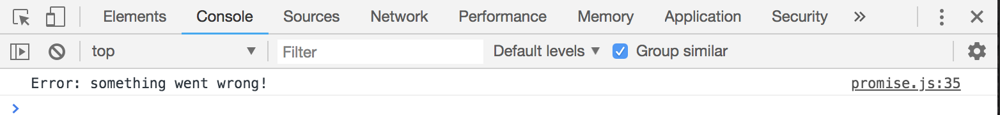

# ES6 Promises

Promises is an ES6 standard, which is an alternative to Callbacks, an alternative to handling asynchronous operations.

It's called Promises bc while they're handling asynchronous operations, they can Promise to do something when that operation is finished. We handle a Promise response with a ```.then``` after a function.

When you create a Promise, after defining a function, you're gonna want to ```return new Promise()``` and then inside ```Promise()``` we pass in a function. This function passes in two parameters ```resolve``` and ```reject```.

* ```resolve``` - is when we're done with what we're doing
* ```reject``` - is called if there's some kind of error that we want to indicate

In this example, take the ```setTimeout()``` and put it into the ```return new Promise```

After the ```post.push(post)``` where we would've had the Callback, the previos version, instead, we'll say ```resolve()``` instead of calling that Callback.

```
const posts = [
  {title: 'First Post', body: 'This is my first post!'},
  {title: 'Second Post', body: 'This is my second post!'}
];

function createPost(post) {
  return new Promise(function(resolve, reject) {
    setTimeout(function() {
      posts.push(post);
      resolve();
    }, 2000);
  });
}
```

Then in the bottom where we call ```createPost```, instead of passing in ```getPosts```, when we get a Promise response, we handle it with ```.then()``` and then inside of that, we can have a function like ```getPosts```.

```
createPost({title: 'Third Post', body: 'This is the third body.'}).then(getPosts);
```

There you go, we should get the same thing like what we did in the previous Callback example.


<kbd></kbd>

Now, let's mimic an error and check for that error. If ```!error```, not error, we want to ```resolve()```, else, if there is an error, we want to reject that and pass in a message. In order to catch that error, we add on using ```.catch``` after ```.then```


```
function createPost(post) {
  return new Promise(function(resolve, reject) {
    setTimeout(function() {
      posts.push(post);

      const error = true;

      if (!error) {
        resolve();
      } else {
        reject('Error: something went wrong!');
      }  
    }, 2000);
  });
}
```

<kbd></kbd>

We're going over Promises now bc next we'll go over the Fetch API, is actually the new standard to make HTTP requests, other than AJAX and XHR, and the Fetch API actually returns the promise.