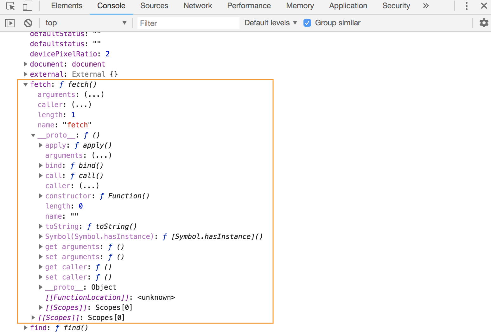
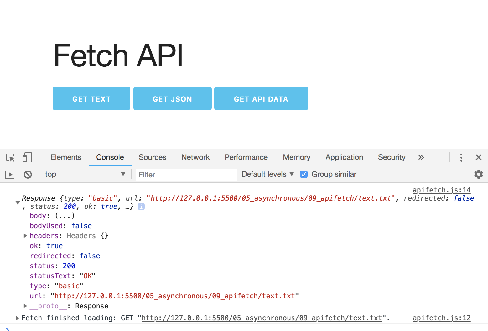

# Fetch API

It's the newer standard for dealing with HTTP requests. In the Dev Tool console, when you type in the ```window``` object, you'll see that there's ```fetch``` that's now a part of the ```window``` object, there's a bunch of Prototype Methods for it as well.


<kbd></kbd>

<kbd></kbd>

<kbd></kbd>

In this example, we're gonna do the same like the previous simple library we made, but this time using updated standards.

<kbd></kbd>

## Get Text File

Use the ```fetch()``` method and pass in whatever we want to get like our ```text.txt``` file. Remember, fetch returns Promises. When you get a response from a promise, you'll have to use ```.then``` and also pass in a function with a response. Then ```console.log``` to test and see what it gives us.

```
// grab button ids from HTML
const button1 = document.querySelector('#button1');

// add event listeners on click
button1.addEventListener('click', getText);

// create getText function - use fetch
function getText() {
  fetch('text.txt')
    .then(function(response) {
      console.log(response);
    });
}
```

<kbd></kbd>

You'll see that ```status: 200``` which means it's ok.

```
// grab button ids from HTML
const button1 = document.querySelector('#button1');

// add event listeners on click
button1.addEventListener('click', getText);

// create getText function - use fetch
function getText() {
  fetch('text1.txt')
    .then(function(response) {
      console.log(response);
    });
}
```

<kbd></kbd>

This is when there's an error, unable to get to the file.


## The ```text``` prototype in fetch

Because we're fetching a text file (.txt) we're gonna be using this.

<kbd></kbd>

Here, you'll see that we get a ```Promise``` when we use:

```
// create getText function - use fetch
function getText() {
  fetch('text.txt')
    .then(function(response) {
      // console.log(response);
      console.log(response.text());
    });
}
```

<kbd></kbd>

Now, getting the data from the text.txt file, we need to do another ```.then``` to go deeper another level in the Promise.

```
// create getText function - use fetch
function getText() {
  fetch('text.txt')
    .then(function(response) {
      // console.log(response); // gets fetch
      return response.text(); // gets the Promise
    })
    .then(function(data) {
      console.log(data); // content from text.txt file
    });
}
```

<kbd></kbd>

We want to return the ```text``` method in that's in prototype bc we're dealing with text, and then, we catch that promise and then we can grab the data. That's why there's two ```.then```

In this example, looks like there's a lot of code, but we will switch to use **arrow functions** later on, which will reduce code.

## Dealign with error, ```.catch```

Put an incorrect text file name like ```text1.txt```.

```
// create getText function - use fetch
function getText() {
  fetch('text1.txt')
    .then(function(response) {
      // console.log(response); // gets fetch
      return response.text(); // gets the Promise
    })
    .then(function(data) {
      console.log(data); // content from text.txt file
    })
    .catch(function(error) {
      console.log(error);
    });
}
```

<kbd></kbd>