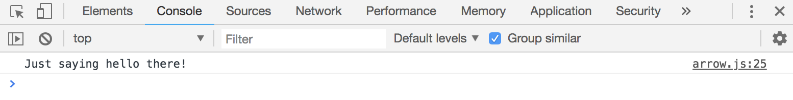
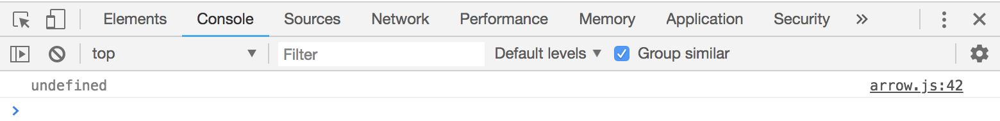
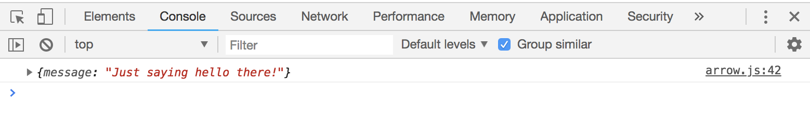
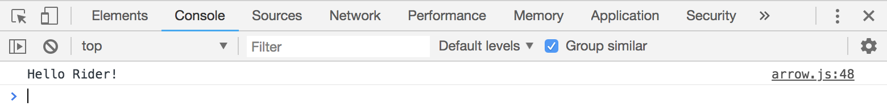

# Arrow Functions

Also known as **fat-arrow functions**, this is a really important and cool part of ES6!

There's a lot of benefits from it like writing less code and also looking neater. It's also useful with **lexical** ```.this```

## ES5 Version of Function

```
const helloThere = function() {
  console.log('Just saying hello there!')
}

helloThere();
```

## ES6 Version of Arrow Function

```
const helloThere = () => {
  console.log('Just saying hello there!')
}

helloThere();
```

You can also do it in one line, no need for curly braces:

```
const helloThere = () => console.log('Just saying hello there!')

helloThere();
```

Same thing with return, you don't even have to write out ```return```:
```
const helloThere = () => 'Just saying hello there!';

console.log(helloThere());
```

<kbd></kbd>

It's much simpler and shorter when writing out a function.

However, you can run into trouble when you're returning an **Object literal**. You're gonna get ```undefined``` bc it's looking at ```{message: 'Just saying hello there!'}``` as the function body instead of an Object literal.

```
const helloThere = () => {message: 'Just saying hello there!'};

console.log(helloThere());
```

<kbd></kbd>

To fix this, wrap the Object literal in parantheses:

```
const helloThere = () => ({message: 'Just saying hello there!'});

console.log(helloThere());
```

<kbd></kbd>

What if we have parameters?

```
const helloThere = (name) => console.log(`Hello ${name}!`);

helloThere('Rider');
```

<kbd></kbd>