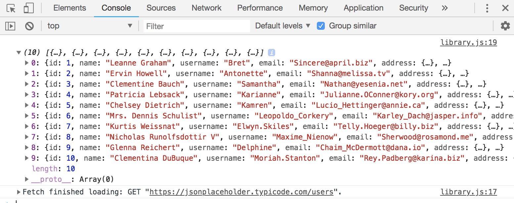
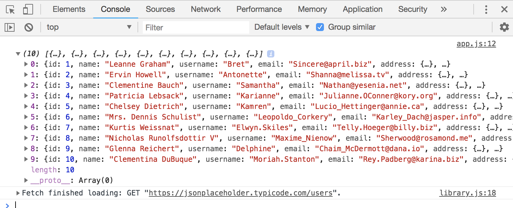
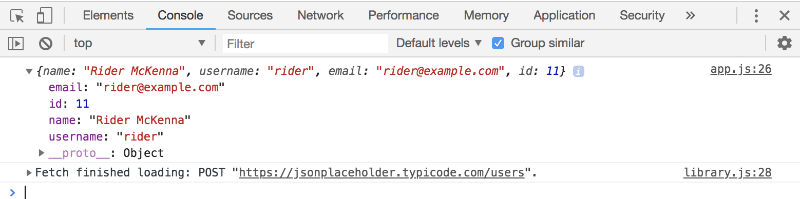

# Custon HTTP Library with Fetch and Promise (version 2)

This version will be updated to the more modern standard with Fetch, ES6 and Promises.

## Use ES6 Classes
No need for Constructor bc we don't need the XHR Object, like we did before where we assigned ```this.http```

We're gonna do the Fetch version first and then promises later.

Do ```fetch(url)``` and then ```.then()``` with ```response``` to ```json()```. Do another ```.then()``` with ```data``` and ```console.log``` it. If there's an ```error```, ```.catch()``` it.

## GET Request

**library.js**
```
class libraryHTTP {
  // make HTTP GET request
  get(url) {
    fetch(url)
      .then(response => response.json())
      .then(data => console.log(data))
      .catch(error => console.log(error))
  }
}
```

**app.js**
We're gonna use https://jsonplaceholder.typicode.com/users in this example.

```
// Initialize varibale
const http = new libraryHTTP;

// GET users
http.get('https://jsonplaceholder.typicode.com/users');
```

It's gonna log out the 10 users:

<kbd></kbd>

In a synchronous way, we need to wrap the fetch in a Promise. Rememeber a Promise takes in ```resolve``` (when we wnat to send a response) and ```reject``` (when we want to send an error). 

And then in ```.then(data => data)``` we want to instead return ```.then(data => reslove(data)```

**library.js**
```
class libraryHTTP {
  // make HTTP GET request
  get(url) {
    return new Promise((resolve, reject) => {
      fetch(url)
      .then(response => response.json())
      .then(data => resolve(data))
      .catch(error => reject(error));
    });
  }
}
```

**app.js**
```
// Initialize varibale
const http = new libraryHTTP;

// GET users
// asyncrhonous way
http.get('https://jsonplaceholder.typicode.com/users')
  .then(data => console.log(data))
  .catch(error => console.log(error));
```

<kbd></kbd>

So you see that this is much cleaner compared to what we did before.

## POST Request

It's similar to the GET request, but POST is gonna have to take in ```data``` as well. When you ```fetch``` in a POST request, you're gonna have to add in an object ```{}``` with some info like ```method: 'POST'``` and ```headers: {'Content-type': 'application/json'}``` and send the ```body: JOSN.stringify(data)```.

**library.js**
```
class libraryHTTP {
  // make HTTP GET request
  get(url) {
    return new Promise((resolve, reject) => {
      fetch(url)
      .then(response => response.json())
      .then(data => resolve(data))
      .catch(error => reject(error));
    });
  }

  // make HTTP POST request
  post(url, data) {
    return new Promise((resolve, reject) => {
      fetch(url, {
        method: 'POST',
        headers: {
          'Content-type': 'application/json'
        },
        body: JSON.stringify(data)
      })
      .then(response => response.json())
      .then(data => resolve(data))
      .catch(error => reject(error));
    });
  }
}
```

**app.js**
```
// create data
const data = {
  name: 'Rider McKenna',
  username: 'rider',
  email: 'rider@example.com'
}

// create POST
http.post('https://jsonplaceholder.typicode.com/users', data)
  .then(data => console.log(data))
  .catch(error => console.log(error));
```

<kbd></kbd>

Notice that it's showing id ```11```, that means we're a new one has been added bc remember, earlier, it was ```10```.

## PUT Request

Everything is the same like a POST request, but change it to PUT.

**library.js**
```
...
  put(url, data) {
    return new Promise((resolve, reject) => {
      fetch(url, {
        method: 'PUT',
        headers: {
          'Content-type': 'application/json'
        },
        body: JSON.stringify(data)
      })
      .then(response => response.json())
      .then(data => resolve(data))
      .catch(error => reject(error));
    });
  }
}
```

We'll update ```https://jsonplaceholder.typicode.com/users/2```. You'll see that id ```2``` has the updated user data from our ```const data```

**app.js**
```
const data = {
  name: 'Rider McKenna',
  username: 'rider',
  email: 'rider@example.com'
}

http.put('https://jsonplaceholder.typicode.com/users/2', data)
  .then(data => console.log(data))
  .catch(error => console.log(error));
```