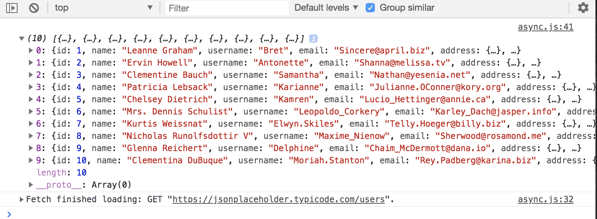

# Async and Await

This is actually a part of ES7, ES 2016 standard, but it is fully implemented in Google Chrome.

To have it work on other browsers, you may have to compile it by using Webpack, which we'll learn later.

**A normal function**

```
function myFunction() {
  return 'Hello';
}

console.log(myFunction());
```

**With Async**

What we do is add ```async``` to the beginning of the function and just doing that, makes this function return a Promise.

```
async function myFunction() {
  return 'Hello';
}

console.log(myFunction());
```

<kbd></kbd>

```
async function myFunction() {
  return 'Hello';
}

myFunction()
  .then(response => console.log(response));
```

<kbd></kbd>

It's a really nice feature, bc you don't have to wrap in ```return new Promise``` like before. Even just ```async``` withouth ```await```, it works great.

**With Async & Await**

If we use ```aysync```, we can use ```await``` to wait for it to resolve. In this example, we'll create a ```new Promise``` inside and pass in an arrow function. The arrow function is going to take in ```resolve``` and ```reject```. Then afterwards, do a ```setTimeout()``` with an arrow function and ```resolve``` a string like 'Hello there!' and set the time to 1 second.

Below the ```const promise```, create another varibale of ```const response``` and set it to ```await promise``` and that ```promise``` is refering to the previous variable we made. This line of code, will wait until the promise is resolved, which we've set for 1 second.

Then go ahead and return response.

```
async function myFunction() {

  const promise = new Promise((resolve, reject) => {
    setTimeout(() => resolve('Hello there!'), 1000);
  })

  const response = await promise;

  return response;
}

// console.log(myFunction()); //test to show that it returns a Promise

myFunction()
  .then(response => console.log(response));
```

**With Async & Await - Throw Errors**

```
async function myFunction() {

  const promise = new Promise((resolve, reject) => {
    setTimeout(() => resolve('Hello there!'), 1000);
  })

  const error = true; // can change to false

  if (!error) {
    const response = await promise;
    return response;
  } else {
    await Promise.reject(new Error('Oops, something went wrong'));
  }
}
```

```
myFunction()
  .then(response => console.log(response))
  .catch(error => console.log(error));
```

<kbd></kbd>

There you go, this above example isn't the best example, just an intro for us to play around and use async and await. The next one will be simple as well, but slightly better bc we will be using it with Fetch API, which is the best case to use.

## Async & Await with Fetch API

Usually with our ```const response``` we'd have to do two ```.then()```, but now bc we're using ```await fetch()``` we can instead create a variable called ```data``` or whatever you want to name it and set it to ```await response.json()``` and then ```return``` the ```data```.

```
async function getNames() {
  // await response of the fetch call
  const response = await fetch('https://jsonplaceholder.typicode.com/users');

  // proceed once that promise is resolved
  const data = await response.json();
  
  // process when the second Promise is resolved
  return data;
}

getNames().then(names => console.log(names));
```

<kbd></kbd>

This looks a lot neater than the previous version bc we don't have to deal with the two ```.then()``` like before.