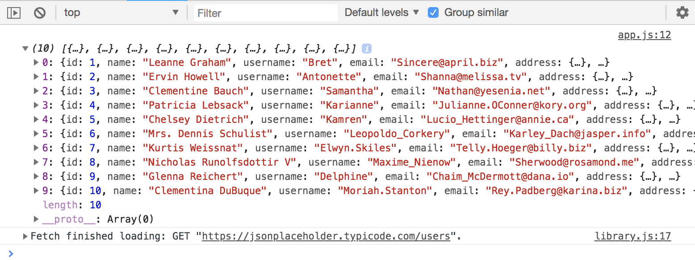
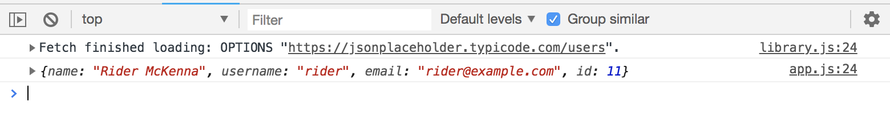

# Custom HTTP Library with Fetch and Async & Await

We're gonna take the previous HTTP Lirary examples and convert it to a fetch with async and await. Turn the functions into async

## GET Request

**library.js**

```
class libraryHTTP {
  // make HTTP GET request
  async get(url) {
    const response = await fetch(url);
    const responseData = await response.json();
    return responseData;
  }
}
```

**app.js**
```
http.get('https://jsonplaceholder.typicode.com/users')
  .then(data => console.log(data))
  .catch(error => console.log(error));
```

<kbd></kbd>

## POST Request

**library.js**
```
...
  // make HTTP POST request
  async post(url, data) {
    const response = await fetch(url, {
      method: 'POST',
      headers: {
        'Content-type': 'application/json'
      },
      body: JSON.stringify(data)
    });
    const responseData = await response.json();
    return responseData;
  }
}
```

**app.js**
```
// create data
const data = {
  name: 'Rider McKenna',
  username: 'rider',
  email: 'rider@example.com'
}

// create POST
http.post('https://jsonplaceholder.typicode.com/users', data)
  .then(data => console.log(data))
  .catch(error => console.log(error));
```

<kbd></kbd>

## PUT Request

**library.js**
```

```

**app.js**
```

```