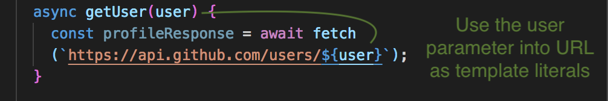
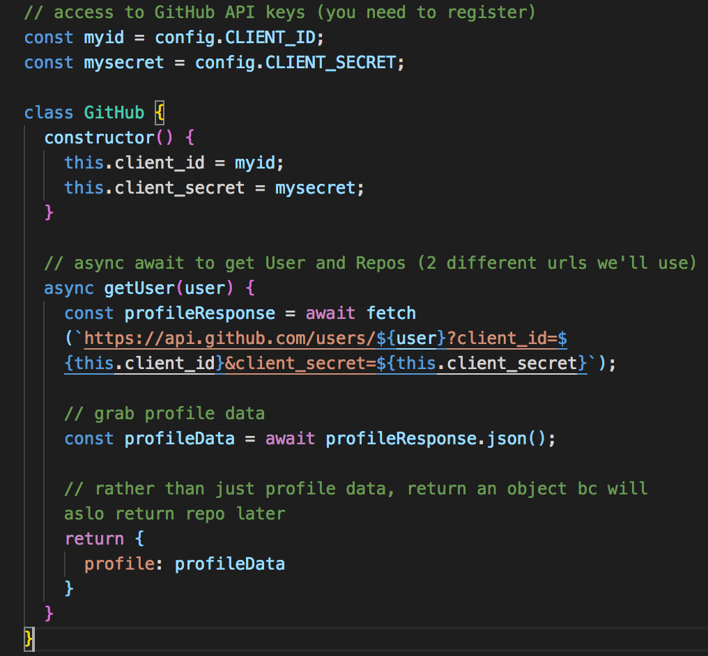

# Fetch Profile Data

On the UI, our input element is going to have an event listener and it's going to listen for a ```key-up event```.  

<kbd></kbd>

## app.js File

The ```app.js``` file will be our entry point.

In the addEventListener, we need to get the text that's being typed in with ```const userText = e.target.value``` to get whatever value that's being typed in.

**app.js**

<kbd></kbd>

Check to make sure input is not blank. If ```userText``` is not equal to nothing, we want to go on and make an HTTP call to GitHub (this call will be done through our ```github.js``` file). First, let's test with ```console.log```.

<kbd></kbd>

## github.js File

Use ES6 Classes and use ```constructor```.

**github.js**
<kbd></kbd>

Use the ```user``` parameter in the async function in the fetch URL as **template literal**.

We also need to add in the GitHub API's Client ID and Client Secret after the ```${user}``` template literal with a ```?``` and then a **query string** of ```client_id``` and set it ```=``` to a template literal of ```${this.client_id}```. Then add an ampersand ```&``` bc we want another **query string** of ```client_secret``` and set it to ```${this.client_secret}```.

Our feth URL now looks like this inside our async function:
```
...
    const profileResponse = await fetch(`https://api.github.com/users/${user}?client_id=${this.client_id}&client_secret=${this.client_secret}`);
```

Then below, grab profile data with ```const profileData = await profileResponse.json();```. Afterwards, just ```return``` that as an object bc we will return the User's repos as well later on.

This is what's great about using Promises and using **async await** as opposed to callbacks. If we used **callbacks**, we have to have one callback, get the reponse and then have another one with the repo getting the repos.

**github.js**
<kbd></kbd>

## Connect between app.js and github.js

We need to **instantiate** the Class ```Github``` from github.js into the app.js file at the top of app.js file to use (kinda of like importing in React).