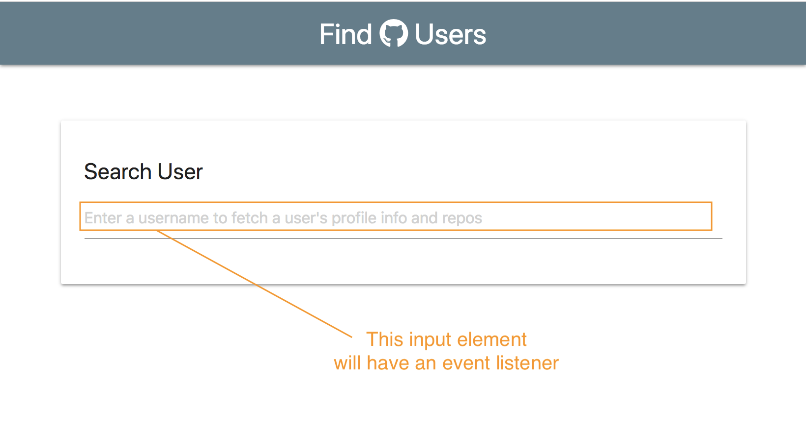
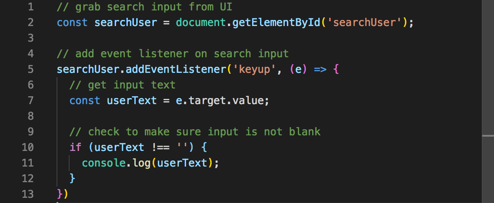
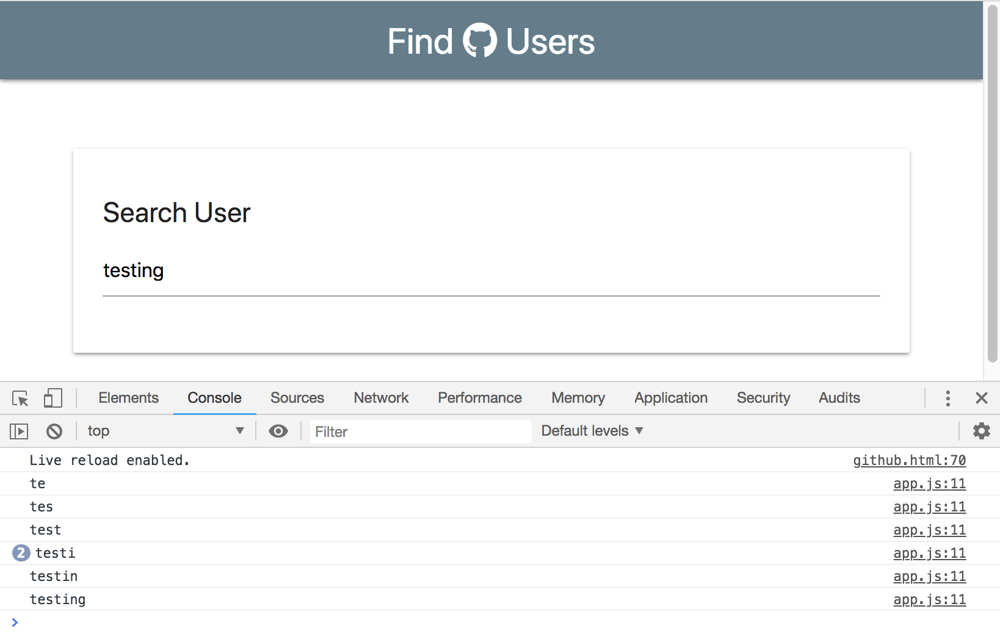

# Fetch Profile Data

On the UI, our input element is going to have an event listener and it's going to listen for a ```key-up event```.  

<kbd></kbd>

The ```app.js``` file will be our entry point.

In the addEventListener, we need to get the text that's being typed in with ```const userText = e.target.value``` to get whatever value that's being typed in.

**app.js**

<kbd></kbd>

Check to make sure input is not blank. If ```userText``` is not equal to nothing, we want to go on and make an HTTP call to GitHub (this call will be done through our ```github.js``` file). First, let's test with ```console.log```.

<kbd></kbd>