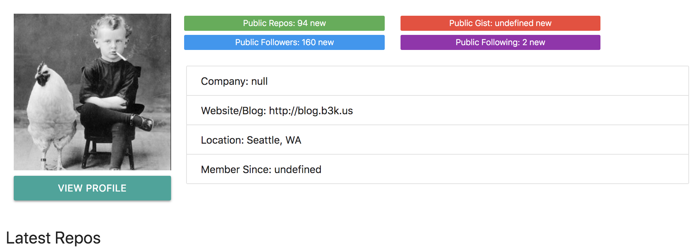

# Dynamically Display Profile

We can now fetch data from GitHub. We've already created a ```Github``` Class that will do that for us using Promises and Asyn Await. Then, we're returning that fetched data in the profile.

Now, we want to render the profile in the DOM, in the UI, when it's fetched (in app.js in the ```.then...else //show profile```).

Go to ```ui.js``` and create a Class called ```UI``` then add ```constructor() {...}``` and inside that, add the property ```this.profile = document.getElementById('profile')``` it's grabbing the id profile from our html file.

Then, create a method called ```showProfile``` and it'll take in a ```user``` as its parameter.

**ui.js**
```
class UI {
  constructor() {
    this.profile = document.getElementById('profile');
  }

  showProfile(user) {
    
  }
}
```

Go back to ```app.js``` and we need to initialize/instantiate the ```UI Class```. Then, down where we commented "show profile", write ```ui.showProfile()``` and remember it takes in a ```user``` and we can get that from ```data.profile``` bc that's what we're getting back from ```github.getUser()```. So, in ```ui.showProfile()```, pass in ```data.profile``` like this, ```ui.showProfile(data.profile)```.

<kbd></kbd>

We want to take the ```user``` data and build a template from it using **template literals** and then insert into this profile, which is that profile ID.

<kbd></kbd>

It logs what we want. Now, we want to take the user data and build a template from it using **template literal** and then insert above into the construcotr method of ```this.profile``` property, which the profile id from the html file.

Inside ```showProfile(user) {...}``` is ```this.profile.innerHTML``` equals a **template literal/string** with ``` `...` ``` and we'll add html markup as the template to be dynamically injected into the DOM.

## UI Template

<kbd></kbd>

**ui.js**
```
...
showProfile(user) {

  // template to display on DOM
  this.profile.innerHTML = `
    <div class="row">
      <div class="col m3 s12">
        
        <a href="${user.html_url}" target="_blank" class="waves-effect waves-light btn">View Profile</a>
      </div>
      <div class="col m9">
        <div class="row">
          <div class="col l5 m9 s12">
            <span class="new badge green">Public Repos: ${user.public_repos}</span>
          </div>
          <div class="col l5 m9 s12">
            <span class="new badge red">Public Gist: ${user.gist}</span>
          </div>
          <div class="col l5 m9 s12">
            <span class="new badge blue">Public Followers: ${user.followers}</span>
          </div>
          <div class="col l5 m9 s12">
            <span class="new badge purple">Public Following: ${user.following}</span>
          </div>
        </div>
        <ul class="collection">
          <li class="collection-item">Company: ${user.company}</li>
          <li class="collection-item">Website/Blog: ${user.blog}</li>
          <li class="collection-item">Location: ${user.location}</li>
          <li class="collection-item">Member Since: ${user.create_at}</li>
        </ul>
      </div>
    </div>
    <h5>Latest Repos</h5>
    <div id="repos"></div>
  `;
}
```

What it the template on the DOM looks like when it fetches data for API:

<kbd></kbd>