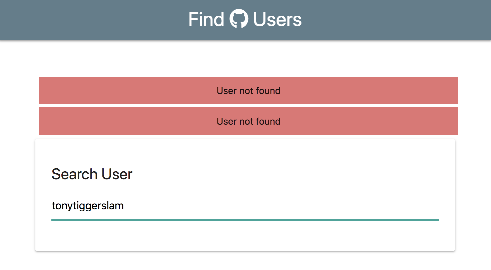
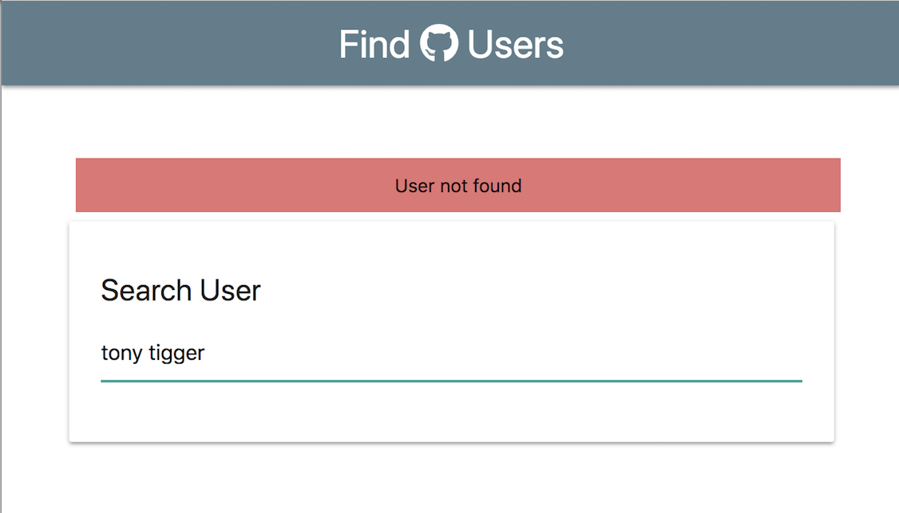
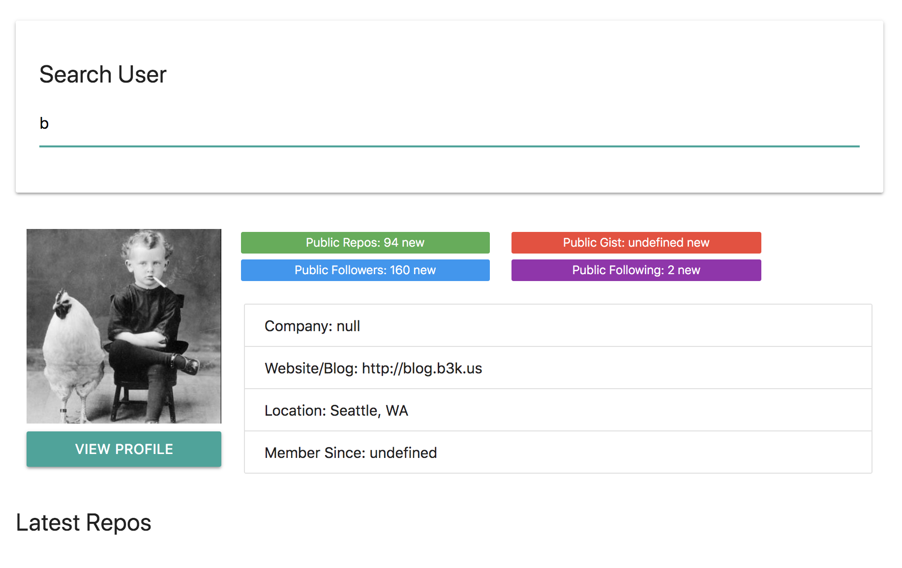

# More UI/UX Behaviors

Next, we'll add more behavior like clearing the Search bar and the DOM template when Search bar is cleared. Also, We'll create an alert to improve user experience when data of that user they're searching for is not found.

## Clear DOM Template when Search Bar Clear

In **app.js** in ```else``` where we commented "if true, clear profile info on DOM", we have to call ```ui``` from the UI Class and add a method called ```clearProfile()```. 

**app.js**
```
...
  } else {
    ui.clearProfile();
  }
```

Then, in **ui.js**, go to the bottom and create a ```clearProfile``` function. Inside, have ```this.profile.innerHTML = ''```. Simple as that. Now, when the Search bar is clear, the DOM is going to be empty and cleared out.

**ui.js**
```
...
  clearProfile() {
    this.profile.innerHTML = '';
  }
```

## Show Alert Message When No Data Found

If we get something that is not a profile, we want to have an alert message pop up.

Go to **app.js** where we commented "show alert", and call ```ui.showAlert()``` and it's going to take in two parameters, a string message like ```'User not found'``` and also a class of ```'badge error red lighten-2'```. Add more styling to the class for the alert message in a separate CSS file.

In **ui.js** create the ```showAlert``` function to be used as a method in app.js file.

**us.js**
```
...
  showAlert(message, className) {
    const div = document.createElement('div');
    div.className = className;
    div.appendChild(document.createTextNode(message));
    const container = document.querySelector('.searchContainer');
    const search = document.querySelector('.search');
    container.insertBefore(div, search);
  }
```

<kbd></kbd>

### Prevent Multiple Error Alert Messages

The solution to this is to clear the alert before we actually output it. Go back to **ui.js** and create a new function/method called ```clearAlert```.

```
...
  clearAlert() {
    const currentAlert = document.querySelector('.error');

    // check to see if there is a message alert
    if (currentAlert) {
      currentAlert.remove();
    }

  }
```


```
...
  showAlert(message, className) {
    // clear any remaining alerts
    this.clearAlert();
```

<kbd></kbd>

Make the alert message go away after 3 seconds if user is found with the ```setTimeout()``` method.

<kbd></kbd>