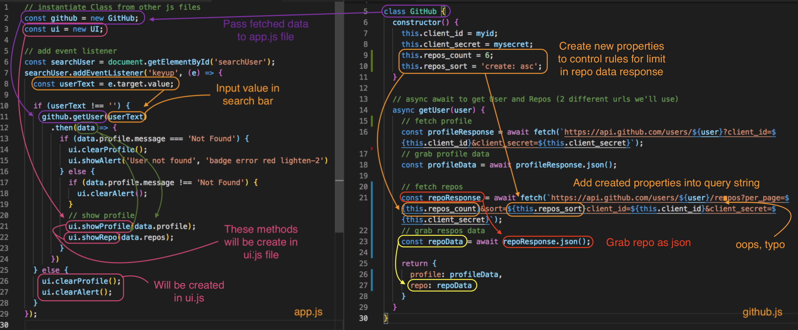
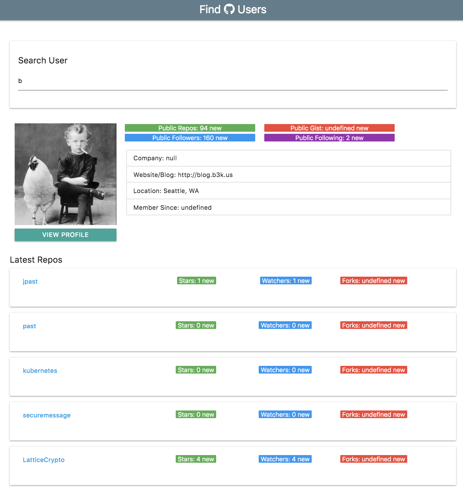

# Fetch and Display Repos

We've finished fetching data for user profile, now we want to include their repositories as well.

## github.js

We need to go to our **github.js** and make an async await fetch request for our profile, we'll do the same for the repo, but the repo uses a different url location, so we'll have to write new code for that.

**github.js**
```
...
  const repoResponse = await fetch(`https://api.github.com/users/${user}/respos?client_id=${this.client_id}&client_secret=${this.client_secret}`);
```

Leaving the await fethc like this, it's going to fetch all the user's repos and we don't want a super long list of repos on that profile, so we need to create a couple properties in the ```constructor()``` method above.

**github.js**
```
class GitHub {
  constructor() {
    this.client_id = myid;
    this.client_secret = mysecret;
    this.repos_count = 6; // will limit the # of repos to show
    this.repos_sort = 'create: asc'  // we also want it to sort (can be used as query strings in our url)
  }
 ... 


   // async await to get User and Repos (2 different urls we'll use)
  async getUser(user) {
    // fetch profile
    const profileResponse = await fetch(`https://api.github.com/users/${user}?client_id=${this.client_id}&client_secret=${this.client_secret}`);
    const profileData = await profileResponse.json();

    // fetch repos
    const repoResponse = await fetch(`https://api.github.com/users/${user}/respos?per_page=${this.repos_count}&sort=${this.repos_sort}client_id=${this.client_id}&client_secret=${this.client_secret}`);
...  
```

Next, we want to grab the repos data with ```const repoData = await repoResponse.json();``` and then remember to add it to the object that's being returned.

**github.js**
```
return {
  profile: profileData,
  repo: repoData
}
```

## app.js

Go down to the "show profile" section in the if statement and add ```ui.showRepos(data.repos);``` method which we will create in the **ui.js** file. We pass in ```data.repos``` bc now that should be a part of the data object that we're returning in **github.js**.

<kbd></kbd>

## ui.js

This is the last step, to create the functions to ```showRepo()```. It's going to take in the ```repos``` array. Since, it's an array, we'll need to initialize an output variable to nothing ```let output = ''```. Then, iterate/loop through the ```repos``` that was passed as a parameter in the function, use the ```forEach()``` method.

```
repos.forEach((repo) => {

})
```

Pass in ```repo``` in the forEach bc we want to access each one. Then, we're gonna take that ```output``` variable and append to it with ```+=``` and we'll use a **template literal** here as well.

```
showRepos(repos) {
  let output = '';

  repos.forEach((repo) => {
    output += `
    
    `;
  })
}
```

So, for each respository, we want to put it into a card.

```
showRepo(repos) {
  console.log(repos)
  let output = '';

  repos.forEach(function(repo) {
    output += `
      <div class="card-panel">
        <div class="row">
          <div class="col m3 s12">
            <a href="${repo.html_url}" target="_blank">${repo.name}</a>
          </div>
          <div class="col m8 s12">
            <div class="row">
              <div class="col m4 s12">
                <span class="new badge repo-badge green">Stars: ${repo.stargazers_count}</span>
              </div>
              <div class="col m4 s12">
                <span class="new badge repo-badge blue">Watchers: ${repo.watchers_count}</span>
              </div>
              <div class="col m4 s12">
                <span class="new badge repo-badge red">Forks: ${repo.forms_count}</span>
              </div>
            </div>
          </div>
        </div>
      </div>
    `;
  })

  // output repos
  document.getElementById('repos').innerHTML = output;
}
```

<kbd></kbd>