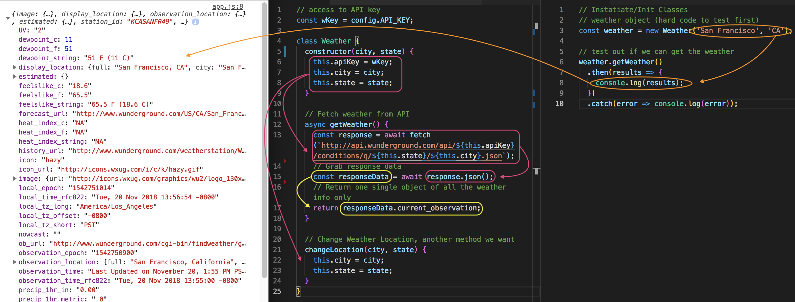

# Fetch Weather API (work in weather.js)

Create a ```Weather``` class.

**weather.js**
```
// access to API key
const wKey = config.API_KEY;

class Weather {
  constructor(city, state) {
    this.apiKey = wKey;
    this.city = city;
    this.state = state;
  }

  // Fetch weather from API
  async getWeather() {
    const response = await fetch(`http://api.wunderground.com/api/Your_Key/conditions/q/CA/San_Francisco.json`);
  }
}
```

**URL Example from their API docs**
http://api.wunderground.com/api/Your_Key/conditions/q/CA/San_Francisco.json

Replace the placeholders with dynamic values of the properties in the constructor.

```
// access to API key
const wKey = config.API_KEY;

class Weather {
  constructor() {
    this.apiKey = wKey;
    this.city = city;
    this.state = state;
  }

  // Fetch weather from API
  async getWeather() {
    const response = await fetch(`http://api.wunderground.com/api/${this.apiKey}/conditions/q/${this.state}/${this.city}.json`);
  }
}
```

## Our Complete Weather Class structure

```
const wKey = config.API_KEY;

class Weather {
  constructor(city, state) {
    this.apiKey = wKey;
    this.city = city;
    this.state = state;
  }

  async getWeather() {
    const response = await fetch(`http://api.wunderground.com/api/${this.apiKey}/conditions/q/${this.state}/${this.city}.json`);

    const responseData = await response.json();

    return responseData.current_observation;
  }

  changeLocation(city, state) {
    this.city = city;
    this.state = state;
  }
}
```

## Initalize/Instantiate our Weather Class in app.js

Remember, the ```Weather Class``` takes in a ```city``` and ```state```. 

So we create a variable called ```weather``` and set it to an instantiation of the ```Weather``` Class. To test our fetch, let's hard code in the city and state to San Francisco, CA as its parameters.

Then below, ```weather.getWeather()``` it's going to return a **Promise** bc ```getWeather()``` from **weather.js** is **Asynchronous**. By using ```async```, means it's going to return a Promise, so we need to use ```.then``` and ```.catch``` in it.

**app.js**
```
const weather = new Weather('San Francisco', 'CA');

// test out if we can get the weather
weather.getWeather()
  .then(results => {
    console.log(results);
  })
  .catch(error => console.log(error));
 
```

<kbd></kbd>

When you look at the object, you'll see all the weather information for San Francisco, CA.

## Wrap Get Weather into a Function

When the DOM loads, should call the get weather function.

**app.js**
```
const weather = new Weather('San Francisco', 'CA');

document.addEventListener('DOMContentLoaded', getWeather);

function getWeather() {
  weather.getWeather()
    .then(results => {
      console.log(results);
    })
    .catch(error => console.log(error));
}
```

Next, we'll work on the UI Class to dynamically insert info to the DOM.