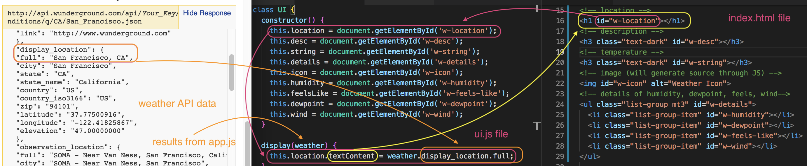
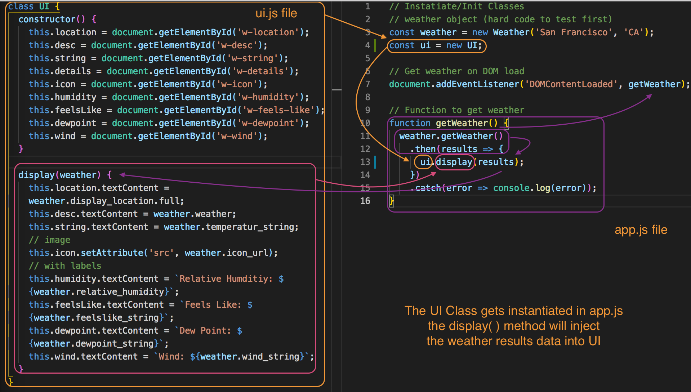
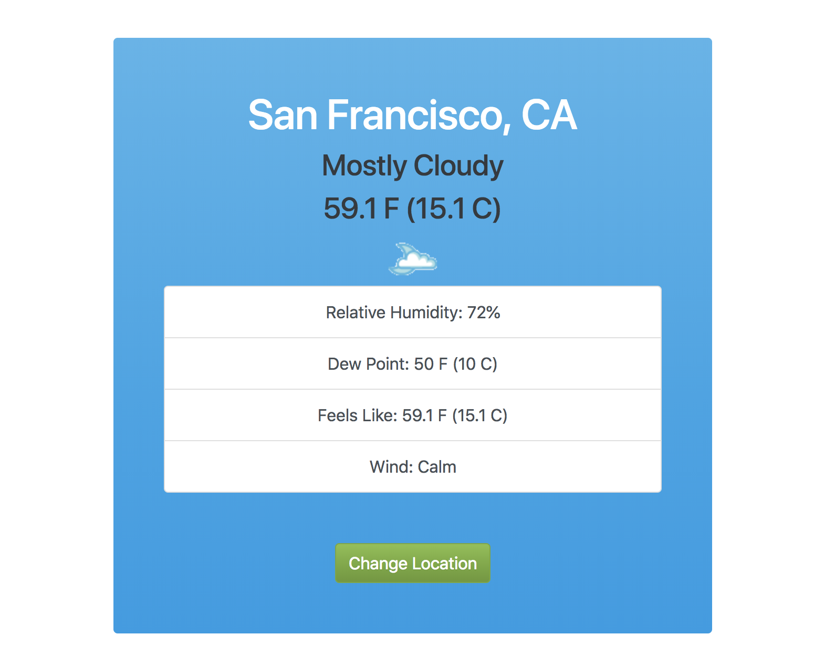

# Display Weather

Now, we want to display the fetched data to the DOM. This will be done in **ui.js**

In the ```getWeather()``` function, where we get the ```results``` back from the asynchronous method inside the class, instead of just logging the results in the console, we want to call a method inside the ```ui``` Class called ```display``` (we still need to code out the UI Class in ui.js) and pass in ```results``` as ```ui.display(results)```.

This image explains why we wrote ```weather.display_location.full``` by referencing the api data.
<kbd></kbd>

Display data to UI.
<kbd></kbd>

What the UI looks like with display.
<kbd></kbd>