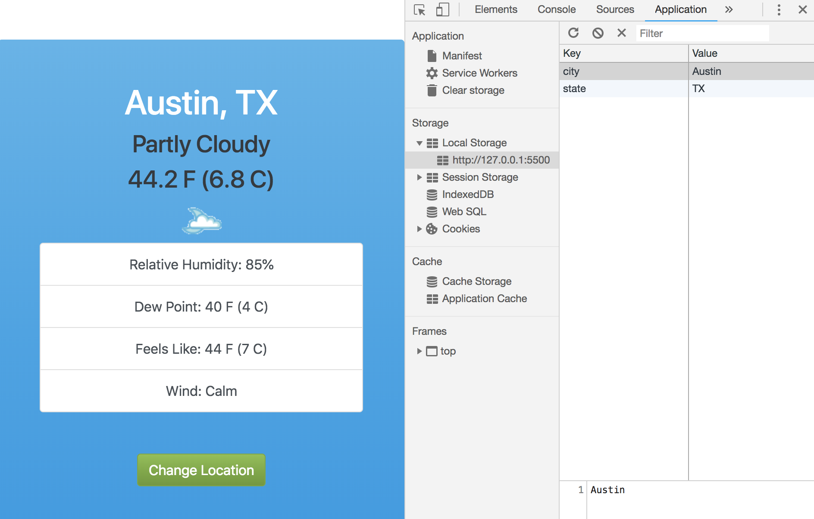

# Add Ability to Change Location on Search and Save on Local Storage

Add Location Change ability in the Modal form and then also have Local Storage remember the location search.

## Change Location Weather Search

Withe Modal, we have to use jQuery bc Bootstrap depends on jQuery. Look at **index.html**, we have an id of ```w-change-btn``` on button element. We need to add an event listener to that.

In **app.js** create an event listener for that.

```
// Change Location event
const modalBtn = document.getElementById('w-change-btn');
modalBtn.addEventListener('click', (e) => {
  const city = document.getElementById('city').value;
  const state = document.getElementById('state').value;

  weather.changeLocation('Modesto', 'CA');

  // Call getWeather and display
  getWeather();

  // Close Modal
  $('#locModal').modal('hide');
})
```

<kbd></kbd>

## Save Location for Weather Search to Local Storage

Need to create a ```Storage Class``` in storage.js and we're just going to initialize ```city``` and ```state``` (later add a default starter in case there's nothing in Local Storage).

**storage.js**
```
class Storage {
  constructor() {
    this.city;
    this.state;
    this.defaultCity = 'Murrieta';
    this.defaultState = 'CA'
  }

  getLocationData() {
    // check if local storage is null
    if (localStorage.getItem('city') === null && localStorage.getItem('state') === null) {
      this.city = this.defaultCity;
      this.state = this.defaultState;
    } else {
      this.city = localStorage.getItem('city');
      this.state = localStorage.getItem('state');
    }

    return {
      city: this.city,
      state: this.state
    }
  }

  setLocationData(city, state) {
    localStorage.setItem('city', city);
    localStorage.setItem('state', state);
  }
}
```

In **app.js** we need to instantiate the ```Storage Class``` and create a new variable called ```weatherLocation``` to access the storage class and the ```getLocationData()``` method.

```
const storage = new Storage();
const weatherLocation = storage.getLocationData();
```

Then, inside the event listener on Modal Button click, add:
```
// Change Location
weather.changeLocation(city, state);

// Set Location in Local Storage
storage.setLocationData(city, state);
```

<kbd></kbd>