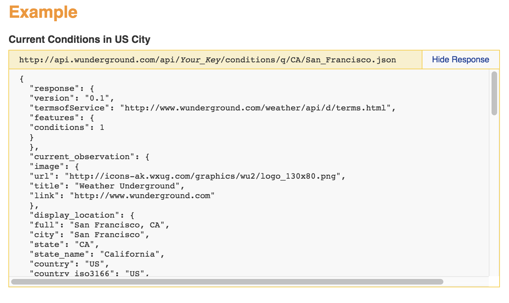

# Weather Application

* Weather Underground API (this API will be obsolete)
* Fetch API to make request
* Bootstrap CSS & Modal
* Local Storage

Need to register to use the Weather Underground API. Their docs: https://www.wunderground.com/api/d/docs

<kbd></kbd>

## Breakdown the Files for Better Proj Structure

* index.html
* app.js - for main code
* ui.js - for template
* storage.js - for local storage
* weather.js - for fetching API